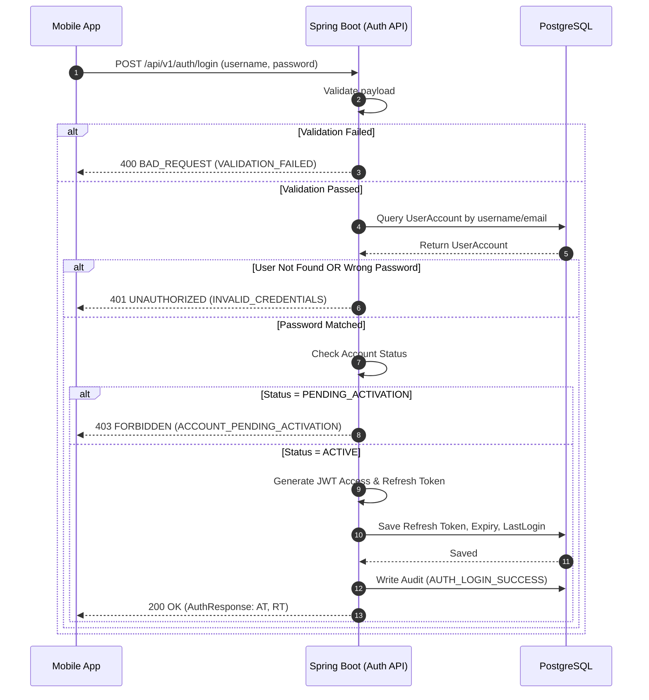
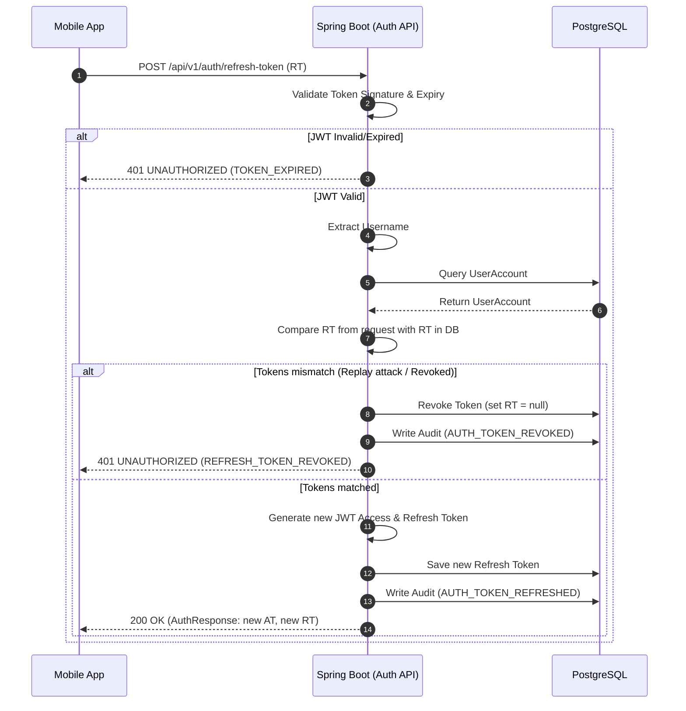
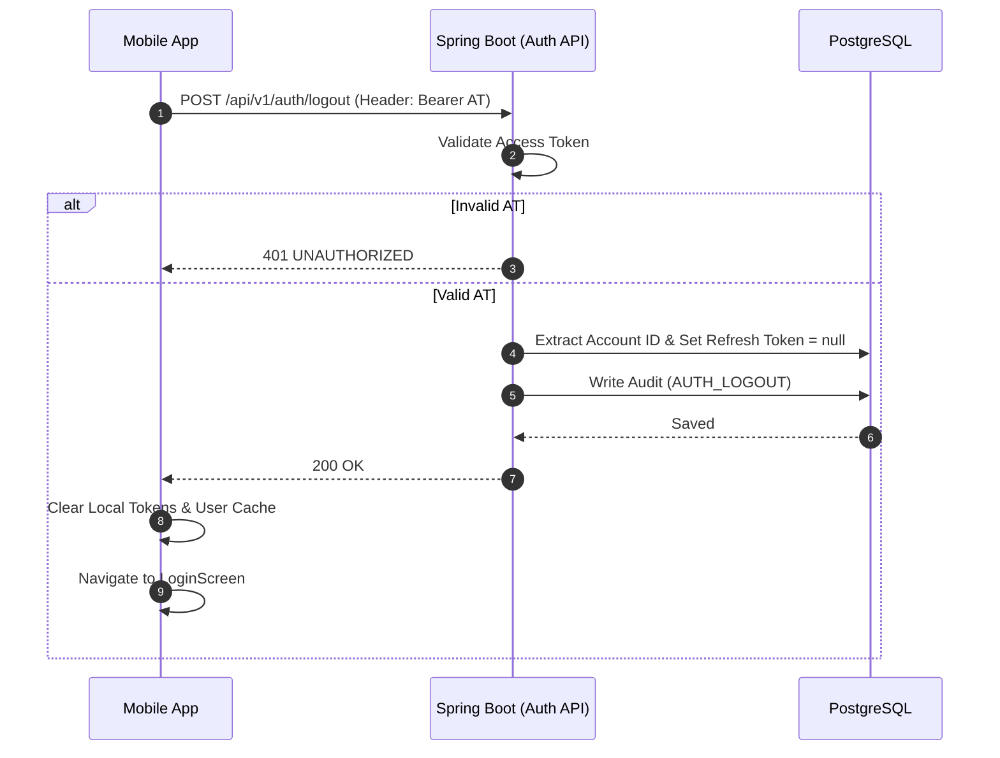
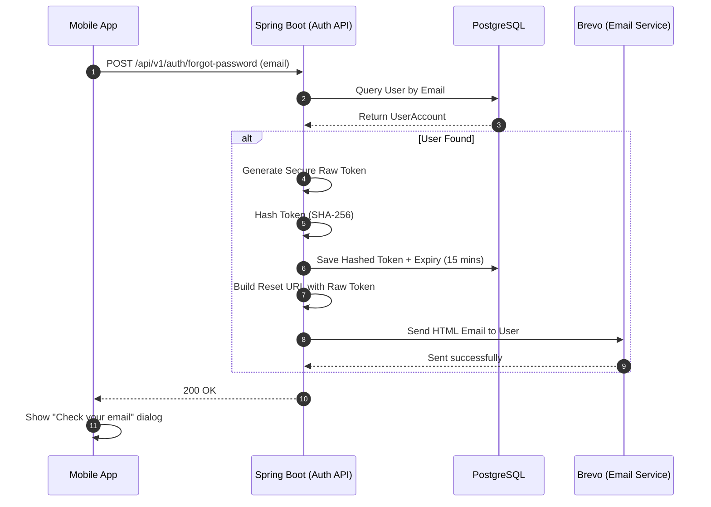

# Auth Sequence Diagrams

## 1. Login Flow

```mermaid
sequenceDiagram
    autonumber
    participant App as Mobile App
    participant BE as Spring Boot (Auth API)
    participant DB as PostgreSQL

    App->>BE: POST /api/v1/auth/login (username, password)
    BE->>BE: Validate payload
    alt Validation Failed
        BE-->>App: 400 BAD_REQUEST (VALIDATION_FAILED)
    else Validation Passed
        BE->>DB: Query UserAccount by username/email
        DB-->>BE: Return UserAccount
        alt User Not Found OR Wrong Password
            BE-->>App: 401 UNAUTHORIZED (INVALID_CREDENTIALS)
        else Password Matched
            BE->>BE: Check Account Status
            alt Status = PENDING_ACTIVATION
                BE-->>App: 403 FORBIDDEN (ACCOUNT_PENDING_ACTIVATION)
            else Status = ACTIVE
                BE->>BE: Generate JWT Access & Refresh Token
                BE->>DB: Save Refresh Token, Expiry, LastLogin
                DB-->>BE: Saved
                BE->>DB: Write Audit (AUTH_LOGIN_SUCCESS)
                BE-->>App: 200 OK (AuthResponse: AT, RT)
            end
        end
    end
```

## 2. Refresh Token Flow

```mermaid
sequenceDiagram
    autonumber
    participant App as Mobile App
    participant BE as Spring Boot (Auth API)
    participant DB as PostgreSQL

    App->>BE: POST /api/v1/auth/refresh-token (RT)
    BE->>BE: Validate Token Signature & Expiry
    alt JWT Invalid/Expired
        BE-->>App: 401 UNAUTHORIZED (TOKEN_EXPIRED)
    else JWT Valid
        BE->>BE: Extract Username
        BE->>DB: Query UserAccount
        DB-->>BE: Return UserAccount
        BE->>BE: Compare RT from request with RT in DB
        alt Tokens mismatch (Replay attack / Revoked)
            BE->>DB: Revoke Token (set RT = null)
            BE->>DB: Write Audit (AUTH_TOKEN_REVOKED)
            BE-->>App: 401 UNAUTHORIZED (REFRESH_TOKEN_REVOKED)
        else Tokens matched
            BE->>BE: Generate new JWT Access & Refresh Token
            BE->>DB: Save new Refresh Token
            BE->>DB: Write Audit (AUTH_TOKEN_REFRESHED)
            BE-->>App: 200 OK (AuthResponse: new AT, new RT)
        end
    end
```

## 3. Logout Flow

```mermaid
sequenceDiagram
    autonumber
    participant App as Mobile App
    participant BE as Spring Boot (Auth API)
    participant DB as PostgreSQL

    App->>BE: POST /api/v1/auth/logout (Header: Bearer AT)
    BE->>BE: Validate Access Token
    alt Invalid AT
        BE-->>App: 401 UNAUTHORIZED
    else Valid AT
        BE->>DB: Extract Account ID & Set Refresh Token = null
        BE->>DB: Write Audit (AUTH_LOGOUT)
        DB-->>BE: Saved
        BE-->>App: 200 OK
        App->>App: Clear Local Tokens & User Cache
        App->>App: Navigate to LoginScreen
    end
```

## 4. Forgot Password Flow

```mermaid
sequenceDiagram
    autonumber
    participant App as Mobile App
    participant BE as Spring Boot (Auth API)
    participant DB as PostgreSQL
    participant Email as Brevo (Email Service)

    App->>BE: POST /api/v1/auth/forgot-password (email)
    BE->>DB: Query User by Email
    DB-->>BE: Return UserAccount
    alt User Found
        BE->>BE: Generate Secure Raw Token
        BE->>BE: Hash Token (SHA-256)
        BE->>DB: Save Hashed Token + Expiry (15 mins)
        BE->>BE: Build Reset URL with Raw Token
        BE->>Email: Send HTML Email to User
        Email-->>BE: Sent successfully
    end
    %% Note: Always return 200 to prevent email enumeration
    BE-->>App: 200 OK
    App->>App: Show "Check your email" dialog
```
