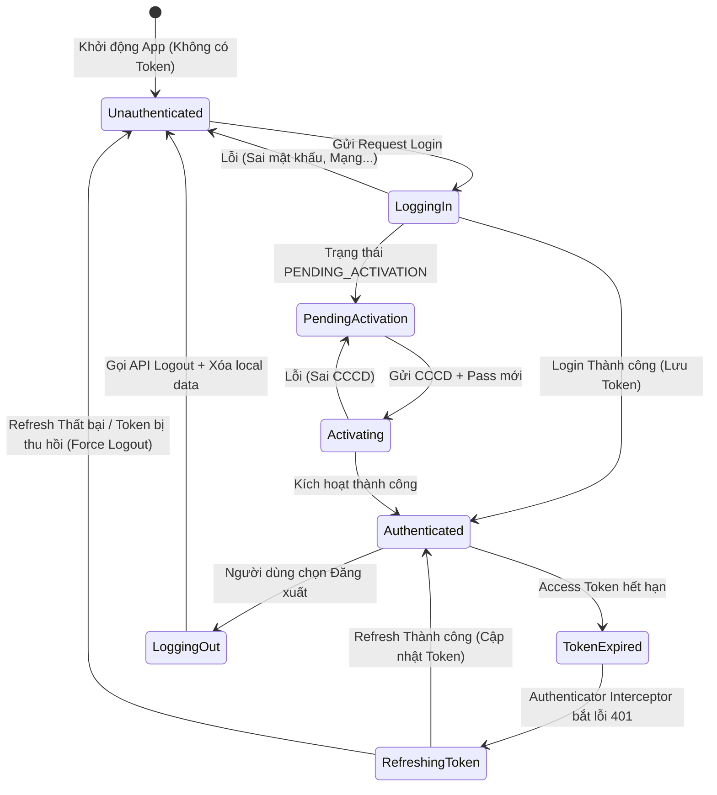

# State Diagram (Authentication Lifecycle)

Sơ đồ thể hiện vòng đời trạng thái xác thực của người dùng trên ứng dụng Mobile.

## Các trạng thái (States)

1. **Unauthenticated**: Trạng thái mặc định khi người dùng chưa đăng nhập, hoặc vừa bị Force Logout. Giao diện hiển thị `LoginScreen`.
2. **LoggingIn**: Đang gọi API `/login` (Hiển thị Loading Indicator).
3. **PendingActivation**: Yêu cầu người dùng (Tân sinh viên) nhập mật khẩu tạm để kích hoạt tài khoản. Hiển thị `ActivationScreen`.
4. **Activating**: Đang gọi API `/activate` (Loading).
5. **Authenticated**: Có Access Token và Refresh Token hợp lệ trên bộ nhớ máy. Trạng thái bình thường để duyệt các tính năng của App.
6. **TokenExpired**: Thời điểm Access Token đã hết hạn, Request API mang tính nghiệp vụ bị Backend từ chối với lỗi 401. Trạng thái ngầm của hệ thống.
7. **RefreshingToken**: Hệ thống (OkHttp Interceptor) tự động chặn các request lại và đi xin cấp Token mới.
8. **LoggingOut**: Đang tiến hành xóa token khỏi hệ thống Backend (gọi API /logout) và xóa data ở local.
