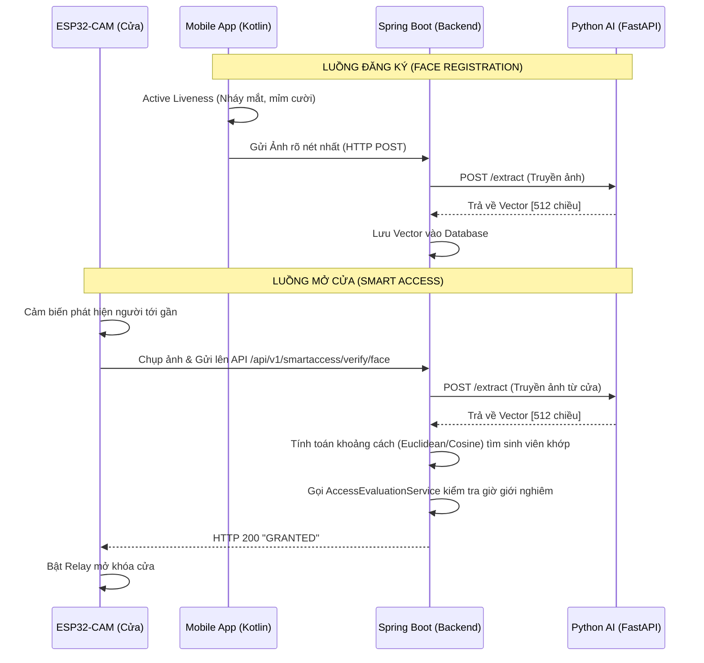

# TÀI LIỆU ĐỊNH HƯỚNG KIẾN TRÚC & ROADMAP TÍCH HỢP HỆ THỐNG
**Dự án:** Smart Dormitory Management System (SDMS)
**Module:** Smart Access & Face Recognition
**Phiên bản:** 1.0 (Kiến trúc Python AI Sidecar & Backend-Centric)

---

## 1. TỔNG QUAN KIẾN TRÚC MỚI
Sau quá trình Audit và phân tích rào cản kỹ thuật, hệ thống chốt sử dụng kiến trúc **"Backend làm Trung tâm phân tích AI" (Backend-Centric AI)** với sự hỗ trợ của một **Python Microservice**. 

Kiến trúc này giải quyết triệt để 2 vấn đề lớn nhất của đồ án:
1. Con chip ESP32-CAM quá yếu để tự nhận diện khuôn mặt. Nó chỉ đóng vai trò Camera thụ động.
2. Tránh việc Spring Boot bị sập (Crash JVM) nếu chạy trực tiếp các thư viện C++ (OpenCV/TensorFlow) trên server.

### Luồng Dữ liệu (Data Flow)


---

## 2. KẾ HOẠCH THỰC THI CHO TỪNG MODULE (ROADMAP)

### Giai đoạn 1: Triển khai Python AI Sidecar [COMPLETED]
Đây là trái tim của hệ thống nhận diện.
- **Công nghệ:** Python, FastAPI, PyTorch, OpenCV.
- **Nhiệm vụ:**
  - Copy file mô hình AI (`vggface2.pt`) đang dùng bên App Android bỏ sang Server Python để đảm bảo đồng nhất đầu ra là mảng Float 512 chiều.
  - Viết 1 API duy nhất: `POST /api/v1/faces/extract`.
  - API nhận vào `MultipartFile` (Hình ảnh), dùng OpenCV cắt lấy khuôn mặt, ném vào TFLite và `return` về mảng Float.

### Giai đoạn 2: Điều chỉnh Spring Boot Backend [COMPLETED]
- **Tích hợp Python:** Mở file `RestAiExtractionAdapter.java`, xóa đoạn code sinh Vector Mock (random array), thay bằng RestTemplate gọi thực tế tới `http://localhost:8000/api/v1/faces/extract`.
- **Viết API cho Cửa (ESP32):** Tạo endpoint `POST /api/v1/smartaccess/verify/face`.
- **Thuật toán so khớp (Matching):** Viết một hàm tính khoảng cách `Euclidean Distance` (hoặc `Cosine Similarity`) bằng Java. Duyệt qua mảng `FaceEmbedding` trong DB để tìm người có độ lệch nhỏ nhất (Thường ngưỡng Threshold = 0.6). Nếu tìm thấy, ném qua `AccessEvaluationService` để check Rule.

### Giai đoạn 3: Viết Firmware cho ESP32-CAM (Priority: High)
- **Công nghệ:** C++ (Arduino IDE).
- **Nhiệm vụ:**
  - Kết nối Wi-Fi.
  - Khởi tạo phần cứng Camera.
  - Lắng nghe Nút nhấn hoặc Cảm biến PIR.
  - Khi có tín hiệu: Gọi hàm `esp_camera_fb_get()` lấy Frame ảnh hiện tại, đóng gói HTTP Multipart POST và bắn thẳng lên IP của Spring Boot Backend.
  - Đọc HTTP Response: Nếu chữ chứa `GRANTED`, ghi chân GPIO (ví dụ chân số 4) lên `HIGH` trong 5 giây để kích Relay nam châm mở cửa. Trả về `LOW` để đóng cửa.

### Giai đoạn 4: Điều chỉnh Mobile App Kotlin (Priority: Medium)
- **Cắt giảm:** Xóa bỏ code trích xuất Vector bằng TFLite ở bước Đăng ký (để App nhẹ đi).
- **Giữ lại:** Bắt buộc giữ lại luồng Liveness Detection (nháy mắt, mỉm cười) để chống giả mạo bằng ảnh tĩnh.
- **Giao tiếp:** Gọi API upload File Ảnh lên Spring Boot khi người dùng hoàn tất đăng ký.
- **Giá trị gia tăng (Tùy chọn):** Nếu muốn tận dụng tính năng Offline / Room DB cũ, có thể sửa đổi thành tính năng **"Face Login"** (Mở app không cần mật khẩu, chỉ cần đưa mặt vào).

---

## 3. KHUYẾN NGHỊ TỪ ARCHITECT
- **Bắt đầu từ đâu?** Hãy code Python API Sidecar và test nó bằng Postman trước. Đảm bảo bạn ném 2 cái ảnh của cùng 1 người vào, Vector trả ra phải giống nhau (khoảng cách cực thấp). 
- **Networking:** Khi nối ESP32-CAM với Backend, nếu đang chạy ở Localhost (Máy tính cá nhân), nhớ lấy IPv4 LAN (ví dụ `512.168.1.x`) để nạp cứng vào code ESP32, không dùng `localhost`.
- **An ninh:** Tuyệt đối không lưu ảnh của sinh viên ở định dạng file tĩnh (jpg/png) nếu không cần thiết. Sau khi trích xuất ra Vector số, hãy xóa ảnh gốc đi để tiết kiệm ổ cứng và tuân thủ chuẩn Privacy.
# BÁO CÁO AUDIT HỆ THỐNG SMART ACCESS & FACE RECOGNITION (SDMS)

*Ngày lập báo cáo: 02/07/2026*
*Vai trò thực hiện: Principal Solution Architect & Tech Lead*

---

## 1. Tổng quan hệ thống
Kiến trúc tổng thể của hệ thống bao gồm sự kết hợp giữa thiết bị IoT (ESP32-CAM), AI (Kotlin) và Backend (Spring Boot). Tuy nhiên, sau khi quét toàn bộ kho lưu trữ mã nguồn hiện tại, tôi nhận thấy **chỉ có Backend (Spring Boot)** được triển khai một phần. Các component quan trọng như App Kotlin (AI), ESP32-CAM (Firmware), Gateway, MQTT Broker hoàn toàn vắng mặt trong repo này. Hệ thống Backend hiện tại đóng vai trò xử lý Business Rule, nhưng bị đứt gãy luồng kết nối IoT (không thể điều khiển mở cửa thực tế).

---

## 2. Thành phần đã hoàn thiện (DONE)
Dựa trên mã nguồn Spring Boot, các thành phần sau đã được triển khai hoàn thiện về mặt Core Business Logic:

- **Face Module (Data & Logic)**:
  - Các Entity cốt lõi: `FaceProfile`, `FaceEmbedding`, `FaceVerificationAttempt`.
  - Quản lý phiên bản khuôn mặt (`FaceProfileService`).

- **Smart Access (Business Rules)**:
  - Đánh giá quyền truy cập dựa trên Time Window & Curfew Policy (`AccessEvaluationService`, `TimeWindowEvaluationStrategy`, `CurfewResolutionStrategy`).
  - Xử lý Idempotency chống trùng lặp sự kiện (`IdempotencyService`).
  - Ghi nhận lịch sử vào/ra qua `AccessHistoryRepository`.

- **Integration**:
  - Observer Pattern: `IdentityVerifiedEventListener` kết nối rời rạc giữa Face Module và SmartAccess, đảm bảo tính Decoupling.

---

## 3. Thành phần đang dở (PARTIAL)
- **Face Recognition API**: API đã có, cấu trúc orchestration (`FaceAiOrchestrator`) đã có, nhưng port AI (`AiExtractionPort` -> `RestAiExtractionAdapter`) đang bị **Mock dữ liệu**. 
  - *Chi tiết*: Trả về một Mock Vector 512-dimension ngẫu nhiên do *"AI Engine sidecar is pending deployment"*.
- **Remote Unlock**: `RemoteUnlockService` đã được code, vượt qua Curfew Rules và lưu vào bảng `AccessHistory`. Tuy nhiên, dòng code cuối cùng chỉ là comment `// Publish event to trigger IoT module`. Không có sự kiện MQTT nào được gửi xuống phần cứng.
- **Smart Access Evaluation**: Hàm `evaluateAccess()` xử lý logic xong chỉ ghi log vào Database, hoàn toàn thiếu việc Publish MQTT message để relay mở cửa.

---

## 4. Thành phần chưa có (MISSING)
Hệ thống đang thiếu nghiêm trọng các khối nền tảng cho IoT và AI thực tế:
- Không có bất kỳ file `.kt`, `.ino`, `.cpp` nào trong dự án (Missing AI App & Firmware).
- Hoàn toàn vắng bóng cấu trúc cấu hình MQTT (Publisher/Subscriber/QoS).
- Không có module IoT/Device để quản lý trạng thái các mạch ESP32 và Camera.

---

## 5. Sai kiến trúc
- **Trách nhiệm AI không rõ ràng**: Tài liệu có đề cập "AI viết bằng Kotlin" nhưng Adapter của Backend lại comment gọi đến "External Python AI service". Hơn nữa, việc đẩy tính toán AI xuống Edge (App Kotlin) hay gom lên Server (Python/Backend) chưa được chốt dứt điểm. Nếu App Kotlin làm AI, thì Backend không cần `AiExtractionAdapter` gọi REST API nữa, mà App Kotlin phải tự gửi kết quả nhận diện kèm Event lên Backend.
- **Micro-services / Gateway**: Thiếu Gateway (API Gateway / IoT Gateway) dẫn đến Backend Spring Boot đang ôm đồm quá nhiều việc, từ Core API REST cho đến dự kiến giao tiếp trực tiếp với thiết bị phần cứng.

---

## 6. Thiếu Business Rule
- **Các luồng cực đoan (Edge cases)**: Không có logic xử lý khi cửa bị giữ mở quá lâu (Door Held Open), cửa bị phá (Forced Entry).
- **Đồng bộ Offline**: Không có rule để xử lý khi ESP32 mất mạng nhưng vẫn phải cho sinh viên quẹt thẻ/khuôn mặt offline.
- **Anti-Spam**: Không có cơ chế giới hạn tần suất quẹt thẻ/mặt liên tục.

---

## 7. Thiếu API
Mặc dù API cho Face đã có, nhưng chúng ta vẫn thiếu:
- **Device API**: Đăng ký ESP32, Cập nhật IP/Mac address, Heartbeat status.
- **Door API**: Thiết lập quan hệ mapping giữa Camera ID <-> Door ID <-> Relay ID.
- **Command API**: Retry Command, Force Lock, Emergency Open (Mở toàn bộ cửa khi có báo cháy).

---

## 8. Thiếu Database
Phần cốt lõi của SmartAccess mới chỉ có `AccessHistory`, `CurfewPolicy`. Hoàn toàn thiếu các bảng vật lý:
- `Device` (Lưu thông tin ESP32-CAM)
- `Door` (Lưu thông tin cửa vật lý)
- `Camera` (Liên kết Camera với Cửa)
- `DoorCommand` / `DoorCommandHistory` (Lưu trạng thái lệnh gửi xuống thiết bị)
- `DeviceHeartbeat` (Kiểm tra Online/Offline)

---

## 9. Thiếu Security
- **Device Authentication**: ESP32-CAM gọi lên Backend không có xác thực (ví dụ thiếu x509 certificate hoặc MQTT Username/Password).
- **Face Spoofing (Liveness Detection)**: Đang thiếu cơ chế chống dùng ảnh in, màn hình điện thoại (Fake image) để đánh lừa Camera.
- **Replay Attack**: MQTT/REST Payload từ thiết bị chưa có Timestamp, Nonce hoặc HMAC. Kẻ gian có thể capture gói tin "Unlock" và replay lại.
- **Data in transit**: Mất kiểm soát TLS/SSL cho luồng IoT.

---

## 10. Thiếu IoT
- **ESP32 Firmware**: Chưa có mã nguồn C++/Arduino điều khiển Capture Image, MQTT Client, GPIO Relay.
- **Heartbeat & Health Check**: Không biết được Camera nào đang hỏng, cửa nào đang kẹt.
- **Offline Queue**: Không có hàng đợi lệnh. Ví dụ: Lệnh mở cửa từ xa gửi xuống nhưng rớt mạng, lúc có mạng lại thì cửa có tự mở không? Cần cơ chế QoS và TTL cho MQTT.

---

## 11. Thiếu AI
- **Mã nguồn AI**: Kotlin AI không tồn tại trong repo hiện hành.
- **Face Registration**: Backend mới có cấu trúc lưu vector, nhưng chưa có luồng Crop/Cắt mặt/Extract Embedding thực tế.
- **Face Evolution**: Thiếu chức năng tự động cập nhật độ chính xác khi đặc điểm khuôn mặt của sinh viên thay đổi qua các năm.

---

## 12. Thiếu Gateway
- Dự án **CHƯA CÓ GATEWAY**.
- **Mức độ ảnh hưởng**: Trung bình đến Cao.
- **Đánh giá**: Mặc dù không bắt buộc phải có API Gateway (như Kong/Traefik) nếu chỉ là Monolithic Spring Boot, nhưng **RẤT CẦN một IoT Gateway (Edge node)** nếu có hàng ngàn ESP32-CAM. Việc đẩy thẳng luồng ảnh/stream từ hàng ngàn sinh viên lên thẳng Server sẽ làm quá tải hệ thống. IoT Gateway ở tòa nhà sẽ làm nhiệm vụ gom gói tin MQTT, Cache Rule, và xử lý Face Recognition sơ bộ.

---

## 13. Thiếu MQTT
Toàn bộ phần giao tiếp thiết bị đang là khoảng trống.
- Chưa có MQTT Broker (Mosquitto/EMQX).
- Thiếu định nghĩa Topic Design (Ví dụ: `sdms/buildingA/door1/unlock`).
- Chưa cấu hình Spring Integration MQTT (Publish/Subscribe).
- Thiếu thiết kế Quality of Service (Ít nhất phải dùng QoS 1 cho các lệnh đóng mở cửa).

---

## 14. Thiếu Audit
Hệ thống log `AccessHistory` khá tốt khi lưu lại được `denialReason`. Tuy nhiên, bảng Audit toàn cục (System Log) còn thiếu việc tracking:
- Sự kiện vè cửa: `DOOR_FORCED_OPEN`, `DOOR_HELD_OPEN`.
- Trạng thái thiết bị: `DEVICE_ONLINE`, `DEVICE_OFFLINE`.
- Lịch sử vận hành: `REMOTE_UNLOCK` (Chưa có hệ thống Audit Trail truy xuất độc lập chống chối bỏ việc ai là người nhấn nút mở từ xa).

---

## 15. Khả năng mở rộng (Scalability cho RFID/Fingerprint)
**ĐÁNH GIÁ: CỰC KỲ TỐT.**
Kiến trúc SmartAccess trong mã nguồn hiện tại được thiết kế theo hướng **Domain-Driven Design (DDD)** và rất mở:
- Entity `AccessHistory` đã định nghĩa field `method` (Type: `VerificationMethod`).
- Các hàm của `AccessEvaluationService` không bị trói buộc với Face ID. Nó nhận vào thông tin `studentId`, `gateId` và `method`.
- Vì vậy, sau này nếu thêm RFID, Vân tay hay QR Code, hệ thống chỉ cần tạo ra các Listener mới (vd: `RfidScannedEventListener`), gọi vào hàm `evaluateAccess` và truyền thêm `VerificationMethod.RFID`. Toàn bộ rules (Curfew, TimeWindow) vẫn sẽ được tái sử dụng 100%.

---

## KẾT LUẬN & MỨC ĐỘ SẴN SÀNG (%)
| Hạng mục | Độ hoàn thiện | Ghi chú |
| :--- | :---: | :--- |
| **Backend Business Logic** | 80% | Kiến trúc sạch, OOP và Design Pattern tốt. Đã có đủ rule. |
| **API & Database IoT** | 10% | Chỉ có log Access, thiếu toàn bộ Device/Door/Command Entities. |
| **MQTT Integration** | 0% | Chưa có broker và cơ chế pub/sub. |
| **AI (Face Engine)** | 10% | Đang mock vector 512, chưa tích hợp Engine thực. |
| **ESP32 Firmware** | 0% | Mã nguồn trống. |
| **Security & Auditing** | 30% | Auth REST tốt nhưng Security cho IoT là Zero. |
| **TỔNG THỂ DỰ ÁN** | **~25%** | **Sẵn sàng Demo Mockup. Chưa thể chạy thiết bị phần cứng.** |

**Lời khuyên của Architect:** Khoan tối ưu hay thêm tính năng REST mới. Nhiệm vụ cấp bách nhất bây giờ là **Dựng Database cho Device/Door**, **Setup MQTT Broker** và **Viết ESP32 Firmware** để đả thông luồng End-to-End từ Hardware chạy lên Backend và ngược lại.
# BÁO CÁO KIỂM TOÁN TÍCH HỢP MQTT (MQTT INTEGRATION AUDIT)

**Dự án:** Smart Dormitory Management System (SDMS)
**Phạm vi:** SDMS Backend (Java Spring Boot)
**Mục tiêu:** Trích xuất toàn bộ thông tin cấu hình, luồng dữ liệu và thiết kế MQTT hiện tại để phục vụ tích hợp thiết bị IoT (ESP32-CAM) và kiểm thử.

---

## 1. MQTT Configuration

Thông tin cấu hình MQTT Broker hiện tại trong Backend được định nghĩa tại file cấu hình mặc định, có thể bị ghi đè bởi `application.yml` thông qua các biến môi trường:

*   **File cấu hình chính:** `src/main/java/com/sdms/backend/modules/smartaccess/infrastructure/config/MqttConfig.java`
*   **Broker URL (Host & Port):** `${sdms.mqtt.url:tcp://localhost:1883}` (Mặc định: localhost, port 1883)
*   **Username:** `${sdms.mqtt.username:}` (Mặc định: rỗng)
*   **Password:** `${sdms.mqtt.password:}` (Mặc định: rỗng)
*   **ClientId:** `sdms-backend-pub- + UUID.randomUUID()` (Ví dụ: `sdms-backend-pub-123e4567-e89b-12d3-a456-426614174000`)
*   **Auto Reconnect:** `true` (Cấu hình tự động kết nối lại khi mất mạng)
*   **Clean Session:** `true`
*   **Connection Timeout:** `10` giây

---

## 2. MQTT Libraries

Dự án đang sử dụng các thư viện tích hợp MQTT tiêu chuẩn của hệ sinh thái Spring. 

**Dependencies (Trích từ `pom.xml`):**
```xml
<dependency>
    <groupId>org.springframework.integration</groupId>
    <artifactId>spring-integration-mqtt</artifactId>
</dependency>
<dependency>
    <groupId>org.eclipse.paho</groupId>
    <artifactId>org.eclipse.paho.client.mqttv3</artifactId>
    <version>1.2.5</version>
</dependency>
```
*Ghi chú: Đang sử dụng **Eclipse Paho MQTT v3 Client** thông qua Spring Integration.*

---

## 3. MQTT Beans

Các Spring Bean đảm nhiệm việc giao tiếp MQTT:

1.  **`mqttClientFactory`** (`DefaultMqttPahoClientFactory`)
    *   *Package:* `...infrastructure.config.MqttConfig`
    *   *Nhiệm vụ:* Khởi tạo kết nối tới Broker, thiết lập timeout, session, và credentials.
2.  **`mqttOutboundChannel`** (`DirectChannel`)
    *   *Package:* `...infrastructure.config.MqttConfig`
    *   *Nhiệm vụ:* Kênh message nội bộ của Spring Integration để đẩy dữ liệu ra ngoài.
3.  **`mqttOutbound`** (`MqttPahoMessageHandler`)
    *   *Package:* `...infrastructure.config.MqttConfig`
    *   *Nhiệm vụ:* Đóng vai trò là Service Activator, nhận message từ `mqttOutboundChannel` và publish lên MQTT Broker theo giao thức bất đồng bộ (`async=true`).
4.  **`MqttGateway`** (Interface có `@MessagingGateway`)
    *   *Package:* `...infrastructure.config.MqttGateway`
    *   *Nhiệm vụ:* Cung cấp method `sendToMqtt(topic, payload)` để các Service trong tầng Application dễ dàng gọi mà không bị phụ thuộc vào Spring Integration API.

---

## 4. MQTT Publish

Dưới đây là các vị trí mã nguồn thực hiện việc Publish dữ liệu lên MQTT Broker:

### 4.1. Gate Command Publish
*   **Class:** `SmartAccessMqttListener.java`
*   **Method:** `handleGateCommand(GateCommandEvent event)`
*   **Topic:** `sdms/gates/{gateId}/command`
*   **Payload:** `{"command": "UNLOCK", "reason": "...", "timestamp": 123456789}`
*   **Trigger:** Khi Admin gọi API Remote Unlock thành công.

### 4.2. Emergency Broadcast Publish
*   **Class:** `SmartAccessMqttListener.java`
*   **Method:** `handleSystemEmergency(SystemEmergencyEvent event)`
*   **Topic:** 
    *   `sdms/gates/building/{buildingId}/command` (Nếu khẩn cấp theo tòa)
    *   `sdms/gates/system/broadcast` (Nếu khẩn cấp toàn khu)
*   **Payload:** `{"command": "OPEN_ALL", "reason": "...", "timestamp": 123456789}`
*   **Trigger:** Khi Admin kích hoạt chế độ khẩn cấp (Emergency Override).

### 4.3. Offline Whitelist Sync Publish
*   **Class:** `SmartAccessMqttListener.java`
*   **Method:** `syncWhitelistToEdge()`
*   **Topic:** `sdms/gates/system/whitelist`
*   **Payload:** `{"type": "WHITELIST_SYNC", "count": 10, "data": ["RFID1", "RFID2"], "timestamp": 123456789}`
*   **Trigger:** Tự động gọi mỗi khi có sinh viên Check-out (trả phòng) hoặc được Gán thẻ RFID mới.

---

## 5. MQTT Subscribe

**Trạng thái hiện tại:** CHƯA CÓ SUBSCRIBER NÀO Ở BACKEND.

**Phân tích:** 
Trong kiến trúc hiện hành, Backend chỉ đóng vai trò là **Publisher** gửi lệnh điều khiển (Command) và đồng bộ danh sách (Sync). 
Thiết bị ESP32 giao tiếp ngược lại với Backend (gửi ảnh khuôn mặt, gửi mã thẻ RFID) thông qua **REST API** (`IotVerificationController` - POST `/api/v1/smartaccess/verify/face` và `/verify/card`) chứ không dùng MQTT. Vì vậy, không có `MqttPahoMessageDrivenChannelAdapter` nào được định nghĩa để Subscribe.

---

## 6. MQTT Topic Design

| Topic | Publisher | Subscriber | Payload | Mục đích |
|--------|-----------|------------|----------|----------|
| `sdms/gates/{gateId}/command` | Backend | ESP32 (Gate) | JSON (Command) | Bắn lệnh mở/đóng cửa riêng lẻ cho từng cổng. |
| `sdms/gates/building/{buildingId}/command`| Backend | Các ESP32 trong tòa nhà | JSON (Command) | Mở tất cả các cửa của một tòa nhà khi khẩn cấp. |
| `sdms/gates/system/broadcast` | Backend | Tất cả ESP32 | JSON (Command) | Lệnh hệ thống khẩn cấp, tác động lên toàn bộ KTX. |
| `sdms/gates/system/whitelist` | Backend | Tất cả ESP32 | JSON (Sync) | Đồng bộ mảng mã thẻ RFID để ESP32 lưu cache offline. |

---

## 7. Payload Contract

Dưới đây là cấu trúc JSON cho các Topic đã thiết kế:

**Lệnh mở cửa (UNLOCK):**
```json
{
  "command": "UNLOCK",
  "reason": "Admin remote unlocked",
  "timestamp": 1751238472819
}
```

**Lệnh khẩn cấp (EMERGENCY):**
```json
{
  "command": "OPEN_ALL",
  "reason": "Fire alarm triggered",
  "timestamp": 1751238472819
}
```

**Đồng bộ danh sách ngoại tuyến (WHITELIST_SYNC):**
```json
{
  "type": "WHITELIST_SYNC",
  "count": 3,
  "data": [
    "A1B2C3D4",
    "E5F6G7H8",
    "I9J0K1L2"
  ],
  "timestamp": 1751238472819
}
```

---

## 8. REST API liên quan MQTT

Các REST API sau đây khi gọi thành công sẽ kích hoạt luồng phát sinh Message MQTT:

### Luồng 1: Mở cửa từ xa (Remote Unlock)
```
POST /api/v1/access/gates/{gateId}/unlock
  ↓
RemoteUnlockController.unlockGate()
  ↓
RemoteUnlockService.executeRemoteUnlock()
  ↓ (Ghi lịch sử vào DB xong)
EventPublisher.publishEvent(GateCommandEvent)
  ↓
SmartAccessMqttListener.handleGateCommand()
  ↓
MqttGateway.sendToMqtt("sdms/gates/{gateId}/command", payload)
```

### Luồng 2: Kích hoạt khẩn cấp (Emergency Override)
```
POST /api/v1/access/emergency
  ↓
EmergencyOverrideController.executeOverride()
  ↓
EmergencyOverrideService.executeEmergencyOverride()
  ↓
EventPublisher.publishEvent(SystemEmergencyEvent)
  ↓
SmartAccessMqttListener.handleSystemEmergency()
  ↓
MqttGateway.sendToMqtt("sdms/gates/building/{id}/command", payload)
```

---

## 9. Sự kiện cốt lõi (Events)

Backend áp dụng **Event-Driven Architecture** thông qua Spring Application Events để decoupling logic nghiệp vụ và logic IoT.

*   `GateCommandEvent`: Chứa thông tin cổng và lệnh.
*   `SystemEmergencyEvent`: Chứa cờ báo khẩn cấp và ID tòa nhà.
*   `StudentCheckedOutEvent`: Báo hiệu một sinh viên vừa rời KTX, cần cập nhật whitelist.
*   `StudentRfidAssignedEvent`: Báo hiệu một sinh viên vừa được cấp thẻ, cần cập nhật whitelist.

**Lưu ý kỹ thuật:** Tất cả các Listener trong `SmartAccessMqttListener` đều dùng `@TransactionalEventListener(phase = TransactionPhase.AFTER_COMMIT)`. Nghĩa là lệnh MQTT chỉ thực sự được gửi đi sau khi dữ liệu lịch sử/nhật ký đã lưu thành công vào Database. Điều này ngăn chặn việc "cửa đã mở nhưng Database bị rollback".

---

## 10. ESP32 Integration Readiness

**Đánh giá mức độ sẵn sàng:** Đủ điều kiện để kết nối một chiều (Backend ra lệnh -> ESP32 thực thi).

**Các điểm thiếu hụt (Gaps) cần lưu ý khi lập trình C++ cho ESP32:**
1.  **Không có MQTT ACK:** Backend bắn lệnh ra đi và tin rằng ESP32 nhận được (Fire and Forget). Backend không có logic Subscribe để lắng nghe thông báo "Đã mở cửa thành công" từ ESP32 qua MQTT. 
2.  **Không có Heartbeat/Device Status:** Hiện tại Backend chưa có bảng lưu trạng thái Online/Offline của thiết bị ESP32 (ping pong).
3.  **Bất đồng bộ (Lai REST & MQTT):** ESP32 phải code cả thư viện `HTTPClient` để gửi ảnh khuôn mặt lên `POST /api/v1/smartaccess/verify/face` (Synchronous HTTP) VÀ thư viện `PubSubClient` để lắng nghe lệnh mở cửa từ `MQTT` (Asynchronous).

---

## 11. Hướng dẫn kiểm thử bằng MQTT Explorer

Bạn có thể giả lập thiết bị ESP32 hoàn toàn trên máy tính mà không cần có mạch thực tế:

1.  **Cài đặt & Khởi động MQTT Broker:** Chạy Mosquitto (port 1883).
2.  **Giả lập thiết bị (MQTT Explorer):**
    *   Mở MQTT Explorer, kết nối vào `localhost:1883`.
    *   Thêm Topic vào ô Subscribe: `sdms/gates/#`
3.  **Kích hoạt luồng (Postman / Swagger):**
    *   Chạy Backend Spring Boot.
    *   Gọi API: `POST http://localhost:8080/api/v1/access/gates/G123/unlock` (Kèm Token Admin hợp lệ).
4.  **Kết quả mong đợi:** 
    *   API trả về `204 No Content`.
    *   Tại màn hình MQTT Explorer, một message lập tức xuất hiện tại topic `sdms/gates/G123/command` với nội dung `{"command":"UNLOCK",...}`.

---

## 12. Architecture Review

**Ưu điểm:**
*   Tuân thủ tốt **Clean Architecture / Hexagonal Architecture**: Mã nguồn nghiệp vụ (`RemoteUnlockService`) không hề biết đến sự tồn tại của thư viện Eclipse Paho. Nó chỉ quăng ra một `GateCommandEvent`. Phần tích hợp hạ tầng (`MqttListener`, `MqttGateway`) sẽ lo việc chuyển giao thức.
*   An toàn dữ liệu nhờ `@TransactionalEventListener(AFTER_COMMIT)`.
*   Giảm tải cho MQTT Broker vì luồng nhận diện ảnh nặng nề được thực hiện qua REST API thay vì ép MQTT chở file nhị phân lớn.

**Nhược điểm / Technical Debt:**
*   Sự thiếu vắng luồng nhận tín hiệu từ thiết bị (Inbound MQTT) làm cho Backend "bị mù" về trạng thái thật của cánh cửa (cửa có bị kẹt không, có mở thật không).
*   Chưa có Security (Username/Password, SSL/TLS) rõ ràng trên cấu hình mặc định (dễ bị nghe lén payload nếu chạy public broker).

**Khuyến nghị cho nhóm IoT (ESP32):**
*   Thiết kế mạch ESP32 tập trung xử lý REST API để xác thực và tải whitelist. Dùng luồng MQTT chỉ như một "kênh Wake-up" hoặc kênh nhận lệnh Override từ Admin.
