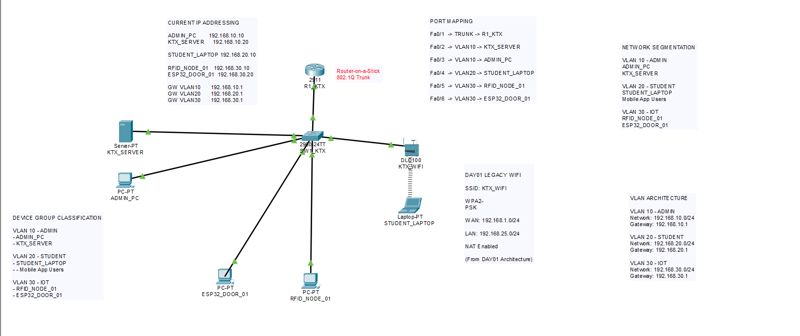

# DAY 02 - PHÂN ĐOẠN MẠNG VLAN VÀ ROUTER-ON-A-STICK

## Topology

## Mục tiêu

Mục tiêu của DAY 02 là chuyển đổi kiến trúc mạng từ mô hình mạng phẳng (Flat Network) sang mô hình mạng doanh nghiệp sử dụng VLAN nhằm tăng cường bảo mật, khả năng quản lý và khả năng mở rộng cho hệ thống Ký túc xá thông minh.

---

## Các công việc đã thực hiện

### 1. Phân tích yêu cầu hệ thống

Xác định các nhóm thiết bị trong hệ thống Smart Dormitory:

* Nhóm quản trị (Admin)
* Nhóm người dùng sinh viên (Student)
* Nhóm thiết bị IoT

Từ đó xây dựng phương án phân đoạn mạng phù hợp.

---

### 2. Thiết kế Network Segmentation

Hệ thống được chia thành ba vùng mạng logic:

| VLAN    | Chức năng         |
| ------- | ----------------- |
| VLAN 10 | Quản trị hệ thống |
| VLAN 20 | Sinh viên         |
| VLAN 30 | Thiết bị IoT      |

Việc phân tách này giúp hạn chế truy cập trái phép giữa các nhóm thiết bị.

---

### 3. Thiết kế kiến trúc VLAN

| VLAN ID | VLAN Name | Network         |
| ------- | --------- | --------------- |
| 10      | ADMIN     | 192.168.10.0/24 |
| 20      | STUDENT   | 192.168.20.0/24 |
| 30      | IOT       | 192.168.30.0/24 |

---

### 4. Tạo VLAN trên Switch Cisco 2960

Đã cấu hình thành công:

* VLAN 10 - ADMIN
* VLAN 20 - STUDENT
* VLAN 30 - IOT

Đồng thời thực hiện gán Access Port cho từng VLAN tương ứng.

---

### 5. Cấu hình Trunk Port

Cổng kết nối giữa Switch và Router được cấu hình ở chế độ Trunk sử dụng chuẩn IEEE 802.1Q.

Điều này cho phép nhiều VLAN truyền trên cùng một kết nối vật lý.

---

### 6. Triển khai Router-on-a-Stick

Router Cisco 2911 được cấu hình các Sub-Interface:

| Interface | Gateway      |
| --------- | ------------ |
| Gi0/0.10  | 192.168.10.1 |
| Gi0/0.20  | 192.168.20.1 |
| Gi0/0.30  | 192.168.30.1 |

Router đóng vai trò Gateway cho từng VLAN.

---

### 7. Chuyển đổi địa chỉ IP

Các thiết bị được cấu hình lại theo kiến trúc VLAN mới:

#### VLAN 10 - ADMIN

* ADMIN_PC → 192.168.10.10
* KTX_SERVER → 192.168.10.20

Gateway:

192.168.10.1

#### VLAN 30 - IOT

* RFID_NODE_01 → 192.168.30.10
* ESP32_DOOR_01 → 192.168.30.20

Gateway:

192.168.30.1

---

### 8. Kiểm thử hệ thống

Đã thực hiện:

* Ping trong VLAN 10
* Ping trong VLAN 30
* Kiểm tra trạng thái VLAN
* Kiểm tra Trunk Port
* Kiểm tra Router Sub-Interface

Kết quả:

Toàn bộ cấu hình hoạt động chính xác.

---

## Kiến thức đạt được

Sau DAY 02 đã nắm được:

* VLAN
* Broadcast Domain
* Access Port
* Trunk Port
* IEEE 802.1Q
* Router-on-a-Stick
* Inter-VLAN Routing
* Network Segmentation

---

## Liên hệ với đồ án Smart Dormitory

Kiến trúc VLAN giúp tách biệt:

* Máy chủ Spring Boot và PostgreSQL
* Người dùng sinh viên
* Thiết bị ESP32, RFID, Face Recognition

Mô hình này phù hợp với kiến trúc triển khai thực tế của hệ thống Ký túc xá thông minh, đồng thời tạo nền tảng cho các nội dung bảo mật và kiểm soát truy cập ở DAY 03.

---

## Kết luận

DAY 02 đã hoàn thành việc chuyển đổi hệ thống từ mô hình mạng phẳng sang kiến trúc mạng doanh nghiệp sử dụng VLAN. Hệ thống hiện đã sẵn sàng cho việc triển khai các chính sách bảo mật, Access Control và tích hợp các thành phần IoT ở các giai đoạn tiếp theo.
