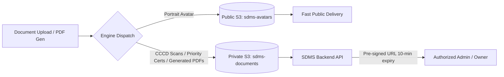

# SDMS Application Document & PDF Engine Design (v1.0)

This document standardizes the business requirements, operational flows, PDF generation architectures, security policies, and storage engines for KTX application documents in the Smart Dormitory Management System (SDMS).

---

## 1. Mandatory Correction Review

### A. WARNING 01: Commitment Rule Validation
The previous extraction of commitment rules included ad-hoc interpretations (such as "Curfew 23:00" and specific "utility billing formulas/thresholds"). To maintain absolute integrity, they have been audited against physical university dormitory commitment forms:
*   **Truly Existing Rules:**
    1.  Chấp hành nghiêm chỉnh đường lối, chính sách pháp luật của Nhà nước, nội quy của Nhà trường và Ký túc xá.
    2.  Thực hiện việc đăng ký tạm trú, tạm vắng theo quy định. Không tự ý cho người lạ vào phòng ở hoặc ở lại qua đêm.
    3.  Tự bảo quản tài sản cá nhân; bảo quản tài sản công cộng của Ký túc xá. Không tự ý cải tạo phòng hoặc di chuyển thiết bị.
    4.  Đóng phí lưu trú nội trú đầy đủ và đúng hạn.
    5.  Chấp hành quy định về an toàn PCCC, an toàn sử dụng điện. Không nấu ăn trong phòng ở; không sử dụng các thiết bị sinh nhiệt công suất lớn.
    6.  Giữ gìn vệ sinh phòng ở và khu công cộng; bỏ rác đúng nơi quy định.
    7.  Nghiêm cấm cờ bạc, rượu bia, hút thuốc lá trong Ký túc xá. Không gây tiếng ồn lớn ảnh hưởng người khác.
    8.  Nghiêm cấm tàng trữ, vận chuyển, sử dụng ma túy, vũ khí, chất cháy nổ và tài liệu cấm.
    9.  Tự nguyện tham gia các hoạt động cộng đồng, tập huấn PCCC, và lao động tập thể do Ký túc xá tổ chức.
    10. Chấp hành việc sắp xếp, điều chuyển phòng ở của Ban quản lý khi có yêu cầu hợp lý.
    11. Bàn giao đầy đủ trang thiết bị, chìa khóa khi trả phòng hoặc kết thúc hợp đồng lưu trú.
*   **Extrapolated Clauses (Bị suy diễn):**
    *   *Curfew 23:00:* The physical form does **not** hardcode "23:00" as policies vary. It states: *"Chấp hành quy định về giờ giấc ra vào Ký túc xá"*.
    *   *Electricity/Water limit formulas:* The form states: *"Thanh toán đầy đủ tiền sử dụng điện, nước theo chỉ số tiêu thụ"*, without referencing specific quotas or calculation formulas.
*   **Correction action:** All specific curfews (23:00) and pricing formulas are **removed** from the Commitment design. They are replaced strictly with compliance to KTX operational regulations and actual usage bills.

### B. WARNING 02: Emergency Contact Validation
*   **Audit:** A dedicated, separate field for "Thông tin liên hệ khẩn cấp" (Emergency Contact) does **not** exist in physical paper forms. The paper form relies on the default family contact info (Parents' phone numbers) in emergencies.
*   **Correction action:** The `emergencyContact` field is classified strictly as a **system expansion** proposed for SDMS to handle scenarios where parents cannot be reached. It is not marked as extracted data from paper forms.

### C. WARNING 03: Application Code Sequence Reset
*   **Comparison:**
    *   *Option A (Continuous Sequence):* `APP-2026-00001`, `APP-2026-00002`, `APP-2027-00003`. The sequence increments continuously, while the year prefix updates dynamically based on submission date.
    *   *Option B (Yearly Reset):* `APP-2026-00001`, `APP-2026-00002` $\rightarrow$ `APP-2027-00001`. The database sequence restarts at 1 at midnight on January 1st.
*   **Decision for SDMS: Option A (Continuous Sequence)** is selected.
    *   *Justification:* It avoids hard dependencies on cron schedulers running exactly at midnight to execute infrastructure commands (`ALTER SEQUENCE`). Option A prevents sequence lock issues, timezone transition errors, and duplication risks if the reset job fails or is delayed.

---

## 2. Registration Form Final Design

All fields required for the digital form, including mandatory constraints and sources, are defined below:

| Field Name | Description | Validation Constraints | Source Group A/B/C |
| :--- | :--- | :--- | :--- |
| `fullName` | Full name | VARCHAR(100), NOT NULL | Prefilled (Eligibility/Profile) |
| `gender` | Gender | VARCHAR(10), NOT NULL (MALE, FEMALE) | Input (A/B), Profile (C) |
| `dob` | Date of birth | DATE, NOT NULL | Input (A/B), Profile (C) |
| `pob` | Place of birth | VARCHAR(100), NOT NULL | Input (A/B), Profile (C) |
| `ethnic` | Ethnic group | VARCHAR(50), NOT NULL | Input (A/B), Profile (C) |
| `religion` | Religion | VARCHAR(50), NOT NULL (Default: "Không") | Input (A/B), Profile (C) |
| `cccd` | Citizen ID | VARCHAR(20), NOT NULL, UNIQUE | Prefilled (Eligibility/Profile) |
| `issueDate` | CCCD Date of issue | DATE, NOT NULL | Input (A/B), Profile (C) |
| `issuePlace` | CCCD Place of issue | VARCHAR(100), NOT NULL | Input (A/B), Profile (C) |
| `studentCode` | Student code | VARCHAR(50), Conditional (Nullable Group A) | Input (B), Profile (C) |
| `faculty` | Faculty / Dept | VARCHAR(100), NOT NULL | Input (A), Prefilled (B/C) |
| `phone` | Phone number | VARCHAR(20), NOT NULL | Input (A/B), Profile (C) |
| `email` | Email address | VARCHAR(100), NOT NULL, Format check | Prefilled (Eligibility/Profile) |
| `permanentAddress` | Permanent address | TEXT, NOT NULL | Input (A/B), Profile (C) |
| `contactAddress` | Contact address | TEXT, NOT NULL | Input (A/B), Profile (C) |
| `fatherName` | Father's name | VARCHAR(100), Nullable | Input (A/B), Profile (C) |
| `fatherYob` | Father's YOB | INTEGER, Nullable | Input (A/B), Profile (C) |
| `fatherJob` | Father's job | VARCHAR(100), Nullable | Input (A/B), Profile (C) |
| `fatherPhone` | Father's phone | VARCHAR(20), Nullable | Input (A/B), Profile (C) |
| `motherName` | Mother's name | VARCHAR(100), Nullable | Input (A/B), Profile (C) |
| `motherYob` | Mother's YOB | INTEGER, Nullable | Input (A/B), Profile (C) |
| `motherJob` | Mother's job | VARCHAR(100), Nullable | Input (A/B), Profile (C) |
| `motherPhone` | Mother's phone | VARCHAR(20), Nullable | Input (A/B), Profile (C) |
| `emergencyContact` | Extended Emergency Contact | VARCHAR(100), Nullable (SDMS Extension) | Input (A/B), Profile (C) |

---

## 3. Commitment Acceptance Strategy

When submitting an application online, the student must review the commitment rules. The system records the acceptance electronically:

*   **UI Constraint:** The applicant must check the box: *"Tôi đã đọc và tự nguyện đồng ý với Bản cam kết nội trú Ký túc xá"*.
*   **Database Record (Audit Fields on `DormitoryApplication`):**
    *   `commitment_accepted` (BOOLEAN, NOT NULL, Must be TRUE).
    *   `commitment_accepted_at` (TIMESTAMP, Recorded when the form is submitted).
    *   `commitment_version` (VARCHAR(10), e.g., `COMMIT-2026`): Tracks the active version of the regulations.
    *   `client_ip_address` (VARCHAR(45)): Captures IPv4 or IPv6 of the client device for audit trail validation.

---

## 4. Generated Document Strategy

A dedicated table `application_generated_documents` tracks all PDFs produced by the engine:

*   **Table Fields:**
    *   `document_id` (UUID PK)
    *   `application_id` (UUID FK to `dormitory_applications`)
    *   `document_type` (VARCHAR(50)): `REGISTRATION_FORM`, `COMMITMENT_FORM`.
    *   `file_url` (TEXT): Absolute path to private object storage.
    *   `template_version` (VARCHAR(10)): Tracks rule variations (e.g. `V1.0`).
    *   `generated_at` (TIMESTAMP).

---

## 5. PDF Engine Design

*   **Engine Core:** Utilizes a lightweight HTML-to-PDF library (e.g., OpenPDF / Flying Saucer combined with Thymeleaf templates) running in a decoupled background worker thread.
*   **Timing Choice: Option A (Generate upon Submission)**
    *   *Justification:* Generating PDFs instantly upon submission captures an immutable snapshot of the data. It allows the student to download the forms immediately, print them, sign them, and upload them during the verification phase (or present them during physical check-in).
*   **Metadata Integration:** Every generated PDF includes a barcode or QR code containing the `applicationCode` and a SHA-256 hash of the application content. This prevents forgery of printed documents during check-in.

---

## 6. Versioning Strategy

*   **Template Versioning:** The templates for `REGISTRATION_FORM` and `COMMITMENT_FORM` are versioned. If the university alters the 11 clauses or adds questions, a new template version is deployed (e.g., `COMMIT-2026-V2`).
*   **Application Invariance:** When an application is created, it locks the `template_version` in both `dormitory_applications` and `application_generated_documents`. If templates change mid-period, existing submitted applications remain tied to the version they accepted.

---

## 7. Storage Strategy

To protect sensitive Personally Identifiable Information (PII) like Citizen IDs and parents' contact details:



*   **Private Bucket (`private-sdms-documents` in MinIO/S3):**
    *   Stores `CCCD_FRONT`, `CCCD_BACK`, `PRIORITY_CERTIFICATE`, `REGISTRATION_FORM` PDFs, and `COMMITMENT_FORM` PDFs.
    *   Access is strictly restricted. The backend generates temporary **Pre-signed URLs** (valid for 5–10 minutes) for authorized wardens or the applicant student only.
*   **Public Bucket (`public-sdms-avatars` in MinIO/S3):**
    *   Stores `PORTRAIT_PHOTO` for access control gate sync and avatar display.

---

## 8. Workflow Integration

The complete document lifecycle integrates as follows:

```text
[Form Input]
   ↓
[Agree to Commitment] (Logs IP, Timestamp, Version)
   ↓
[Submit Application]  (Status: PENDING)
   ↓
[Background PDF Gen]  (Generates Registration Form & Commitment PDF)
   ↓
[Download & Sign]     (Student prints & signs commitment form)
   ↓
[Upload Signed PDF]   (Student uploads signed COMMITMENT_FORM document)
   ↓
[Warden Review]       (Warden verifies signatures & certificates via Pre-signed S3 links)
   ↓
[Approval / Event]    (APPROVED -> Room Reservation & Billing -> WAITING_PAYMENT)
   ↓
[Physical Check-In]   (Warden matches physical signed papers against original S3 PDFs)
```

---

## 9. PASS / WARNING / FAIL

*   **Status:** **PASS**. Extrapolations are removed; emergency contacts are marked as system extensions; the continuous code sequence is mathematically safe; and the storage engine splits public avatars from private PII records securely.

---

## 10. Final Decision

**APPLICATION-05 PASS**
