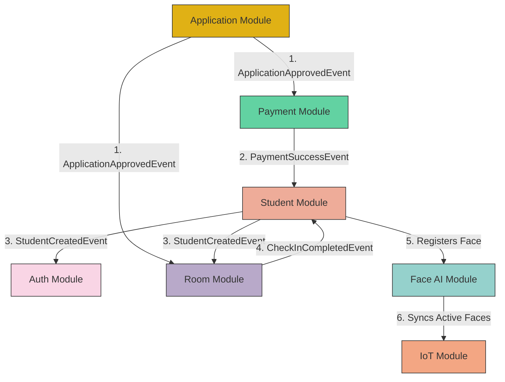

# SDMS Cross-Module Document Dependency Map

**Technical Role**: Lead Systems Architect  
**Status**: **FROZEN**  
**Last Updated**: 2026-06-21  

This document maps all architectural, functional, and event-driven dependencies across the core modules of the Smart Dormitory Management System (SDMS).

---

## 1. System Integration Flow

The diagram below visualizes the architectural dependencies and event-driven choreography among the modules:

---

## 2. Document Dependency Matrix

The table below catalogs specific file-to-file relationships and the nature of their integration:

| Source Document | Target Document | Dependency Type | Description |
| :--- | :--- | :--- | :--- |
| [student_event_integration.md](file:///D:/qt-team-projects/graduation_thesis/smart-dormitory-management-system/sdms-backend/docs/02-student/student_event_integration.md) | [payment_lifecycle_design_audit.md](file:///D:/qt-team-projects/graduation_thesis/smart-dormitory-management-system/sdms-backend/docs/05-payment/payment_lifecycle_design_audit.md) | **Event Consumer** | Student module listens to `PaymentSuccessEvent` published by Payment module to register student profiles. |
| [auth_event_integration.md](file:///D:/qt-team-projects/graduation_thesis/smart-dormitory-management-system/sdms-backend/docs/01-auth/auth_event_integration.md) | [student_lifecycle_design.md](file:///D:/qt-team-projects/graduation_thesis/smart-dormitory-management-system/sdms-backend/docs/02-student/student_lifecycle_design.md) | **Event Consumer** | Auth module listens to `StudentCreatedEvent` published by Student module to provision account credentials. |
| [room_event_integration_audit.md](file:///D:/qt-team-projects/graduation_thesis/smart-dormitory-management-system/sdms-backend/docs/04-room/room_event_integration_audit.md) | [student_lifecycle_design.md](file:///D:/qt-team-projects/graduation_thesis/smart-dormitory-management-system/sdms-backend/docs/02-student/student_lifecycle_design.md) | **Event Consumer** | Room module listens to `StudentCreatedEvent` to trigger linkage of student to the active assignment. |
| [student_event_integration.md](file:///D:/qt-team-projects/graduation_thesis/smart-dormitory-management-system/sdms-backend/docs/02-student/student_event_integration.md) | [room_event_integration_audit.md](file:///D:/qt-team-projects/graduation_thesis/smart-dormitory-management-system/sdms-backend/docs/04-room/room_event_integration_audit.md) | **Event Consumer** | Student module listens to `CheckInCompletedEvent` to transition student status to `ACTIVE`. |
| [room_service_workflow_design_audit.md](file:///D:/qt-team-projects/graduation_thesis/smart-dormitory-management-system/sdms-backend/docs/04-room/room_service_workflow_design_audit.md) | [application_domain_model_audit.md](file:///D:/qt-team-projects/graduation_thesis/smart-dormitory-management-system/sdms-backend/docs/03-application/application_domain_model_audit.md) | **State Pre-condition** | Creating a bed reservation requires an approved dormitory application state. |
| [payment_domain_model_design_audit.md](file:///D:/qt-team-projects/graduation_thesis/smart-dormitory-management-system/sdms-backend/docs/05-payment/payment_domain_model_design_audit.md) | [room_domain_model_entity_audit.md](file:///D:/qt-team-projects/graduation_thesis/smart-dormitory-management-system/sdms-backend/docs/04-room/room_domain_model_entity_audit.md) | **Reference Entity** | Bill entity references the Assignment ID from the Room module to track charges. |
| [payment_database_flyway_design_audit.md](file:///D:/qt-team-projects/graduation_thesis/smart-dormitory-management-system/sdms-backend/docs/05-payment/payment_database_flyway_design_audit.md) | [room_domain_model_entity_audit.md](file:///D:/qt-team-projects/graduation_thesis/smart-dormitory-management-system/sdms-backend/docs/04-room/room_domain_model_entity_audit.md) | **Foreign Key Constraint** | Bills table references assignment_id from Room module student_housing_assignments table. |
| [payment_billing_generalization_design_audit.md](file:///D:/qt-team-projects/graduation_thesis/smart-dormitory-management-system/sdms-backend/docs/05-payment/payment_billing_generalization_design_audit.md) | [room_domain_model_entity_audit.md](file:///D:/qt-team-projects/graduation_thesis/smart-dormitory-management-system/sdms-backend/docs/04-room/room_domain_model_entity_audit.md) | **Generalization Constraint** | Bills table references room_id and student_id to support utility billing and penalties. |
| [payment_boundary_preservation_design_audit.md](file:///D:/qt-team-projects/graduation_thesis/smart-dormitory-management-system/sdms-backend/docs/05-payment/payment_boundary_preservation_design_audit.md) | [room_domain_model_entity_audit.md](file:///D:/qt-team-projects/graduation_thesis/smart-dormitory-management-system/sdms-backend/docs/04-room/room_domain_model_entity_audit.md) | **Boundary Constraint** | Decouples Payment entities from Room and Student JPA objects using plain UUID reference keys. |
| [payment_method_gateway_separation_design.md](file:///D:/qt-team-projects/graduation_thesis/smart-dormitory-management-system/sdms-backend/docs/05-payment/payment_method_gateway_separation_design.md) | [payment_gateway_webhook_design.md](file:///D:/qt-team-projects/graduation_thesis/smart-dormitory-management-system/sdms-backend/docs/05-payment/payment_gateway_webhook_design.md) | **API Design Alignment** | Decouples method from processing gateway in SePay/VietQR webhooks. |
| [payment_architecture_audit.md](file:///D:/qt-team-projects/graduation_thesis/smart-dormitory-management-system/sdms-backend/docs/05-payment/payment_architecture_audit.md) | [application_domain_model_audit.md](file:///D:/qt-team-projects/graduation_thesis/smart-dormitory-management-system/sdms-backend/docs/03-application/application_domain_model_audit.md) | **State Trigger** | Payment generation (Bill creation) is triggered automatically upon dormitory application approval. |
| [student_face_registration_design.md](file:///D:/qt-team-projects/graduation_thesis/smart-dormitory-management-system/sdms-backend/docs/02-student/student_face_registration_design.md) | [face_domain_business_specification.md](file:///D:/qt-team-projects/graduation_thesis/smart-dormitory-management-system/sdms-backend/docs/06-face/face_domain_business_specification.md) | **Biometric API Contract** | Student profile image registration is governed and validated against Face AI engine validation APIs. |
| [face_ai_integration_contract.md](file:///D:/qt-team-projects/graduation_thesis/smart-dormitory-management-system/sdms-backend/docs/06-face/face_ai_integration_contract.md) | [student_face_registration_design.md](file:///D:/qt-team-projects/graduation_thesis/smart-dormitory-management-system/sdms-backend/docs/02-student/student_face_registration_design.md) | **Reference Profile** | Face biometric recognition processes match video/images against registered student profiles. |
| [global_architecture_consistency_audit.md](file:///D:/qt-team-projects/graduation_thesis/smart-dormitory-management-system/sdms-backend/docs/10-audit/global_architecture_consistency_audit.md) | [document_dependency_map.md](file:///D:/qt-team-projects/graduation_thesis/smart-dormitory-management-system/sdms-backend/docs/08-integration/document_dependency_map.md) | **Global Audit** | Summarizes system-wide architectural consistency, domain models, and event choreographies. |
| [database_architecture_decision_record.md](file:///D:/qt-team-projects/graduation_thesis/smart-dormitory-management-system/sdms-backend/docs/09-architecture/database_architecture_decision_record.md) | [database_evolution_history.md](file:///D:/qt-team-projects/graduation_thesis/smart-dormitory-management-system/sdms-backend/docs/00-overview/database_evolution_history.md) | **Database Architecture** | ADRs defend the schemas generated throughout the database evolution history. |
| [database_future_roadmap.md](file:///D:/qt-team-projects/graduation_thesis/smart-dormitory-management-system/sdms-backend/docs/08-integration/database_future_roadmap.md) | [database_evolution_history.md](file:///D:/qt-team-projects/graduation_thesis/smart-dormitory-management-system/sdms-backend/docs/00-overview/database_evolution_history.md) | **Future Extension** | Roadmap for upcoming V19+ schemas complementing the historical V1-V18 chain. |
| [database_document_index.md](file:///D:/qt-team-projects/graduation_thesis/smart-dormitory-management-system/sdms-backend/docs/00-overview/database_document_index.md) | [document_dependency_map.md](file:///D:/qt-team-projects/graduation_thesis/smart-dormitory-management-system/sdms-backend/docs/08-integration/document_dependency_map.md) | **Module Index** | Central index for all database-related architectural documentation. |
| [room_document_index.md](file:///D:/qt-team-projects/graduation_thesis/smart-dormitory-management-system/sdms-backend/docs/04-room/room_document_index.md) | [document_dependency_map.md](file:///D:/qt-team-projects/graduation_thesis/smart-dormitory-management-system/sdms-backend/docs/08-integration/document_dependency_map.md) | **Module Index** | Central index for all Room module documentation. |
| [payment_document_index.md](file:///D:/qt-team-projects/graduation_thesis/smart-dormitory-management-system/sdms-backend/docs/05-payment/payment_document_index.md) | [document_dependency_map.md](file:///D:/qt-team-projects/graduation_thesis/smart-dormitory-management-system/sdms-backend/docs/08-integration/document_dependency_map.md) | **Module Index** | Central index for all Payment module documentation. |
| [smart_access_integration_specification.md](file:///D:/qt-team-projects/graduation_thesis/smart-dormitory-management-system/sdms-backend/docs/08-integration/smart_access_integration_specification.md) | [auth_architecture_design.md](file:///D:/qt-team-projects/graduation_thesis/smart-dormitory-management-system/sdms-backend/docs/01-auth/auth_architecture_design.md) | **Authorization Claim Dependency** | Smart Access phụ thuộc Permission Claims. Không phụ thuộc Role Names. |
| [smart_access_runtime_architecture.md](file:///D:/qt-team-projects/graduation_thesis/smart-dormitory-management-system/sdms-backend/docs/08-integration/smart_access_runtime_architecture.md) | [document_dependency_map.md](file:///D:/qt-team-projects/graduation_thesis/smart-dormitory-management-system/sdms-backend/docs/08-integration/document_dependency_map.md) | **Runtime Architecture** | Base document for Smart Access Runtime Architecture. |
| [smart_access_failure_scenarios.md](file:///D:/qt-team-projects/graduation_thesis/smart-dormitory-management-system/sdms-backend/docs/08-integration/smart_access_failure_scenarios.md) | [document_dependency_map.md](file:///D:/qt-team-projects/graduation_thesis/smart-dormitory-management-system/sdms-backend/docs/08-integration/document_dependency_map.md) | **Failure Scenarios** | Contains resilience and failure testing models for Smart Access. |
| [smart_access_observability_design.md](file:///D:/qt-team-projects/graduation_thesis/smart-dormitory-management-system/sdms-backend/docs/08-integration/smart_access_observability_design.md) | [document_dependency_map.md](file:///D:/qt-team-projects/graduation_thesis/smart-dormitory-management-system/sdms-backend/docs/08-integration/document_dependency_map.md) | **Observability** | Contains monitoring, metrics, and alerting strategies. |
| [remote_unlock_operational_flow.md](file:///D:/qt-team-projects/graduation_thesis/smart-dormitory-management-system/sdms-backend/docs/08-integration/remote_unlock_operational_flow.md) | [document_dependency_map.md](file:///D:/qt-team-projects/graduation_thesis/smart-dormitory-management-system/sdms-backend/docs/08-integration/document_dependency_map.md) | **Operational Flow** | Outlines remote unlock staff/admin process. |
