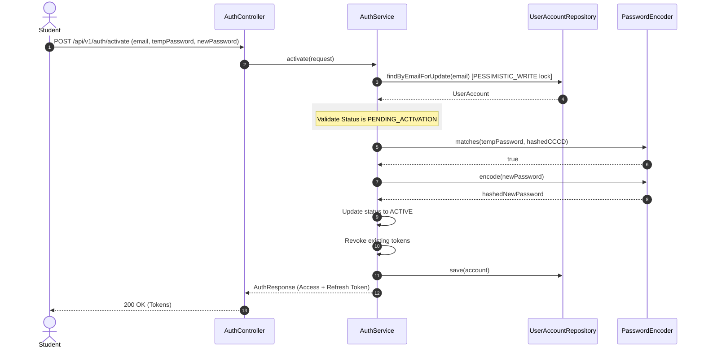

# User Account Provisioning & Activation Workflow

## 1. Account Auto-Provisioning Flow
Dormitory resident accounts are not created manually. Instead, they are auto-generated as a direct result of payment completion:
1. Student pays the room accommodation bill.
2. `PaymentService` processes the payment and publishes a `PaymentSuccessEvent`.
3. `PaymentEventListener` handles the event synchronously within the same transaction.
4. The listener invokes `userAccountRepository.save()` to provision a new user profile with:
   - **Username**: Student Code (`STU-APP-XXXX`)
   - **Email**: Application Email
   - **Role**: `STUDENT`
   - **Status**: `PENDING_ACTIVATION`
   - **Temporary Password**: Student's CCCD (BCrypt hashed)

---

## 2. Account Activation Workflow (`AuthService.activate`)
A student cannot log in immediately with their temporary credentials. They must first activate their account and set a secure password:

### Key Implementation Steps
* **Pessimistic Locking**: `AuthService.activate` locks the user record via `userAccountRepository.findByEmailForUpdate` to prevent double-activation race conditions.
* **Validation**: The method enforces that the account status is exactly `PENDING_ACTIVATION`. If it is already `ACTIVE` or `LOCKED`, the request is rejected immediately with a `BAD_REQUEST` status.
* **Password Change**: The temporary password (CCCD) is matched using `passwordEncoder.matches`. If successful, the new password is encrypted via BCrypt and saved, and the status changes to `ACTIVE`.
* **Token Issuance**: The method revokes any existing sessions and generates the initial JWT Access and Refresh Tokens.
