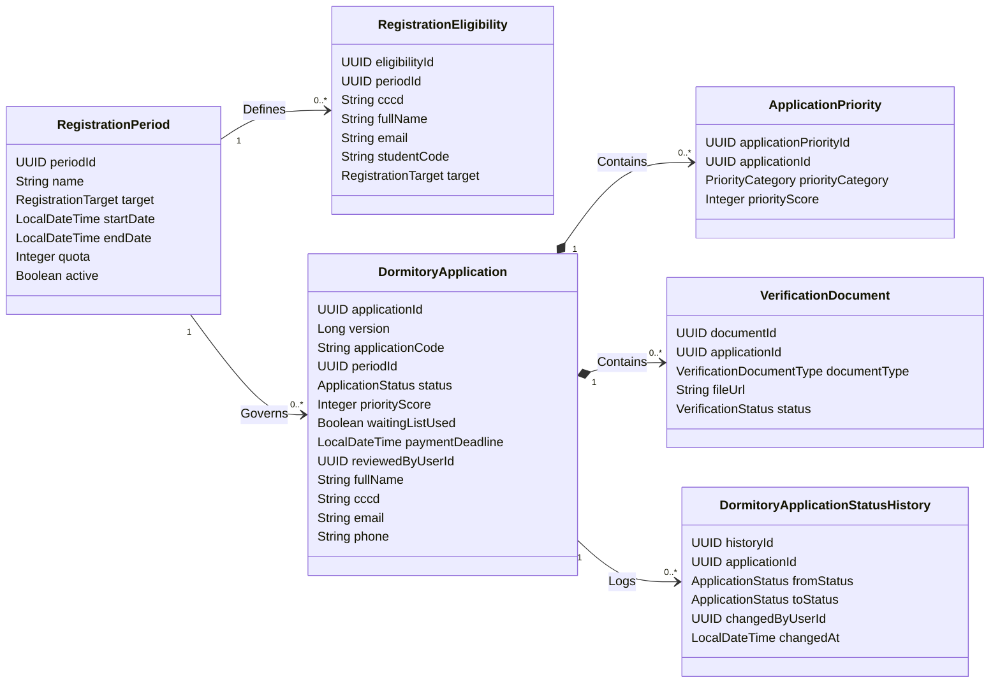

# SDMS Application Domain Model & Entity Design Audit (v2.0)

This document standardizes the Domain Models, Entities, Enums, Relationships, and Flyway database migrations strategy for the Application Module of the Smart Dormitory Management System (SDMS) after auditing the corrections for APPLICATION-02.

---

## 1. Aggregate Root Design

*   **Aggregate Root:** `DormitoryApplication` is the central aggregate root.
*   **Justification:** It encapsulates the student's submission state, contact details, priority categories, and uploaded verification documents. All operations on documents or status changes must be coordinated through the `DormitoryApplication` root to ensure transaction integrity and domain state invariants.

---

## 2. DormitoryApplication Data Ownership & Split

To prevent unnecessary data duplication and ensure the **Student Module** remains the absolute source of truth for student profiles, the data fields within `DormitoryApplication` are split into two categories:

### A. Application Business Data (Owned by Application Module)
*These fields represent the state and metadata of the application itself. They are persistent and managed solely by the Application Module.*
*   `applicationId` (UUID PK): Unique identifier.
*   `version` (Long `@Version`): Optimistic locking version.
*   `applicationCode` (String, Unique): Public reference code (e.g., `APP-2026-0001`).
*   `periodId` (UUID FK): Reference to the active `RegistrationPeriod`.
*   `status` (`ApplicationStatus` Enum): PENDING, UNDER_REVIEW, APPROVED, WAITING_LIST, WAITING_PAYMENT, REJECTED, EXPIRED.
*   `priorityScore` (Integer): Total calculated weight of verified priorities.
*   `waitingListUsed` (Boolean): Indicates whether the applicant entered/used the waiting list.
*   `paymentDeadline` (LocalDateTime, Nullable): The absolute deadline for room payment.
*   `submittedAt` (LocalDateTime): Date and time of submission.
*   `approvedAt` (LocalDateTime, Nullable): Date and time of approval.
*   `reviewNote` (String, Nullable): Reviewer feedback or rejection reason.
*   `reviewedByUserId` (UUID, Nullable): Soft reference to the administrator who performed the review.
*   `applicationPdfUrl` (String, Nullable): Path to the generated PDF application form.

### B. Student Profile Data (Transient Staging Container)
*These fields act as a staging area / draft profile for the student. They do not constitute the source of truth for student profile records.*
*   **Identity Profile:** `cccd` (String), `fullName` (String), `dob` (LocalDate), `gender` (`Gender` Enum), `issueDate` (LocalDate), `issuePlace` (String), `email` (String), `phone` (String).
*   **Address:** `permanentAddress` (Text).
*   **Family Contacts:** `fatherName` (String), `fatherPhone` (String), `motherName` (String), `motherPhone` (String), `emergencyContact` (String).
*   **Academic:** `studentCode` (String, Nullable - empty for new Group A freshmen).

#### De-duplication Policy:
1.  **Transient Staging:** During application creation, profile data is stored as a draft.
2.  **Profile Generation / Activation:** Upon successful payment (`PaymentSuccessEvent`), the Student Module consumes the event, reads the application's profile data, and initializes a permanent `Student` record and its sub-entities.
3.  **Ownership Handover:** Once the `Student` profile is created, the Student Module owns it. Any future profile updates (e.g., change of address, parents' phone number) are handled exclusively within the Student Module. The `DormitoryApplication` fields remain static for historical audit purposes.

---

## 3. Entity Inventory

### 1. `RegistrationPeriod` (Entity)
Manages KTX enrollment windows.
*   `periodId` (UUID PK): Unique identifier.
*   `name` (String): e.g., "Học kỳ 1 - Năm học 2026-2027".
*   `target` (`RegistrationTarget` Enum): FRESHMAN, CURRENT_STUDENT, ALL.
*   `startDate` (LocalDateTime): Submission start time.
*   `endDate` (LocalDateTime): Submission end time.
*   `quota` (Integer): Maximum number of beds allocated for this period.
*   `active` (Boolean): Flag indicating if the period is active.

### 2. `RegistrationEligibility` (Entity)
Used to import a list of eligible students from the school's central database to authorize registrations on the public site (primarily Group A and Group B).
*   `eligibilityId` (UUID PK): Unique identifier.
*   `periodId` (UUID FK): Reference to the `RegistrationPeriod`.
*   `cccd` (String, Not Null): Citizen Identification Number.
*   `fullName` (String, Not Null): Full name of the eligible applicant.
*   `email` (String, Not Null): Pre-registered email for communication.
*   `studentCode` (String, Nullable): Student code. Nullable because Group A (new freshman) might not have codes assigned yet at the time of list import.
*   `target` (`RegistrationTarget` Enum): Identifies if the eligible student is a Freshman or Current Student.

### 3. `ApplicationPriority` (Entity)
To support students with **multiple priority categories**, priorities are separated from the main application entity into a 1:N relationship.
*   `applicationPriorityId` (UUID PK): Unique identifier.
*   `applicationId` (UUID FK): References `DormitoryApplication` (Cascade delete).
*   `priorityCategory` (`PriorityCategory` Enum): Category of priority.
*   `priorityScore` (Integer): Weight/score of the priority category.

### 4. `VerificationDocument` (Entity)
Stores verification files submitted by the student (CCCD scan, portrait photo, commitment form, and priority proof certificates).
*   `documentId` (UUID PK): Unique identifier.
*   `applicationId` (UUID FK): References `DormitoryApplication` (Cascade delete).
*   `documentType` (`VerificationDocumentType` Enum): Type of document.
*   `fileUrl` (String): Storage path or URL.
*   `status` (`VerificationStatus` Enum): PENDING, VALID, INVALID.
*   `note` (String, Nullable): Review note for this specific document.
*   `verifiedAt` (LocalDateTime, Nullable): Time when document was marked valid/invalid.

### 5. `DormitoryApplicationStatusHistory` (Entity)
Tracks status transitions for auditing and reporting.
*   `historyId` (UUID PK): Unique identifier.
*   `applicationId` (UUID FK): References `DormitoryApplication`.
*   `fromStatus` (`ApplicationStatus` Enum, Nullable): Pre-transition state.
*   `toStatus` (`ApplicationStatus` Enum): Post-transition state.
*   `changedByUserId` (UUID, Nullable): Soft reference to the administrator who triggered the status change.
*   `changedAt` (LocalDateTime): Date and time of transition.
*   `note` (String, Nullable): Transition log reason.

---

## 4. Enum Design

*   **`ApplicationStatus` (Frozen):** `PENDING`, `UNDER_REVIEW`, `APPROVED`, `WAITING_LIST`, `WAITING_PAYMENT`, `REJECTED`, `EXPIRED`.
*   **`RegistrationTarget`:** `FRESHMAN`, `CURRENT_STUDENT`, `ALL`.
*   **`RegistrationType`:** `NEW` (Groups A & B), `RENEWAL` (Group C).
*   **`VerificationStatus`:** `PENDING`, `VALID`, `INVALID`.
*   **`PriorityCategory`:** `MARTYR_CHILD` (100), `WOUNDED_SOLDIER_CHILD` (95), `DISABLED_STUDENT` (90), `ORPHAN` (85), `POOR_HOUSEHOLD` (80), `ETHNIC_MINORITY` (70), `REMOTE_AREA` (60), `PARTY_MEMBER` (50).
*   **`VerificationDocumentType`:**
    *   *Normal:* `CCCD_FRONT`, `CCCD_BACK`, `PORTRAIT_PHOTO`, `COMMITMENT`.
    *   *Priority:* `MARTYR_CERTIFICATE`, `WOUNDED_SOLDIER_CERTIFICATE`, `DISABILITY_CERTIFICATE`, `ORPHAN_CERTIFICATE`, `POVERTY_CERTIFICATE`, `ETHNIC_CERTIFICATE`, `REMOTE_AREA_CERTIFICATE`, `PARTY_MEMBER_CERTIFICATE`.

---

## 5. Relationship Matrix & Decoupled References



### Decoupling Rules:
*   **`reviewedByUserId`:** Replaces the direct foreign key to `UserAccount` with a soft UUID reference. This avoids tight runtime and database-level dependencies between the Application Module and the Auth/User Module.
*   **Student Module Integration:** The Student Module owns the `Student` entity. In `Student`, a soft reference `source_application_id` points back to `DormitoryApplication`. The Application Module has no runtime or DB dependencies on the Student Module.
*   **Room Module Integration:** The Room Module owns `StudentHousingAssignment` which has an `application_id` referencing `DormitoryApplication`. The Application Module remains clean of Room/Assignment domain concepts.

---

## 6. Service Decoupling & Domain Events

References to workflow-level services such as `HousingAssignmentService` and `BillService` are removed from the Domain Model Layer. The Application Module is decoupled and integrates with other modules exclusively via **Domain Events**:

*   **`DormitoryApplicationSubmittedEvent`**: Published when a student submits an application.
*   **`DormitoryApplicationApprovedEvent`**: Published when the admin changes status to `APPROVED`.
    *   *Payload:* `applicationId`, `studentProfile` (CCCD, email, name, gender, phone, permanentAddress, emergency contacts, etc.), `periodId`.
    *   *Listeners:*
        *   **Room Module Listener**: Assigns a bed/room in `RESERVED` state.
        *   **Payment Module Listener**: Generates a corresponding Accommodation Bill and sets `paymentDeadline`.
*   **`DormitoryApplicationRejectedEvent`**: Published when an application is rejected.
    *   *Payload:* `applicationId`, `reviewerUserId`, `rejectionNote`.
*   **`DormitoryApplicationWaitingListPromotedEvent`**: Published when an application is promoted from the waiting list.
*   **`DormitoryApplicationExpiredEvent`**: Published when the payment deadline is reached without payment, releasing the reserved bed.

---

## 7. Flyway Strategy Audit & Roadmap

To support the updated design, we must audit the database migrations. The application requires a new Flyway migration script, `V16__application_module_refactor.sql`, to update the database schema.

### Audited Concerns:
1.  **Priority:** The existing single column `priority_category` on `dormitory_applications` is insufficient for students with multiple priority groups. We will introduce `application_priorities` to support a 1:N relationship.
2.  **Waiting List:** The waiting list is a logical status. V10 introduced the `waiting_list_used` column and the conditional index `idx_dorm_app_status_waiting` on `dormitory_applications` (`WHERE status = 'WAITING_LIST'`), which allows highly performant sorting on `priority_score DESC` and `submitted_at ASC`. No separate physical queue table is necessary.
3.  **Status History:** For auditing, we will introduce `dormitory_application_status_history` to track status transitions.

### Proposed Flyway Migration: `V16__application_module_refactor.sql`

```sql
-- 1. Cập nhật bảng registration_eligibilities để hỗ trợ import đầy đủ danh sách hợp lệ
ALTER TABLE registration_eligibilities
    ADD COLUMN email VARCHAR(100),
    ADD COLUMN student_code VARCHAR(50),
    ADD COLUMN target VARCHAR(50);

-- 2. Thêm cột soft reference reviewed_by_user_id vào bảng dormitory_applications
ALTER TABLE dormitory_applications
    ADD COLUMN reviewed_by_user_id UUID;

-- 3. Tạo bảng application_priorities để hỗ trợ nhiều chế độ ưu tiên
CREATE TABLE application_priorities (
    application_priority_id UUID PRIMARY KEY DEFAULT uuid_generate_v4(),
    application_id UUID NOT NULL,
    priority_category VARCHAR(50) NOT NULL,
    priority_score INTEGER NOT NULL DEFAULT 0,
    created_at TIMESTAMP DEFAULT CURRENT_TIMESTAMP,
    updated_at TIMESTAMP DEFAULT CURRENT_TIMESTAMP,
    
    CONSTRAINT fk_priority_application
        FOREIGN KEY (application_id)
            REFERENCES dormitory_applications(application_id)
            ON DELETE CASCADE
);

-- Index tối ưu việc quét và tính điểm ưu tiên của hồ sơ
CREATE INDEX idx_app_priority_application_id ON application_priorities(application_id);

-- 4. Tạo bảng dormitory_application_status_history để lưu lịch sử chuyển đổi trạng thái hồ sơ
CREATE TABLE dormitory_application_status_history (
    history_id UUID PRIMARY KEY DEFAULT uuid_generate_v4(),
    application_id UUID NOT NULL,
    from_status VARCHAR(20),
    to_status VARCHAR(20) NOT NULL,
    changed_by_user_id UUID,
    changed_at TIMESTAMP NOT NULL DEFAULT CURRENT_TIMESTAMP,
    note TEXT,
    
    CONSTRAINT fk_status_history_application
        FOREIGN KEY (application_id)
            REFERENCES dormitory_applications(application_id)
            ON DELETE CASCADE
);

CREATE INDEX idx_status_history_application_id ON dormitory_application_status_history(application_id);
```

---

## 8. PASS / WARNING / FAIL

*   **Status:** **PASS**. The domain model is now fully decoupled, correctly separates business data from transient profile data, uses soft referencing for user records, uses Domain Events to communicate across module boundaries, and outlines a complete Flyway schema migration strategy.

---

## 9. Final Decision

**APPLICATION-02 PASS**
