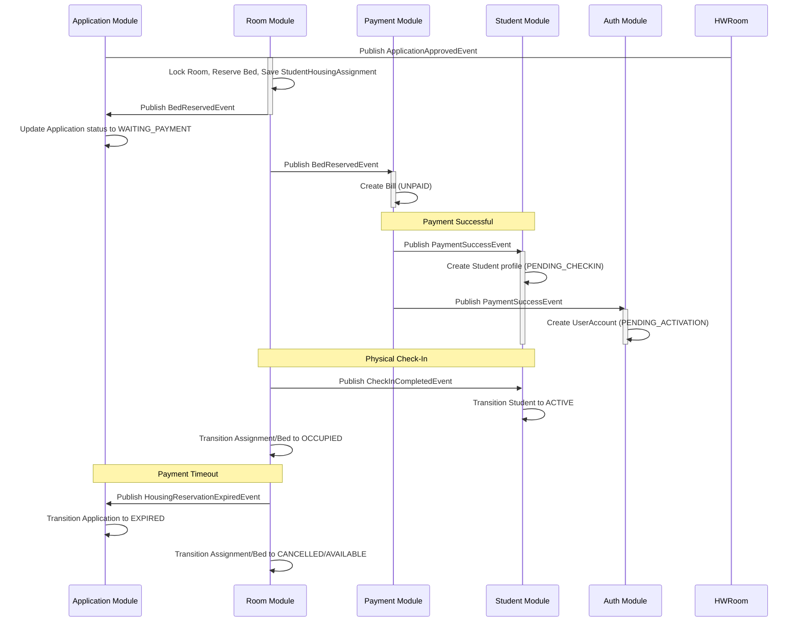

# ROOM-01: ROOM ASSIGNMENT & HOUSING WORKFLOW AUDIT REPORT (CORRECTED)

## 1. EXECUTIVE SUMMARY
This document presents the corrected business architecture audit of the **Room Assignment and Housing Workflow** in the Smart Dormitory Management System (SDMS).

The purpose of this audit is to define clear bounded context boundaries, specify the state machine models for assignments, beds, and rooms, outline the event flows for integration, and review concurrency and failure handling rules.

### Final Verdict
* **Overall Verdict**: **ROOM-01 PASS**

---

## 2. CHECKPOINT EVALUATIONS

### CHECK 01: Room Domain Boundary
* **Status**: **PASS**
* **Verification**:
  * **Room Module Bounded Context**: Correctly owns `DormitoryBuilding`, `Room`, `Bed`, `StudentHousingAssignment` (HousingAssignment), `RoomCapacity`, `Occupancy`, and `WaitingList` promotion flows.
  * **External Entities (Not Owned)**: The Room Module does not own or store `Student`, `UserAccount`, `Bill`, or `Payment`. Communication with these modules is conducted via service layer calls or domain events.

---

### CHECK 02: Room Assignment Workflow
* **Status**: **PASS**
* **Flow Stages & States**:
  1. **Application Approved**: Admin approves the registration -> publishes `ApplicationApprovedEvent`.
  2. **Reserve Bed**: Room Module processes the event -> locks Room, checks available bed -> transitions `Bed.status` to `RESERVED` and sets `StudentHousingAssignment.status` to `RESERVED`.
  3. **WAITING_PAYMENT**: `BedReservedEvent` is published -> Application Module moves the application status to `WAITING_PAYMENT` and sets the payment deadline; Payment Module creates a `Bill` in `UNPAID` status.
  4. **Payment Success**: Student pays -> Bill status transitions to `PAID` -> publishes `PaymentSuccessEvent`.
  5. **Check-In Pending**: PaymentEventListener creates `Student` (`PENDING_CHECKIN`) and `UserAccount` (`PENDING_ACTIVATION`), linking the student profile to the housing assignment.
  6. **Physical Check-In**: Admin/Staff verifies student physical records -> publishes `CheckInCompletedEvent` (or calls Student Service) -> transitions `Student` to `ACTIVE` (in Student Module), `UserAccount` to `ACTIVE` (after activation in Auth Module), and `StudentHousingAssignment` to `OCCUPIED` (in Room Module), and `Bed` to `OCCUPIED`.
  7. **Check-Out**: Student departs -> transitions `StudentHousingAssignment` to `CHECKED_OUT`, `Bed` to `AVAILABLE`, and room occupancy counts are decremented.

---

### CHECK 03: Housing Assignment Lifecycle
* **Status**: **PASS**
* **Assignment Status Transition Map**:
  * **Business Lifecycle vs. Enum Design Alignment**:
    * The conceptual business lifecycle contains states `RESERVED`, `PENDING_CHECKIN`, `ACTIVE`, `CHECKED_OUT`, `CANCELLED`, `EXPIRED`.
    * The database enum design ([AssignmentStatus.java](file:///D:/qt-team-projects/graduation_thesis/smart-dormitory-management-system/sdms-backend/src/main/java/com/sdms/backend/modules/room/enums/AssignmentStatus.java)) contains `RESERVED`, `OCCUPIED`, `CHECKED_OUT`, `CANCELLED`.
    * **Mapping Strategy**:
      * Conceptual `RESERVED` is persisted as `RESERVED`.
      * Conceptual `PENDING_CHECKIN` is represented in the database as a `RESERVED` assignment that has a `studentId` linked (since payment success generates the student and links it to the assignment).
      * Conceptual `ACTIVE` is persisted as `OCCUPIED`.
      * Conceptual `CHECKED_OUT` is persisted as `CHECKED_OUT`.
      * Conceptual `CANCELLED` and `EXPIRED` are both persisted as `CANCELLED`.
  * **State Transitions**:
    * `RESERVED`: Initial state when bed is allocated for an approved application.
    * `PENDING_CHECKIN` (DB: `RESERVED` + `Student` linked): Triggers when `PaymentSuccessEvent` is handled.
    * `ACTIVE` (DB: `OCCUPIED`): Triggers when Staff/Admin performs check-in confirmation.
    * `CHECKED_OUT`: Triggers when Checkout approval is completed.
    * `CANCELLED` / `EXPIRED` (DB: `CANCELLED`): Triggers when student declines reservation or payment window timeout expires.

---

### CHECK 04: Bed Lifecycle
* **Status**: **PASS**
* **Transitions**:
  * `AVAILABLE` -> `RESERVED`: Application approved and bed allocated.
  * `RESERVED` -> `OCCUPIED`: Checked in.
  * `RESERVED` -> `AVAILABLE`: Payment deadline expires or reservation is cancelled.
  * `OCCUPIED` -> `AVAILABLE`: Checkout approved.
  * `AVAILABLE` -> `MAINTENANCE`: Marked for repairs or cleaning by Admin.
  * `MAINTENANCE` -> `AVAILABLE`: Maintenance completed.

---

### CHECK 05: Payment Timeout
* **Status**: **PASS**
* **Flow**: `WAITING_PAYMENT` -> `Reservation Expired` -> `Release Bed` -> `Application EXPIRED`.
* **Timeout Ownership Correction**: 
  * The Application Module owns `ApplicationStatus`. The Room Module owns `StudentHousingAssignment` and `Bed`.
  * When payment timeout occurs, the Room scheduler / job clears the housing reservation (status `CANCELLED`), frees the Bed (status `AVAILABLE`), and publishes `HousingReservationExpiredEvent`.
  * The Application Module listens to `HousingReservationExpiredEvent` and transitions `DormitoryApplication.status` to `EXPIRED`. This preserves boundary decoupling.

---

### CHECK 06: Waiting List Workflow
* **Status**: **PASS**
* **Flow**: `No Bed Available` -> `WAITING_LIST` -> `Bed Released` -> `Reallocation` (Waiting List Promotion).
* **Ranking Strategy**: Promotions are ranked using:
  1. Priority Score descending (`priorityScore DESC`).
  2. Submission date ascending (`createdAt ASC`) for first-come, first-served fairness.
  * Reallocation occurs in `Propagation.REQUIRES_NEW` via `HousingAssignmentService.promoteFromWaitingList` utilizing a dedicated `WaitingListValidator` to prevent infinite loops.

---

### CHECK 07: Check-In Workflow
* **Status**: **PASS**
* **Role**: Restricted to **Staff** or **Admin** roles.
* **Student Module Boundary Isolation**:
  * The Room Module does not own or directly transition the `Student` entity state to `ACTIVE`.
  * Instead, upon confirming check-in, the Room Module publishes a `CheckInCompletedEvent` (or invokes the Student Module Service API).
  * The Student Module handles `CheckInCompletedEvent` to transition `Student.status` to `ACTIVE`.
  * The Room Module updates the local `StudentHousingAssignment.status` to `OCCUPIED` and `Bed.status` to `OCCUPIED`.

---

### CHECK 08: Check-Out Workflow
* **Status**: **PASS**
* **Flow**: Request -> Admin approval -> `checkOut` invoked -> transitions assignment to `CHECKED_OUT`, bed status to `AVAILABLE`, decrements room occupied beds, and runs `recalculateRoomStatus` to toggle Room status (`AVAILABLE` / `FULL`).

---

### CHECK 09: Event Integration
* **Status**: **PASS**
* **Event Chain**:
  * `ApplicationApprovedEvent`: Published by Application Module -> Triggers Room Module allocation.
  * `BedReservedEvent`: Published by Room Module -> Triggers Bill Creation in Payment Module and updates Application state.
  * `PaymentSuccessEvent`: Published by Payment Module -> Triggers Student/UserAccount creation and links student to assignment.
  * `CheckInCompletedEvent`: Published by Room Module -> Triggers Student status activation in Student Module.
  * `HousingReservationExpiredEvent`: Published by Room Module -> Triggers Application status expiration in Application Module.

---

### CHECK 10: State Machine Audit
* **Status**: **PASS**
* **Enums verified**:
  * [AssignmentStatus.java](file:///D:/qt-team-projects/graduation_thesis/smart-dormitory-management-system/sdms-backend/src/main/java/com/sdms/backend/modules/room/enums/AssignmentStatus.java): `RESERVED`, `OCCUPIED`, `CHECKED_OUT`, `CANCELLED`.
  * [BedStatus.java](file:///D:/qt-team-projects/graduation_thesis/smart-dormitory-management-system/sdms-backend/src/main/java/com/sdms/backend/modules/room/enums/BedStatus.java): `AVAILABLE`, `RESERVED`, `OCCUPIED`, `MAINTENANCE`.
  * [RoomStatus.java](file:///D:/qt-team-projects/graduation_thesis/smart-dormitory-management-system/sdms-backend/src/main/java/com/sdms/backend/modules/room/enums/RoomStatus.java): `AVAILABLE`, `FULL`, `MAINTENANCE`, `CLOSED`.

---

### CHECK 11: Concurrency Audit
* **Status**: **PASS**
* **Concurrency Defenses**:
  * **Double Reservation**: Room entity is loaded via pessimistic write lock (`findByIdForUpdate`) before checking available beds. This prevents two threads from selecting the same bed.
  * **Concurrent Bed Allocation**: Locking at the room level acts as a lock boundary.
  * **State Verification**: State check constraints (e.g. `AssignmentValidator`) verify that statuses are correct before transitioning, preventing double actions.

---

### CHECK 12: Module Responsibility Matrix
* **Status**: **PASS**
* **Responsibility Mapping**:
  * `Application Module`: Handles student submissions, priorities, PDF generation, eligibility lists, application status history.
  * `Room Module`: Coordinates beds, buildings, rooms, assignments, waiting list rankings, check-in/checkout event triggers.
  * `Payment Module`: Stores bills, transactions, gateways (VNPay, Cash approval).
  * `Student Module`: Manages candidate profiles, contacts, student statuses.
  * `Auth Module`: Verifies credentials, activation, role-based JWT issuance.

---

## 3. ROOM DOMAIN MODEL PROPOSAL
To cleanly model the Room domain:
* **DormitoryBuilding**: (buildingId, buildingName, genderPolicy).
* **Room**: (roomId, roomCode, capacity, occupiedBeds, roomStatus, floorId).
* **Bed**: (bedId, bedCode, bedStatus, roomId).
* **StudentHousingAssignment**: (assignmentId, reservedAt, checkInAt, checkOutAt, status, bedId, applicationId, studentId).

---

## 4. STATE MACHINE PROPOSAL
* **Room Status**:
  * `AVAILABLE` -> (Occupied beds count reaches capacity) -> `FULL`.
  * `FULL` -> (Checkout or Cancellation releases a bed) -> `AVAILABLE`.
  * Any state -> (Marked for repair) -> `MAINTENANCE`.
* **Bed Status**:
  * `AVAILABLE` -> `RESERVED` -> `OCCUPIED` -> `AVAILABLE`.
  * `RESERVED` -> (Timeout / Cancel) -> `AVAILABLE`.
* **Assignment Status**:
  * `RESERVED` -> `OCCUPIED` (Active) -> `CHECKED_OUT`.
  * `RESERVED` -> `CANCELLED` (Timeout / manual cancel).

---

## 5. EVENT FLOW PROPOSAL

---

## 6. FINAL DECISION
**ROOM-01 PASS**

> [!NOTE]
> **Architecture Audit Note:** The physical implementation of this module uses legacy String-based @PreAuthorize roles (e.g. hasRole('STUDENT')) and lacks strict UI channel route prefixes. This is recorded as technical debt and should not be refactored before the final system freeze.

