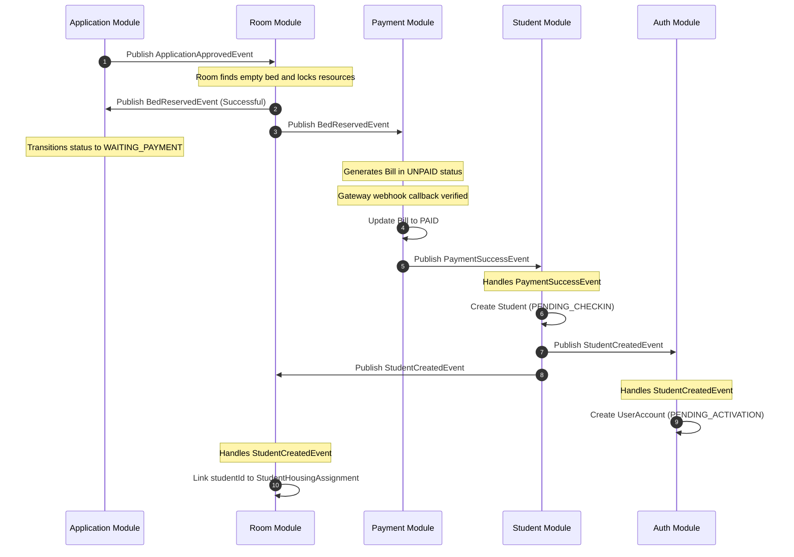

# SDMS Payment Boundary Refactor Design Audit

**Technical Role**: Lead Systems Architect | Technical Governance Officer  
**Status**: **PASS** (Refactor design verified and frozen)  
**Audit Date**: 2026-06-21  

---

## 1. Target Event Choreography

The diagram below details the target event-driven choreography designed to completely eliminate direct service/repository leaks between the Payment, Student, Auth, and Room modules:

---

## 2. Bounded Context Ownership & Boundaries

Following DDD principles, core model ownership and database write operations are restricted to their home modules:

| Bounded Context | Owned Aggregate | Allowable Actions | Strictly Prohibited Actions |
| :--- | :--- | :--- | :--- |
| **Payment Module** | `Bill`, `Payment` | Write Bill and Payment transaction records. | Create/Save `Student`, `UserAccount`, or alter `StudentHousingAssignment` fields. |
| **Student Module** | `Student` | Write/Save `Student` demographics, update statuses (`StudentStatus`). | Access Auth credentials or write Room assignments. |
| **Auth Module** | `UserAccount` | Write/Save `UserAccount`, roles, and activate accounts. | Modify Student demographics or Room records. |
| **Room Module** | `StudentHousingAssignment` | Manage allocations, bed status, and link `studentId`. | Directly modify `Bill` status or write Student profiles. |

---

## 3. Integration & Flow Designs

### 3.1 Student Creation (Task 02)
* **Trigger**: `PaymentSuccessEvent` is consumed by the **Student Module**.
* **Listener**: `StudentEventListener.handlePaymentSuccess()`
* **Transaction Boundary**: `@Transactional(propagation = Propagation.REQUIRES_NEW)` inside `@TransactionalEventListener(phase = TransactionPhase.AFTER_COMMIT)` to isolate Student persistence from Payment transaction boundaries.
* **Outcome**: Student profile created in `PENDING_CHECKIN` status. Emits `StudentCreatedEvent`.

### 3.2 User Account Creation (Task 03)
* **Trigger**: **Auth Module** listens to `StudentCreatedEvent` (instead of PaymentSuccessEvent).
* **Listener**: `AuthEventListener.handleStudentCreated()`
* **Reasoning**: Decouples Auth from Payment events and guarantees that `studentId` and `studentCode` are committed in the database before `UserAccount` tries to link to the student profile.
* **Outcome**: UserAccount created in `PENDING_ACTIVATION` status.

### 3.3 Room Linking Strategy (Task 04)
We analyzed three potential linking strategies:
1. **Option 01: StudentCreatedEvent** (Recommended): Emitted upon student persistence. Room module consumes it to bind `studentId` to the active `assignmentId`. Highly cohesive, allows immediate preparation for check-in.
2. **Option 02: StudentActivatedEvent**: Emitted on password setup. Delayed linkage; prevents check-in planning if a student delays activation.
3. **Option 03: AssignmentReadyEvent**: Emitted too late, serves as an output rather than trigger.

* **Decision**: Implement **Option 01**. Room module consumes `StudentCreatedEvent` to immediately link the student profile to the reservation record.

### 3.4 Bill Expiration Synchronization (Task 05)
* **Trigger**: `HousingReservationExpiredEvent` is published by the Room Module expiration job (`PaymentExpireJob`).
* **Consumer**: **Payment Module**'s `BillEventListener`.
* **Action**: Updates the corresponding `Bill` status from `UNPAID` to `CANCELLED` (or `EXPIRED`).
* **Outcome**: Synchronized expiration between room reservations and payment records.

---

## 4. Webhook Security & Idempotency Specification

To safely interface with payment gateways like SePay or VietQR:
* **Idempotency (Duplicate Callback Protection)**: Enforced by the `unique` constraint on `transaction_code`. Programmatic check returns HTTP 200 immediately if the code has already been successfully recorded.
* **Signature Verification**: Webhooks from SePay must include secure signature validation (HMAC-SHA256 headers using a pre-shared Secret Key) to verify payload authenticity.
* **Amount Matching**: Webhook handler must verify that the incoming transaction amount matches the unpaid balance of the targeted `Bill`.
* **Replay Attack Protection**: Prevent processing historical events by validating timestamp differences and transaction codes.

---

## 5. Event Catalog

| Event Class | Source Module | Main Payload Fields | Consumer Modules & Action |
| :--- | :--- | :--- | :--- |
| `ApplicationApprovedEvent` | Application | `applicationId`, `gender` | Room: Auto-reserve bed. |
| `BedReservedEvent` | Room | `applicationId`, `assignmentId` | Application: WAITING_PAYMENT status. Payment: Create UNPAID Bill. |
| `BedReservationFailedEvent`| Room | `applicationId` | Application: Transition to WAITING_LIST. |
| `PaymentSuccessEvent` | Payment | `billId`, `assignmentId`, `applicationId` | Student: Create Student profile. |
| `StudentCreatedEvent` | Student | `studentId`, `studentCode`, `cccd`, `email` | Auth: Create UserAccount. Room: Link student to Assignment. |
| `HousingReservationExpiredEvent`| Room | `applicationId`, `assignmentId` | Application: EXPIRED status. Payment: CANCELLED Bill status. |
| `CheckInCompletedEvent` | Room | `studentId`, `assignmentId` | Student: Transition status to `ACTIVE`. |
