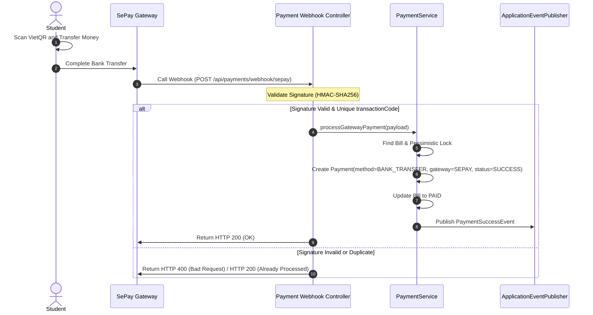

# SDMS Payment Method & Payment Gateway Separation Design

**Technical Role**: Lead Domain Architect | Lead Systems Architect  
**Status**: **PASS**  
**Audit Date**: 2026-06-21  

---

## 1. Domain Concept Separation

In a clean billing architecture, the **Payment Method** (how money is transferred) must be decoupled from the **Payment Gateway** (the third-party engine that processes and confirms the transfer).

### 1.1 PaymentMethod Enum
Represents the actual financial mechanism used to clear a debt.
* **`CASH`**: Physical fiat currency handed to the Dormitory Office staff.
* **`BANK_TRANSFER`**: Digital funds transferred directly from a student's bank account to the dormitory's merchant account.

### 1.2 PaymentGateway Enum
Represents the specific processing provider or channel capturing the payment.
* **`NONE`**: Used for manual cash payments processed directly at the dormitory counter.
* **`SEPAY`**: The webhook-driven bank transfer tracking gateway.
* **`VNPAY`**: (Future portal) VNPay gateway integration.
* **`MOMO`**: (Future portal) MoMo e-wallet gateway integration.

---

## 2. Refactored Entity Design (`Payment.java`)

To support this separation, the `Payment` entity is updated to include the `gateway` field:

```java
public class Payment extends BaseEntity {
    // ... other fields
    
    @Enumerated(EnumType.STRING)
    @Column(nullable = false)
    private PaymentMethod method; // CASH or BANK_TRANSFER

    @Enumerated(EnumType.STRING)
    @Column(nullable = false, length = 30)
    private PaymentGateway gateway = PaymentGateway.NONE; // NONE, SEPAY, MOMO, VNPAY
    
    // ...
}
```

---

## 3. Ownership Matrix

The Payment module maintains exclusive write ownership of all billing and payment transaction contexts:

* **`PaymentMethod` & `PaymentGateway`**: Owned by Payment Module (Domain Enums).
* **`Payment` & `Bill`**: Owned by Payment Module (JPA Entities/Aggregates).
* **`Webhook Controller`**: Owned by Payment Module. Receives SePay webhook payload, validates token signatures, and initiates payment service handling.
* **`Gateway Metadata`**: JSON/Text column in the `Payment` table mapping the raw transaction logging, owned by the Payment Module.

---

## 4. Online Payment Workflow (Task 04)


