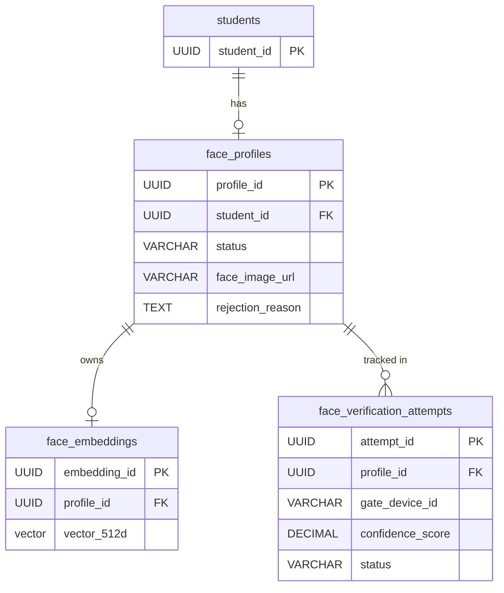

> [!WARNING] 
> STATUS: PLANNED (Not Implemented)

# FACE-BACKEND-03: Entity and Database Design

## 1. Entity Inventory

### 1.1 List of Entities
- `FaceProfile`: Core aggregate root representing a student's face registration record.
- `FaceEmbedding`: Weak entity storing the actual 512-dimension pgvector.
- `FaceVerificationAttempt`: Audit entity recording IoT gate requests and AI verification outcomes.

### 1.2 Ownership & Boundaries
- All three entities are owned strictly by the **Face Module** (`com.sdms.backend.modules.face`).
- The `Student` module retains ownership of the `Student` entity. 
- The `FaceProfile` aggregate root maintains a reference to the `Student` via `student_id`.

## 2. Table Design

### 2.1 Table: `face_profiles`
- **Purpose**: Tracks the lifecycle state of a student's face photo registration.
- **Columns**:
  - `profile_id` (UUID, Primary Key): Unique identifier.
  - `student_id` (UUID, Not Null): Foreign reference to `students.student_id`.
  - `face_image_url` (VARCHAR(500), Nullable): CDN URL of the uploaded image.
  - `status` (VARCHAR(50), Not Null): Enum `PENDING`, `APPROVED`, `REJECTED`, `REVOKED`.
  - `rejection_reason` (TEXT, Nullable): Why the profile was rejected or revoked.
  - `created_at` (TIMESTAMP, Not Null): Audit field.
  - `updated_at` (TIMESTAMP, Not Null): Audit field.
- **Constraints**: 
  - **UNIQUE CONSTRAINT (`student_id`)**: Ensures 1 Student cannot have 2 Profiles. This enforces the strict 1:0..1 relationship.
- **Lifecycle**: Created when a photo is uploaded (PENDING), transitions to APPROVED or REJECTED by Admin. Admin can transition APPROVED to REVOKED.

### 2.2 Table: `face_embeddings`
- **Purpose**: Stores the mathematical vector representation of the approved face.
- **Columns**:
  - `embedding_id` (UUID, Primary Key): Unique identifier.
  - `profile_id` (UUID, Not Null): Foreign key referencing `face_profiles.profile_id`.
  - `vector` (vector(512), Not Null): The pgvector storage for the AI embedding.
  - `created_at` (TIMESTAMP, Not Null): Audit field.
- **Constraints**:
  - **UNIQUE CONSTRAINT (`profile_id`)**: Enforces 1:1 relationship with `FaceProfile`.
- **Lifecycle**: Created asynchronously after `FaceProfile` is APPROVED.

### 2.3 Table: `face_verification_attempts`
- **Purpose**: Audit trail for physical gate entry attempts processed by the AI Engine.
- **Columns**:
  - `attempt_id` (UUID, Primary Key): Unique identifier.
  - `gate_device_id` (VARCHAR(100), Not Null): Identifier of the physical IoT gate.
  - `profile_id` (UUID, Nullable): Matched profile (if successful).
  - `confidence_score` (DECIMAL, Nullable): Cosine similarity distance result.
  - `status` (VARCHAR(50), Not Null): Enum `SUCCESS`, `FAIL`, `AI_TIMEOUT`.
  - `attempted_at` (TIMESTAMP, Not Null): Timestamp of the attempt.
- **Constraints**:
  - `profile_id` references `face_profiles.profile_id` (`ON DELETE SET NULL`) to retain audit data if a profile is deleted.
- **Lifecycle**: Insert-only ledger. Written during IoT verification requests.

## 3. Relationship Design

### 3.1 Relationships
- **`Student` (External) $\leftrightarrow$ `FaceProfile`**: `1 : 0..1`
  - A student can have zero or one `FaceProfile`. The `FaceProfile` strictly references the `student_id`. Enforced by `UNIQUE` constraint on `student_id`.
- **`FaceProfile` $\leftrightarrow$ `FaceEmbedding`**: `1 : 0..1`
  - A `FaceProfile` has exactly one `FaceEmbedding` only when `APPROVED`. Otherwise zero.
- **`FaceProfile` $\leftrightarrow$ `FaceVerificationAttempt`**: `1 : N`
  - A `FaceProfile` can be associated with many verification attempts.

## 4. Index Strategy

### 4.1 Search & Lookup Indexes
- **`face_profiles`**:
  - `idx_face_profiles_student_id`: B-Tree on `student_id` for fast $O(1)$ lookup from the Student context.
- **`face_verification_attempts`**:
  - `idx_face_verif_profile_id`: B-Tree on `profile_id` for auditing a specific student's entries.
  - `idx_face_verif_gate_time`: Composite B-Tree on `(gate_device_id, attempted_at)` for security log filtering.

### 4.2 Approval Queue Indexes
- **`face_profiles`**:
  - `idx_face_profiles_status_created`: Composite B-Tree on `(status, created_at)` to optimize Admin Dashboard queries for fetching `PENDING` queue sorted by oldest first.

### 4.3 Vector Similarity Indexes
- **`face_embeddings`**:
  - `idx_face_embeddings_vector`: HNSW (Hierarchical Navigable Small World) index on `vector` column using the `vector_cosine_ops` operator class. 

## 5. PGVector Design

### 5.1 Storage Strategy
- Data type: Native `vector(512)` provided by the PostgreSQL `pgvector` extension.
- Distance metric: Cosine similarity (`<=>`).

### 5.2 Vector Ownership
- Ownership resides purely in the `face_embeddings` table. It is separated from `face_profiles` to prevent memory bloat during standard transactional queries.

### 5.3 Dimension Count
- Fixed to 512 dimensions (common standard for ArcFace / MobileFaceNet models).

### 5.4 Similarity Search Responsibility
- The Spring Boot Face Module builds and executes the native `pgvector` SQL query (`SELECT profile_id ... ORDER BY vector <=> ? LIMIT 1`).
- The Python AI Engine is *only* responsible for extraction (image $\rightarrow$ 512 floats), not searching.

## 6. Audit Design

### 6.1 Approval Audit
- Tracked via `created_at` and `updated_at` in `face_profiles`.
- Rejection reasons are explicitly preserved in `rejection_reason`.

### 6.2 Verification Audit
- Exclusively handled by the `face_verification_attempts` table. It captures every trigger from an IoT device regardless of outcome.

### 6.3 Revoke Audit
- When an admin revokes access, `status` changes to `REVOKED`. The `rejection_reason` column serves dual purpose to capture the revocation justification. 

## 7. Data Retention Policy

### 7.1 Approved Profile
- Persistent until the student graduates or the admin manually revokes it.

### 7.2 Rejected Profile
- Soft retained. The record stays in DB as `REJECTED`, but the `face_image_url` is removed from Cloudinary immediately via `FaceStorageService`. 

### 7.3 Verification Attempt
- Logs in `face_verification_attempts` are retained for 90 days. A separate archival job (out of scope for Face Module) cleans older records.

### 7.4 Embedding
- Retained as long as the profile is `APPROVED`. If the profile becomes `REVOKED`, the embedding is kept for investigative purposes (e.g., matching a ghost capture) but excluded from active similarity search via a `WHERE status = 'APPROVED'` join.

## 8. Student Module Impact

### 8.1 Required Student Fields
- Zero fields added to `students` table. 

### 8.2 Derived Fields
- No logic is derived inside the Student Module. 

### 8.3 Synchronization Strategy
- No denormalized synchronization needed. Frontend calls `GET /api/v1/student/face/profile` to determine registration state dynamically, completely eliminating state duplication (inconsistency between `status` and `is_face_registered` flags).

## 9. Migration Strategy

### 9.1 Migration Order
1. Enable `pgvector` extension in the database.
2. Create `face_profiles` table with status constraints and `student_id` unique constraint.
3. Create `face_embeddings` table with the `vector` datatype and HNSW index.
4. Create `face_verification_attempts` table.
5. Create indices on `face_profiles` and `face_verification_attempts`.

## 10. ERD Summary

## Final Decision
**PASS**
This database design provides a 100% code-free, structurally sound blueprint for the Face Domain. It meets all audit, retention, and integration constraints while fully supporting `pgvector` and IoT integration requirements.
