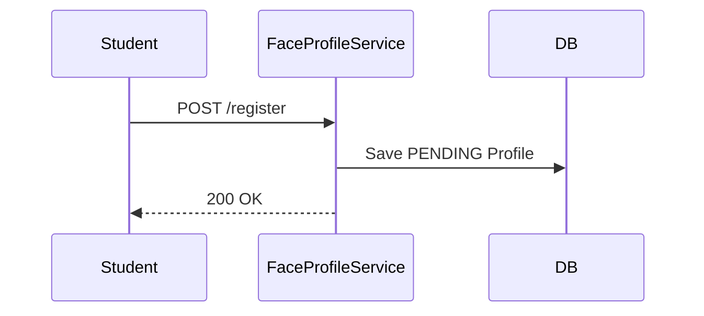
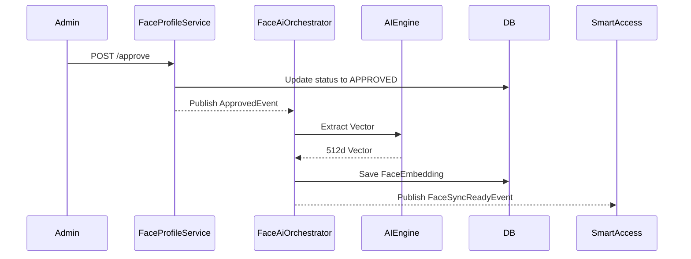
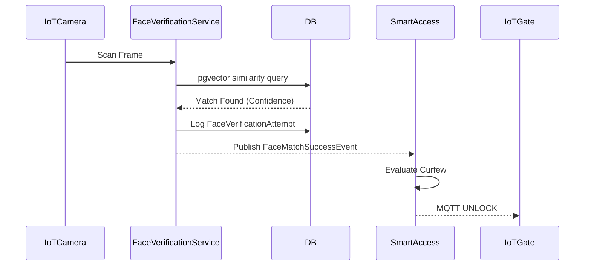

> [!WARNING] 
> STATUS: PLANNED (Not Implemented)

# FACE-BACKEND-04: Service and Event Design

## 1. Use Case Catalog

### 1.1 Student Use Cases
- **Register Face**: Student uploads a portrait photo. Creates a `PENDING` `FaceProfile`.
- **Re-register Face**: Student uploads a new portrait photo after being `REJECTED` or `REVOKED`. Modifies existing `FaceProfile` to `PENDING`.
- **View Face Profile Status**: Student views their current face registration status.

### 1.2 Admin Use Cases
- **View Pending Queue**: Admin lists all `FaceProfile` records with `PENDING` status for review.
- **Approve Profile**: Admin approves a `PENDING` photo, triggering AI extraction and transitioning to `APPROVED`.
- **Reject Profile**: Admin rejects a `PENDING` photo, transitioning to `REJECTED` and triggering image deletion.
- **Revoke Profile**: Admin revokes an `APPROVED` photo, transitioning to `REVOKED` and disabling gate access.

### 1.3 Internal / System Use Cases
- **Verify Face (IoT)**: AI Engine processes a camera frame, Face Module queries similarity, and audits the attempt in `FaceVerificationAttempt`.
- **Extract Embedding (AI)**: System extracts 512d pgvector asynchronously upon profile approval.

## 2. Application Service Catalog

### 2.1 `FaceProfileService`
- **Responsibilities**: Orchestrates the core business logic for profile creation, approval, rejection, and revocation.
- **Dependencies**: `FaceProfileRepository`, `FaceStorageService`, `ApplicationEventPublisher`.
- **Transactions**: Methods are wrapped in `@Transactional` to guarantee atomic database updates.

### 2.2 `FaceVerificationService`
- **Responsibilities**: Handles the matching requests originating from IoT gateways, querying the vector database, and recording the audit trail.
- **Dependencies**: `FaceEmbeddingRepository`, `FaceVerificationAttemptRepository`, `ApplicationEventPublisher`.
- **Transactions**: Read-only for matching, but requires `@Transactional(propagation = Propagation.REQUIRES_NEW)` for persisting the `FaceVerificationAttempt` audit log reliably.

### 2.3 `FaceAiOrchestrator`
- **Responsibilities**: Acts as the anti-corruption layer (ACL) and HTTP client communicating with the external Python AI Engine.
- **Dependencies**: `RestTemplate` or `WebClient`, `FaceEmbeddingRepository`.
- **Transactions**: Executes asynchronously (`@Async`). Vector persistence happens in its own transaction context.

### 2.4 `FaceStorageService`
- **Responsibilities**: Facade for interacting with the infrastructure `upload` module (e.g., Cloudinary).
- **Dependencies**: Cross-module call to `UploadService`.
- **Transactions**: Non-transactional (external network call).

## 3. Domain Event Catalog

### 3.1 `FacePhotoUploadedEvent`
- **Publisher**: `FaceProfileService`
- **Consumer**: None currently. (Reserved for future metrics).
- **Payload**: `profileId`, `studentId`, `uploadedAt`
- **Business Meaning**: A student submitted a photo for review.

### 3.2 `FaceProfileApprovedEvent`
- **Publisher**: `FaceProfileService`
- **Consumer**: `FaceAiOrchestrator` (Face Module), `NotificationModule`
- **Payload**: `profileId`, `studentId`, `faceImageUrl`
- **Business Meaning**: Admin verified the photo.

### 3.3 `FaceProfileRejectedEvent`
- **Publisher**: `FaceProfileService`
- **Consumer**: `NotificationModule`
- **Payload**: `profileId`, `studentId`, `rejectionReason`
- **Business Meaning**: Admin rejected the photo.

### 3.4 `FaceProfileRevokedEvent`
- **Publisher**: `FaceProfileService`
- **Consumer**: `NotificationModule`
- **Payload**: `profileId`, `studentId`, `rejectionReason`
- **Business Meaning**: Admin revoked active access.

### 3.5 `FaceSyncReadyEvent`
- **Publisher**: `FaceAiOrchestrator`
- **Consumer**: `SmartAccessModule`
- **Payload**: `profileId`, `studentId`
- **Business Meaning**: AI extraction finished successfully. The student is now biometrically ready for gate access.

### 3.6 `FaceMatchSuccessEvent`
- **Publisher**: `FaceVerificationService`
- **Consumer**: `SmartAccessModule`
- **Payload**: `studentId`, `gateDeviceId`, `confidenceScore`
- **Business Meaning**: A physical face scanned at a gate matched a student perfectly.

## 4. Event Flow Design

### 4.1 Student Upload
1. Student calls `POST /api/v1/student/face/register`.
2. `FaceProfileService` creates/updates `FaceProfile` (status: `PENDING`).
3. Publishes `FacePhotoUploadedEvent`.

### 4.2 Admin Approval
1. Admin calls `POST /api/v1/admin/faces/{id}/approve`.
2. `FaceProfileService` updates `FaceProfile` (status: `APPROVED`).
3. Publishes `FaceProfileApprovedEvent`.
4. `FaceAiOrchestrator` consumes event $\rightarrow$ calls AI Engine $\rightarrow$ saves `FaceEmbedding`.
5. `FaceAiOrchestrator` publishes `FaceSyncReadyEvent`.

### 4.3 Admin Rejection
1. Admin calls `POST /api/v1/admin/faces/{id}/reject`.
2. `FaceProfileService` updates `FaceProfile` (status: `REJECTED`).
3. `FaceStorageService` synchronously deletes image from Cloudinary.
4. Publishes `FaceProfileRejectedEvent`.

### 4.4 Admin Revoke
1. Admin calls `POST /api/v1/admin/faces/{id}/revoke`.
2. `FaceProfileService` updates `FaceProfile` (status: `REVOKED`).
3. Publishes `FaceProfileRevokedEvent`.

### 4.5 Verification Attempt
1. IoT Camera captures frame.
2. `FaceVerificationService` queries `pgvector` via `FaceEmbeddingRepository`.
3. Records outcome in `FaceVerificationAttempt`.
4. If match > threshold, publishes `FaceMatchSuccessEvent`.

## 5. Smart Access Integration

### 5.1 Boundaries
- Face Module identifies *who* is at the gate. Smart Access determines *if* they are allowed in.
- Face Module has zero dependencies on Smart Access.

### 5.2 Published Events (To Smart Access)
- **`FaceSyncReadyEvent`**: Smart Access marks the student's credentials as `BIOMETRIC_ENABLED`.
- **`FaceMatchSuccessEvent`**: Smart Access intercepts this, evaluates curfew/policies, and commands the IoT gate to unlock.

### 5.3 Consumed Events
- None. Face Module does not consume events from Smart Access.

## 6. Notification Integration

### 6.1 Boundaries
- Face Module has zero dependencies on Notification Module.

### 6.2 Consumed Events (By Notification Module)
- **`FaceProfileApprovedEvent`**: Triggers "Your face registration was approved."
- **`FaceProfileRejectedEvent`**: Triggers "Your face registration was rejected: [reason]."
- **`FaceProfileRevokedEvent`**: Triggers "Your face registration was revoked."

## 7. Student Module Integration

### 7.1 Boundaries
- Face Module queries the `Student` context (e.g. to fetch name for Admin Dashboard), but Student does not query Face.

### 7.2 Read Models
- Frontend calls `GET /api/v1/student/face/profile` to view registration status, completely eliminating duplicated state (`is_face_registered`) in the Student table.

### 7.3 Synchronization Strategy
- No synchronization is necessary due to the elimination of the `is_face_registered` flag (per `FACE-BACKEND-03A`).

## 8. Error Handling Design

### 8.1 Business Exceptions
- `FaceProfileNotFoundException`: 404 Not Found.
- `FaceProfileAlreadyApprovedException`: 409 Conflict. Cannot approve an already approved profile.
- `FaceProfilePendingException`: 409 Conflict. Cannot upload a new photo while one is pending review.

### 8.2 Validation Exceptions
- `FaceImageQualityException`: Thrown if the uploaded file is corrupted or not an image.

### 8.3 AI Service Failures
- `AiEngineTimeoutException`: Thrown when Python AI service is unreachable. Handled via `@Retryable` in `FaceAiOrchestrator` before ultimately failing.

## 9. Transaction Boundaries

### 9.1 Service Transactions
- Core state mutations in `FaceProfileService` are tightly scoped with `@Transactional`. 
- `FaceVerificationAttempt` inserts must be isolated from AI Engine failures using `REQUIRES_NEW`.

### 9.2 Event Publication Timing
- Domain events must be published strictly **after** the database transaction commits to prevent ghost events (e.g., using `@TransactionalEventListener(phase = TransactionPhase.AFTER_COMMIT)`).

## 10. Sequence Diagram Summary

### 10.1 Upload Flow

### 10.2 Approval Flow

### 10.3 Verification Flow

## Final Decision
**PASS**
This Service and Event Design provides a 100% code-free architectural blueprint. It respects all modular boundaries, enforces transaction safety, completely maps event choreographies, and adheres to the `FACE-BACKEND-03A` remediation mandates.
