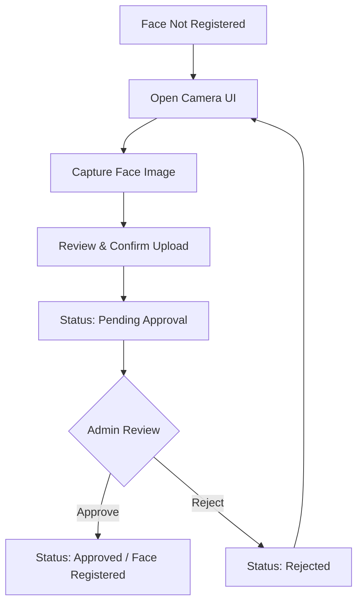

> [!WARNING]
> STATUS: APPROVED DESIGN
> Backend Implementation Pending

# FACE-UI-01: Face User Journey & Screen Architecture Audit

## 1. Actor Analysis
The Face Registration subsystem interacts with three primary personas.

| Actor | Responsibilities | Permissions (Governance Freeze) | Primary Touch Points |
| :--- | :--- | :--- | :--- |
| **Student** | Captures and uploads their face portrait for gate access. Responds to rejection feedback. | UI visibility via `STUDENT_ROLE`. Business actions via `FACE_UPDATE_SELF`. | Student Mobile App / Student Web Dashboard. |
| **Admin** | Audits the entire face registration system. Manually revokes profiles if abuse or eviction occurs. | UI visibility via `ADMIN_ROLE`. Business actions via `FACE_REVOKE`. | SDMS Admin Portal (Web). |
| **Staff** | Daily operational review. Compares newly uploaded photos against official student IDs to approve or reject. | UI visibility via `STAFF_ROLE`. Business actions via `FACE_APPROVAL`, `FACE_VIEW_QUEUE`. | SDMS Admin Portal (Web). |

---

## 2. Face Registration User Journey (Student Flow)
This is the primary happy-path journey for a new student enrolling in the biometric system.

* **Step 1:** The student navigates to the "Biometric Access" tab. The UI reflects `NOT_REGISTERED`.
* **Step 2:** The student is prompted to open the device camera. Guidelines (lighting, no masks) are displayed.
* **Step 3:** The student captures the image and clicks "Submit".
* **Step 4:** The UI locks the capture button and displays a `PENDING_APPROVAL` banner.
* **Step 5:** Upon Admin approval, the UI transitions to an `APPROVED` state, confirming gate access is active.

---

## 3. Face Re-Registration Flow
Students whose faces change significantly or who received a `REJECTED`/`REVOKED` status must re-register.

* **Trigger:** The UI displays a `REJECTED` or `REVOKED` state with the corresponding reason (e.g., "Photo too dark").
* **Journey:** The UI provides a "Re-capture Photo" CTA. The student is taken back through the standard Capture $\rightarrow$ Upload $\rightarrow$ Pending pipeline.
* **UI Constraint:** While in the `PENDING` state for a re-registration, the old face (if previously `REVOKED`) remains inactive at the gate, but the UI clearly communicates that the new photo is under review.

---

## 4. Admin Approval Journey
The daily operational flow for KTX Staff and Admins.

* **Step 1:** Staff navigates to the "Face Approval Queue" screen.
* **Step 2:** The UI presents a split-screen or side-by-side card: Left side shows the **Official Portrait** (from check-in/ID), Right side shows the **Newly Uploaded Photo**.
* **Step 3:** Staff clicks `Approve` or `Reject`.
* **Step 4:** If `Reject` is clicked, a modal prompts the Staff to select a reason (e.g., "Blurry", "Not a face", "Wearing Mask").
* **Step 5:** Upon decision, the card is removed from the Pending Queue, and the UI toasts a success message.

---

## 5. Screen Inventory

### Student Screens (Mobile/Web)
* **Status Dashboard Screen:** Must explicitly separate **Face Registration Status** (e.g., `APPROVED`) from **Gate Access Status** (e.g., `DENIED - CURFEW`). This ensures students do not confuse biometric enrollment with physical building eligibility.
* **Camera Capture Screen:** Native/WebRTC camera interface with an overlay oval to guide face placement.
* **Review & Submit Screen:** Displays the captured photo for user confirmation before upload.

### Admin/Staff Screens (Web)
* **Approval Queue Screen:** A DataGrid/List of all students currently in `PENDING` state.
* **Face Comparison Modal:** The side-by-side review interface.
* **Face Directory Screen:** A searchable grid of all `APPROVED` and `REVOKED` profiles to manage active gate access.

---

## 6. UI State Machine
The Frontend UI must reactively render based on the strict State Machine managed by the Face Module.

| State | UI Display Element | Allowed User Action |
| :--- | :--- | :--- |
| `NOT_REGISTERED` | Grey badge. Empty photo slot. | Enable "Setup Face Access" button. |
| `PENDING` | Yellow/Orange badge. "Under Review". | Disable capture. Wait for review. |
| `APPROVED` | Green badge. "Access Active". | Hide capture. Show "Request Update" option. |
| `REJECTED` | Red badge. Show rejection reason. | Enable "Re-capture" button. |
| `REVOKED` | Dark Red badge. "Access Revoked". | Enable "Re-capture" (if policy allows). |

---

## 7. Notification Journey
The UI must intercept or display notifications at key transition points:

* **Upload Success:** In-app Toast / Snack bar $\rightarrow$ "Photo submitted successfully. Awaiting review."
* **Approval Success:** Push Notification (FCM) & In-app alert $\rightarrow$ "Your face registration is approved. You can now use the gate."
* **Approval Rejected:** Push Notification (FCM) & In-app alert $\rightarrow$ "Your photo was rejected: [Reason]. Please re-capture."
* **Profile Revoked:** Push Notification (FCM) $\rightarrow$ "Your biometric access has been revoked. Please contact administration."

---

## 8. Error Journey
Handling edge cases robustly within the UI:

* **Invalid Face / Multiple Faces:** If the backend AI validation immediately detects 0 or >1 faces during upload, the UI catches the HTTP 400 error (`ERR_NO_FACE`, `ERR_MULTIPLE_FACES`) and immediately displays an inline error: "Please ensure only one face is clearly visible."
* **Upload Failure (File Too Large):** UI intercepts `ERR_IMAGE_TOO_LARGE` and prompts: "Image exceeds 5MB. Please capture a lower resolution photo."
* **Timeout / Offline:** If the upload takes too long or network drops, UI shows a fallback screen allowing the user to save the photo locally and try again later.

---

## 9. Mobile Responsiveness & Hardware Specs
* **Responsive Requirements:** The Admin/Staff screens are primarily Desktop-first (for side-by-side comparison ease), while the Student flow is strictly **Mobile-first**.
* **Image Source Policy (Student):** For SDMS V1, the UI must support **Camera + Gallery** uploads. While Camera-Only prevents some spoofing, WebRTC compatibility issues across diverse student Android/iOS devices make it impractical for V1. The Admin Approval workflow acts as the definitive anti-spoofing barrier.
* **Lighting/Quality Guides:** The capture UI should include a static overlay (an oval) instructing the user to position their face properly with good lighting.

---

## 10. Implementation Readiness

**Readiness Assessment:**
* **React/Web Team:** Has a clear inventory of Admin Screens, DataGrids, and Modal flows.
* **Mobile/App Team:** Has a strict UI State Machine to follow, clear notification triggers, and hardware camera requirements.
* **Integration Alignment:** Perfectly maps to the DTOs and Error Contracts defined in `FACE-APP-02`.

**Final Decision: PASS** ✅

The Face Registration User Journey and Screen Architecture is complete, logically sound, and ready for UI/UX wireframing and frontend component implementation.

