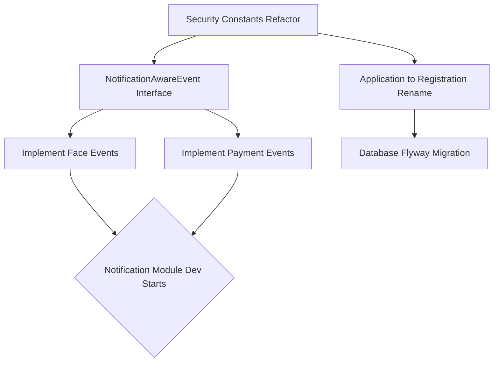

# BACKEND-CONSISTENCY-02: Consistency Remediation Plan

## 1. Executive Summary
This document outlines the strategic remediation plan to resolve architectural inconsistencies discovered during the `BACKEND-CONSISTENCY-01` audit. The primary focus is to stabilize security governance, align module naming conventions, and establish a robust domain event architecture required to support the upcoming Notification Module. No implementation is performed in this phase.

## 2. Issue Remediation Specifications

### Issue 1: Registration vs Application Naming Drift
- **Root Cause:** Legacy development began referring to the student onboarding process as "Application", but technical documentation and architectural taxonomy officially established it as "Registration". 
- **Impact:** Causes severe cognitive load for developers mapping documentation (`04-registration`) to the source code (`com.sdms.backend.modules.application`).
- **Risk Level:** MEDIUM
- **Affected Modules:** `application` (Code), `04-registration` (Docs)
- **Recommended Fix:** Refactor the Java package `com.sdms.backend.modules.application` to `com.sdms.backend.modules.registration`. Rename associated entities (e.g., `DormitoryApplication` -> `DormitoryRegistration`) and Flyway scripts if necessary.
- **Migration Strategy:** 
  1. Rename package and classes via IDE refactoring tools to preserve imports.
  2. Create a Flyway migration to rename database tables (`dormitory_applications` -> `dormitory_registrations`).
  3. Update API endpoints carefully (consider adding `@Deprecated` endpoints routing to the new ones during a transition window).
- **Estimated Effort:** 3-5 Days

### Issue 2: Security Authority Standardization
- **Root Cause:** Early legacy modules relied on hardcoded string-based Role checks (`@PreAuthorize("hasRole('STUDENT')")`), whereas newer modules like Smart Access adopted a strict, refactor-friendly Permission Constant architecture (`@PreAuthorize(SmartAccessPermissions.VIEW_ACCESS_HISTORY)`).
- **Impact:** High risk of typos in security checks. Extremely difficult to audit globally. Hard to introduce granular permissions without breaking existing role structures.
- **Risk Level:** HIGH
- **Affected Modules:** `student`, `room`, `payment`, `application`, `auth`
- **Recommended Fix:** Extract all hardcoded strings into a centralized `SecurityPermissions` or module-specific `[Module]Permissions` registry. Replace all `@PreAuthorize` strings with these constants.
- **Migration Strategy:** 
  1. Create a `DomainPermissions` class in the `auth` module.
  2. Map all existing string roles/authorities to constants.
  3. Perform a global regex search-and-replace for `@PreAuthorize` annotations.
- **Estimated Effort:** 2 Days

### Issue 3: Face Event Implementation Gaps
- **Root Cause:** The `face` module was integrated heavily via API calls or direct database updates without emitting standard Spring Application Domain Events for decoupling.
- **Impact:** The Notification Module will be completely blind to Face Recognition activities. We cannot asynchronously notify students if their face registration fails or succeeds.
- **Risk Level:** CRITICAL (Blocks Notification Module)
- **Affected Modules:** `face`
- **Recommended Fix:** Implement and publish `FaceRegisteredEvent`, `FaceRegistrationFailedEvent`, and `FaceSyncSuccessEvent` within the Face module's service layer.
- **Migration Strategy:** 
  1. Define event records in `face/event/`.
  2. Inject `ApplicationEventPublisher` into Face services.
  3. Publish events strictly inside `@Transactional` blocks to ensure they can be caught by `@TransactionalEventListener(phase = TransactionPhase.AFTER_COMMIT)`.
- **Estimated Effort:** 1 Day

### Issue 4: Payment Event Gaps
- **Root Cause:** While `PaymentSuccessEvent` was implemented, edge cases such as failures, refunds, or overdues were neglected in the event architecture.
- **Impact:** Prevents automated dunning (overdue) notifications or failure alerts, forcing manual polling by admins.
- **Risk Level:** HIGH (Blocks Notification Module)
- **Affected Modules:** `payment`
- **Recommended Fix:** Implement `PaymentFailedEvent`, `PaymentRefundedEvent`, and `PaymentOverdueEvent`.
- **Migration Strategy:** 
  1. Define missing event records.
  2. Add publisher hooks to the payment webhook handlers and scheduled batch jobs handling overdues.
- **Estimated Effort:** 1-2 Days

### Issue 5: Notification Readiness Blockers
- **Root Cause:** The upcoming Notification Module requires a unified interface or common abstract event type to consume events globally without tightly coupling to every single module. Currently, events do not share a common base interface.
- **Impact:** The Notification Module will require messy, monolithic listener classes importing dozens of disparate event types.
- **Risk Level:** MEDIUM
- **Affected Modules:** All Modules (`core` architecture)
- **Recommended Fix:** Introduce a `DomainEvent` or `NotificationAwareEvent` marker interface in the `core` or `global` package that all notification-worthy events must implement.
- **Migration Strategy:** 
  1. Create `NotificationAwareEvent` interface defining `getUserId()` and `getNotificationType()`.
  2. Retrofit existing events (e.g., `BedReservedEvent`, `AccessDeniedEvent`) to implement this interface.
- **Estimated Effort:** 2 Days

## 3. Remediation Roadmap

### Implementation Order
1. **Phase 1: Security Authority Standardization (HIGH RISK, LOW EFFORT)**
   - Must be done immediately to secure the boundaries before further refactoring.
2. **Phase 2: Event Architecture Expansion (CRITICAL BLOCKER)**
   - Implement missing `face` and `payment` events.
   - Introduce `NotificationAwareEvent` interface.
   - *Milestone: Notification Readiness Achieved.*
3. **Phase 3: Registration/Application Naming Drift (MEDIUM RISK, HIGH EFFORT)**
   - Perform the database and package refactoring. This is pushed to last as it carries the highest risk of breaking compilation and testing.

### Dependency Graph

## Final Decision
**PASS**
The remediation plan logically sequences the technical debt resolution. By prioritizing Security and Event architectures first, we unlock the Notification Module development stream while safely delaying the high-risk package renaming.
