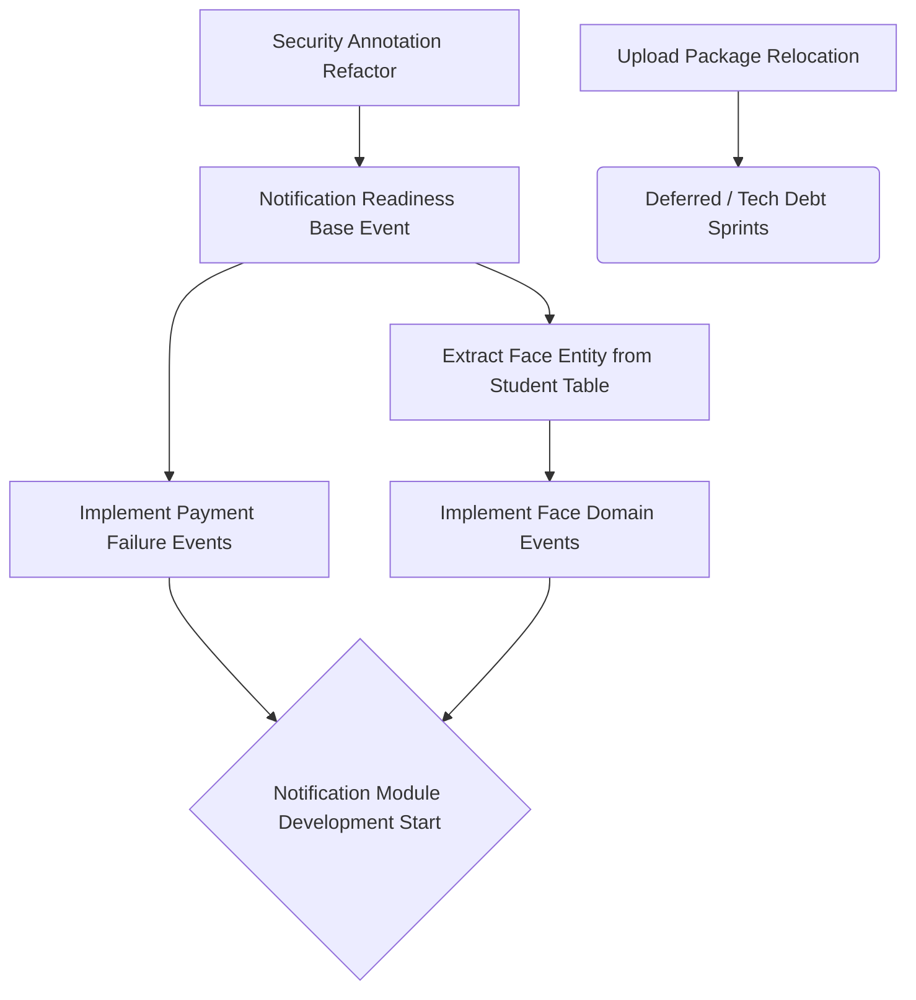

# BACKEND-CONSISTENCY-04: Implementation Gap Remediation Audit

## 1. Executive Summary
This document provides the actionable remediation roadmap to resolve the specific implementation gaps confirmed during the `BACKEND-CONSISTENCY-03` evidence audit. Crucially, a manual business review of the `Application` vs `Registration` module naming has been performed to prevent hazardous renaming. No code has been modified in this phase.

## 2. Manual Business Review: Application vs Registration
- **Finding:** A deep evaluation of the entities reveals that `registration` and `application` are **Distinct Business Concepts**, NOT naming drift.
- **Analysis:** The `registration` module (managing `RegistrationPeriod` and `RegistrationEligibility`) is an administrative bounded context defining *when* and *who* is allowed to apply. The `application` module (managing `DormitoryApplication`) is a student-facing bounded context handling the actual submission lifecycle.
- **Conclusion:** DO NOT RENAME PACKAGES. The perceived naming drift is actually a documentation failure, not a code failure. The taxonomy should be updated in a future governance phase to reflect both modules.

## 3. Gap Remediation Roadmap

### Gap 1: Security Permission Drift
- **Root Cause:** Legacy modules use hardcoded string roles (e.g., `@PreAuthorize("hasRole('STUDENT')")`) rather than unified domain-permission constants.
- **Business Impact:** Security vulnerabilities may occur due to typo-prone strings; auditing who has access to what is extremely slow.
- **Technical Impact:** Difficult to implement dynamic role-based access control (RBAC). Codebase lacks a single source of truth for authorities.
- **Risk:** HIGH
- **Migration Strategy:** 
  1. Define a centralized `SecurityPermissions` registry in the `auth` module.
  2. Replace all string-based role checks with constant references across all controllers.
- **Dependency Impact:** Low (Only touches annotations in the web layer).
- **Notification Impact:** None.

### Gap 2: Face Domain Missing Implementation
- **Root Cause:** Face data was appended directly to the `students` table via Flyway `V15` rather than building out the `face` module as an autonomous domain.
- **Business Impact:** Face AI features cannot be cleanly extracted, scaled, or managed independently of student lifecycle data.
- **Technical Impact:** The `face` module is an empty shell. No events can be published because the domain logic is missing.
- **Risk:** CRITICAL
- **Migration Strategy:** 
  1. Extract Face metadata from the `students` table into a standalone `face_registrations` table via a new Flyway script.
  2. Implement `FaceRegistrationService` and `FaceRegisteredEvent`.
- **Dependency Impact:** High (`student` module must be decoupled from `face`).
- **Notification Impact:** Blocking (Notification Module cannot alert students to Face sync failures).

### Gap 3: Payment Event Gaps
- **Root Cause:** Only the happy-path `PaymentSuccessEvent` was implemented, ignoring failure and refund states.
- **Business Impact:** Financial discrepancies require manual intervention. Dunning processes (chasing unpaid bills) cannot be automated.
- **Technical Impact:** Event architecture is incomplete, forcing other modules to poll the database for payment statuses.
- **Risk:** HIGH
- **Migration Strategy:** 
  1. Introduce `PaymentFailedEvent`, `PaymentRefundedEvent`, and `PaymentOverdueEvent`.
  2. Hook these events into existing webhook catch blocks and cron jobs.
- **Dependency Impact:** Low.
- **Notification Impact:** Blocking (Notification Module cannot send "Payment Overdue" or "Payment Failed" emails).

### Gap 4: Upload Infrastructure Boundary Drift
- **Root Cause:** A 3rd-party integration (`CloudinaryService`) was placed inside the domain `modules` directory instead of an infrastructure layer.
- **Business Impact:** None.
- **Technical Impact:** Architectural drift. Domain layers should not be polluted with strict vendor integrations.
- **Risk:** LOW
- **Migration Strategy:** 
  1. Create an `infrastructure/storage` package.
  2. Move `CloudinaryService` and `UploadController` into this package.
- **Dependency Impact:** Medium (Requires updating imports in any module that uploads files).
- **Notification Impact:** None.

## 4. Priority & Notification Readiness Matrix

### Priority Matrix
| Gap | Severity | Effort | Target Fix Phase |
| --- | --- | --- | --- |
| Security Permission Drift | HIGH | Low | Immediate |
| Face Domain Implementation | CRITICAL | High | Immediate |
| Payment Event Gaps | HIGH | Medium | Immediate |
| Upload Boundary Drift | LOW | Low | Deferred |

### Notification Readiness Matrix
| Dependency Area | Current State | Required For Notification Module |
| --- | --- | --- |
| Event Interface Standardization | Missing | `NotificationAwareEvent` Base Interface |
| Smart Access Events | Ready | No action needed |
| Room Events | Ready | No action needed |
| Face Events | Blocking | `FaceRegistrationFailedEvent`, `FaceSyncEvent` |
| Payment Events | Blocking | `PaymentFailedEvent`, `PaymentOverdueEvent` |

## 5. Dependency Graph

## Final Decision
**PASS**
By formally acknowledging that `Application` and `Registration` are distinct business concepts, we avoid catastrophic, incorrect refactoring. The remediation roadmap safely targets only the proven technical debt (Security, Events, Infrastructure), perfectly positioning the project for the Notification Module build phase.
