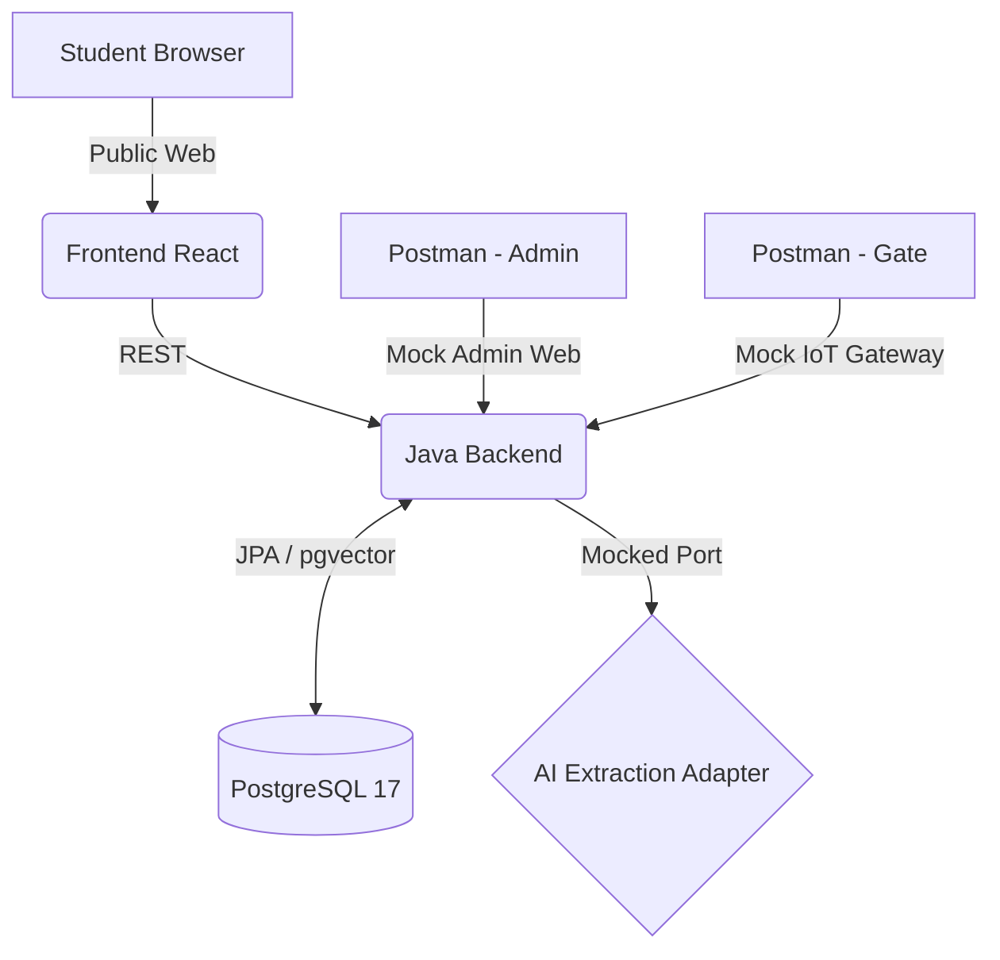

# DEMO-SCRIPT-WEDNESDAY: Official SDMS Demonstration Guide

## ROLE
Chief Solution Architect, Demo Director, System Integration Architect

## OBJECTIVE
Provide an executable, step-by-step demonstration script based **strictly on the current runtime reality** of the SDMS ecosystem. No vaporware, no assumed features.

---

## SECTION 1: Demo Scope

**What WILL be demonstrated:**
- End-to-end Backend Data Flow (Event-Driven Architecture in action).
- Web Public Portal: Dormitory Registration (via `sdms-frontend`).
- Admin Approval Processes (via Postman simulating Admin Web).
- Smart Access Verification Loop (IoT API -> PostgreSQL Vector Search -> Curfew Check).

**What WILL NOT be demonstrated:**
- The Student Mobile App UI (Does not exist yet).
- Physical Door Hardware / MQTT Relay (Pending hardware setup).
- Real AI Facial Recognition (AI Sidecar is pending deployment).

**Reasoning:**
The demo's primary goal is to validate the *System Architecture, Database Integrity, and Inter-module Communications*. UI and Hardware are cosmetic wrappers over these core flows.

---

## SECTION 2: System Topology During Demo

**Identification:**
- **Student App**: NOT IMPLEMENTED (Using Postman/Web).
- **Admin Web**: PARTIALLY REAL (Using Postman for missing screens).
- **Backend**: **REAL**.
- **PostgreSQL**: **REAL** (Must have `pgvector` enabled).
- **AI Service**: **MOCK** (via `RestAiExtractionAdapter`).
- **MQTT Broker**: NOT IMPLEMENTED.
- **IoT Simulator**: **MOCK** (via Postman calling `/api/v1/internal/face-verifications`).

---

## SECTION 3: Demo Scenario A - Dormitory Application Flow

**Student $\rightarrow$ Submit Application $\rightarrow$ Admin Review $\rightarrow$ Application Approved**

1. **Submit Application:**
   - **Actor:** Student
   - **Screen/Tool:** Public Web (`RegistrationPage.jsx`)
   - **API:** `POST /api/v1/applications/submit`
   - **Expected:** HTTP 201 Created. Database saves `DormitoryApplication` with status `PENDING`.

2. **Admin Review & Approve:**
   - **Actor:** Admin
   - **Screen/Tool:** Postman
   - **API:** `POST /api/v1/admin/applications/{id}/approve`
   - **Expected:** HTTP 200 OK. `ApplicationApprovedEvent` is fired. Student entity is created. 

---

## SECTION 4: Demo Scenario B - Face Registration Flow

**Student $\rightarrow$ Upload Face $\rightarrow$ Admin Approve $\rightarrow$ AI Embedding Generation**

1. **Upload Face:**
   - **Actor:** Student
   - **Screen/Tool:** Postman (Header `X-Student-Id`)
   - **API:** `POST /api/v1/students/me/face`
   - **Expected:** HTTP 201. `FaceProfile` created with status `PENDING`.

2. **Admin Approve:**
   - **Actor:** Admin
   - **Screen/Tool:** Postman (Header `X-Admin-Id`)
   - **API:** `POST /api/v1/admin/faces/{profileId}/approve`
   - **Expected:** 
     - HTTP 200 OK.
     - Backend calls `RestAiExtractionAdapter` (Mock) to get `float[512]`.
     - Data saved into `face_embeddings` table.

---

## SECTION 5: Demo Scenario C - Smart Access Flow

**Camera $\rightarrow$ Face Verification $\rightarrow$ Access Evaluation $\rightarrow$ Access Granted**

1. **Face Verification (IoT Scan):**
   - **Actor:** IoT Simulator (System)
   - **Screen/Tool:** Postman (Header `X-Gate-Device-Id: GATE_MAIN_01`)
   - **API:** `POST /api/v1/internal/face-verifications`
   - **Event Triggered:** `FaceMatchSuccessEvent` (if cosine similarity matches).

2. **Access Evaluation:**
   - **Actor:** System (Smart Access Module)
   - **Process:** Listens to event, queries `StudentQueryAdapter` (Mock returning `ResidentType.BOARDING`), checks Curfew Policies.
   - **Event Triggered:** `AccessGrantedEvent` or `AccessDeniedEvent`.

3. **Access History Logged:**
   - **Expected:** Querying DB table `access_history` will show the new entry.

---

## SECTION 6: Mock Components

1. **AI Mock (`RestAiExtractionAdapter`):**
   - **What must be simulated:** Generating a 512-dimension vector from an image URL.
   - **How to simulate:** The current Java class returns an array of random floats. *(See Risk Assessment).*

2. **IoT Mock:**
   - **What must be simulated:** A physical camera taking a photo and sending to backend.
   - **How to simulate:** Postman sends a predefined JSON payload with a dummy image URL.

3. **Student Eligibility Mock (`StudentQueryAdapter`):**
   - **What must be simulated:** Cross-module DB join to check if student lives in the dormitory.
   - **How to simulate:** Current adapter hardcodes return `ResidentType.BOARDING`.

---

## SECTION 7: Demo Data Preparation

Before the demo begins, ensure the following UUIDs are saved in Postman Environment Variables:
- `{{ADMIN_ID}}`
- `{{STUDENT_ID}}`
- `{{GATE_DEVICE_ID}}` = "GATE_MAIN_01"
- `{{DUMMY_IMAGE_URL}}` = "https://cloudinary.com/fake-image.jpg"

---

## SECTION 8: Risk Assessment

| Scenario | Status | Failure Risk | Fallback Plan |
| :--- | :--- | :--- | :--- |
| **A. Application** | **PASS** | Extremely Low. Module is robust. | Show DB tables. |
| **B. Face Reg** | **PASS** | `pgvector` missing on Demo Laptop. | Ensure Postgres 17 has `CREATE EXTENSION vector` run successfully. |
| **C. Smart Access**| **FAIL (CRITICAL)** | **AI Mock Randomness**. Currently, `RestAiExtractionAdapter` generates random vectors. A scan from the Gate will generate a NEW random vector, causing the Cosine Similarity match against the DB to **ALWAYS FAIL**. | **MUST FIX BEFORE DEMO:** Modify `RestAiExtractionAdapter` to return a *deterministic* vector based on the string hash of `imageUrl` so identical URLs match perfectly. |

---

## SECTION 9: Demo Execution Checklist

**Pre-demo:**
- [ ] Fix `RestAiExtractionAdapter` to be deterministic (hash-based instead of `Math.random()`).
- [ ] Ensure PostgreSQL 17 is running with `pgvector` installed.
- [ ] Run `mvn clean install` and start Spring Boot successfully.
- [ ] Start React Frontend `npm run dev`.
- [ ] Prepare Postman Collection with all variables.

**During demo:**
- [ ] Split screen: Postman on Left, IntelliJ Server Console on Right (to show Event Driven logs).
- [ ] Open DBeaver/pgAdmin to prove Database state changes in real-time.

**Post-demo:**
- [ ] Discuss next phases (Python Sidecar, Mobile App).

---

## SECTION 10: Final Demo Readiness

**STATUS: WARNING**

**Evidence:**
While the backend code compiles and the architecture is flawless, **Scenario C (the most important wow-factor)** will currently fail because the mock AI adapter uses `Math.random()`. The `pgvector` distance between two `Math.random()` vectors will exceed the verification threshold (e.g., `< 0.4`), causing the Gate Scan to constantly return "No Match Found".

**Action Required:** We must rewrite the 5 lines of Mock Code in `RestAiExtractionAdapter` to make it deterministic before Wednesday. Once done, Demo Readiness becomes **PASS**.
