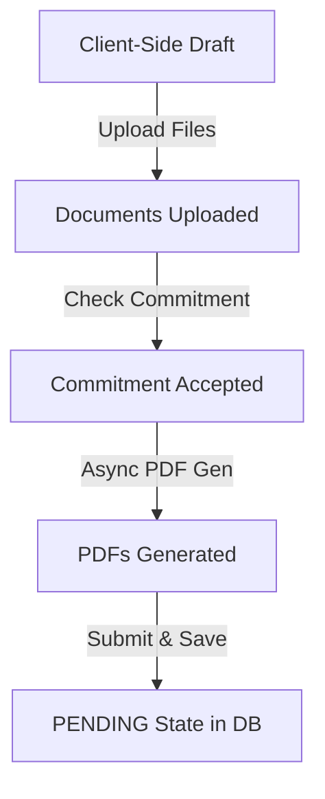
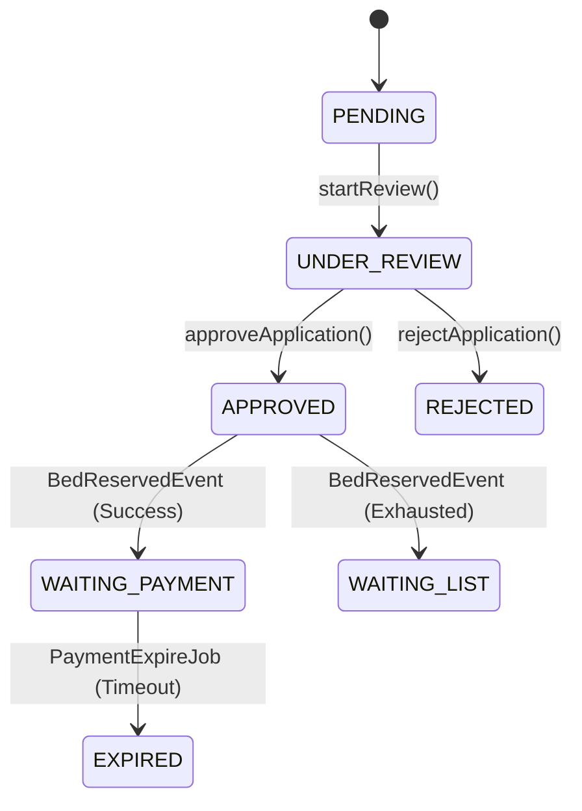
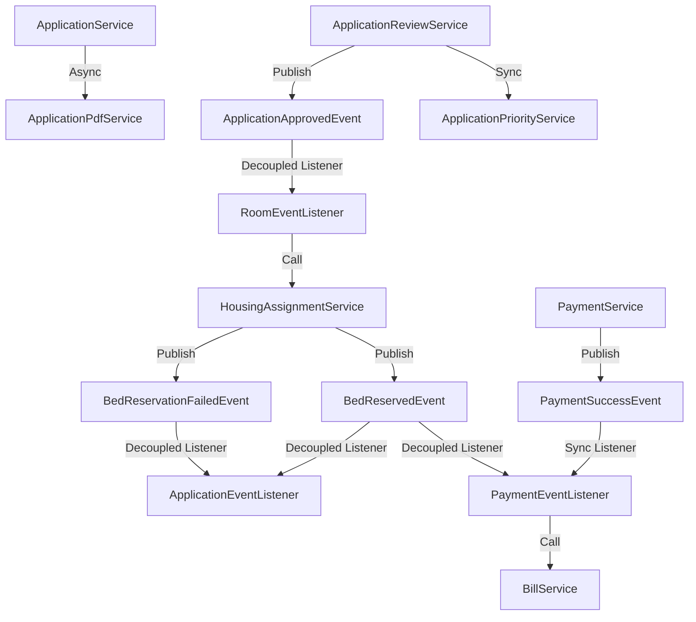

# APPLICATION-08A: SERVICE IMPLEMENTATION PLAN

## 1. Executive Summary
This document establishes the detailed implementation design for the Service Layer and Business Workflows of the **Application Module** within the Smart Dormitory Management System (SDMS). 

It ensures strict compliance with architectural constraints:
- The **Application Module** does not own, reference directly, or write to `Student`, `UserAccount`, `Bill`, `Payment`, `Room`, or `Bed` tables/entities.
- Integration between modules is handled cleanly via Spring **Domain Events** and service interfaces.
- The deprecated state `REVISION_REQUIRED` is completely avoided.

---

## 2. Service Inventory (TASK 01)

### 2.1. ApplicationService
- **Responsibility**: Coordinates the creation and submission of dormitory applications for Group A, B, and C applicants. Manages document uploads, and handles official submission.
- **Owner Module**: Application Module
- **Public Methods**:
  - `uploadDocument(UUID applicationId, VerificationDocumentType type, MultipartFile file): DocumentResponse`
  - `submitApplication(CreateApplicationRequest request): ApplicationResponse`

### 2.2. ApplicationReviewService
- **Responsibility**: Handles transitions of the application lifecycle during the administrative evaluation phase (PENDING $\rightarrow$ UNDER_REVIEW $\rightarrow$ APPROVED / REJECTED). Coordinates validation of normal and priority documents.
- **Owner Module**: Application Module
- **Public Methods**:
  - `startReview(UUID applicationId, UUID adminUserId): void`
  - `verifyDocument(UUID documentId, VerificationStatus status, String note, UUID adminUserId): void`
  - `approveApplication(UUID applicationId, String note, UUID adminUserId): void`
  - `rejectApplication(UUID applicationId, String note, UUID adminUserId): void`

### 2.3. ApplicationPriorityService
- **Responsibility**: Handles assigning, mapping, and calculating priority scores for applications.
- **Owner Module**: Application Module
- **Public Methods**:
  - `assignPriorities(UUID applicationId, List<PriorityCategory> categories): void`
  - `recalculateScore(UUID applicationId): int`

### 2.4. ApplicationPdfService
- **Responsibility**: Generates `REGISTRATION_FORM` and `COMMITMENT_FORM` PDFs asynchronously. Uploads generated files to Cloudinary and saves URL references.
- **Owner Module**: Application Module
- **Public Methods**:
  - `generateRegistrationFormPdf(UUID applicationId): CompletableFuture<String>`
  - `generateCommitmentFormPdf(UUID applicationId): CompletableFuture<String>`

### 2.5. RegistrationEligibilityService (Updates to existing)
- **Responsibility**: Handles importing and validating candidate eligibility lists.
- **Owner Module**: Registration Module
- **Public Methods**:
  - `importEligibility(UUID periodId, MultipartFile file): EligibilityImportResponse` (Refactored to parse `student_code`, `email`, and `target` columns).

---

## 3. Create Application Workflow (TASK 02)
The application creation workflow accommodates three distinct user groups:
- **Group A (Freshman)**: No `student_code` yet. Checks eligibility based on CCCD in the uploaded list with `target = FRESHMAN`.
- **Group B (Non-resident senior student)**: Has `student_code`. Checks eligibility on CCCD with `target = NON_RESIDENT_STUDENT`.
- **Group C (Current resident)**: Has `student_code` and active `Student` profile. Eligibility validation checks if they have a student profile and checks eligibility list if it's a restricted period.

### Workflow States:
> [!IMPORTANT]
> **Draft state is purely a UI State (Client-Side Only)**. No `DRAFT` status is persisted in the database, nor is there a backend draft entity representation. The database record is created directly in the `PENDING` status upon official submission.


1. **Document Upload**: Candidates upload required files (e.g., CCCD scans, Portrait photos) before submitting the formal application.
2. **Commitment Acceptance**: The user agrees to the electronic terms, triggering the asynchronous generation of the PDFs.
3. **Submission**: `ApplicationService.submitApplication` creates the application record in the database directly at `PENDING` status and publishes `ApplicationSubmittedEvent`.

---

## 4. Application Review Workflow (TASK 03)
Administrative review strictly follows the lifecycle diagram below:



- **PENDING $\rightarrow$ UNDER_REVIEW**: Initiated when an admin starts auditing an application.
- **UNDER_REVIEW $\rightarrow$ APPROVED**: When the admin completes document verification and marks the application approved. This publishes `ApplicationApprovedEvent`.
- **APPROVED $\rightarrow$ WAITING_PAYMENT / WAITING_LIST**: Handled dynamically based on bed availability.
- **WAITING_PAYMENT $\rightarrow$ EXPIRED**: Triggered by the automated `PaymentExpireJob` scheduler if payment remains unpaid after 3 days.

---

## 5. Priority Scoring & Waiting List (TASK 04)
- **Scoring Owner**: Calculation of priority scores is owned by `ApplicationPriorityService`.
- **Recalculation Trigger**: Triggered whenever a document of type `PRIORITY_PROOF` changes its verification status to `VALID` or `INVALID` in `ApplicationReviewService.verifyDocument`.
- **Ranking**: The ranking of waitlist candidates is evaluated dynamically using:
  ```sql
  ORDER BY a.priorityScore DESC, a.createdAt ASC
  ```
- **Promotion**: When a bed is released, `WaitingListPromotionJob` scans candidates ordered by the ranking above and promotes them one-by-one inside isolated transactions.

---

## 6. PDF Generation (TASK 05)
- **Forms**: `REGISTRATION_FORM` (Phiếu đăng ký nội trú), `COMMITMENT_FORM` (Bản cam kết nội trú).
- **Generation Trigger**: Sparked asynchronously upon drafting confirmation and commitment signature submission.
- **Version Strategy**: Incremental template numbering (`V1.0`, `V1.1`). Every regeneration creates a new `ApplicationGeneratedDocument` record to preserve history.
- **Storage Strategy**: Cloudinary storage bucket `dormitory_pdfs/applications/`. DB stores URL snapshots.

---

## 7. Domain Events Inventory (TASK 06)

| Event Name | Publisher | Consumer | Sync/Async | Transaction Boundary |
| :--- | :--- | :--- | :--- | :--- |
| `ApplicationSubmittedEvent` | `ApplicationService` | `NotificationService` | Async | `AFTER_COMMIT` |
| `ApplicationApprovedEvent` | `ApplicationReviewService` | `RoomEventListener` | Decoupled | `AFTER_COMMIT` (Starts new transaction in Room context) |
| `BedReservedEvent` | `HousingAssignmentService` | `PaymentEventListener`, `ApplicationEventListener` | Decoupled | `AFTER_COMMIT` (Starts new transaction in target contexts) |
| `BedReservationFailedEvent` | `HousingAssignmentService` | `ApplicationEventListener` | Decoupled | `AFTER_COMMIT` (Starts new transaction in Application context) |
| `BillCreatedEvent` | `BillService` | `NotificationService` | Async | `AFTER_COMMIT` |
| `PaymentSuccessEvent` | `PaymentService` | `PaymentEventListener` | Sync | Participates in Payment Transaction |

---

## 8. Integration Workflows

### 8.1. Room Module Integration (TASK 07)
- **Action APPROVED $\rightarrow$ Reserve Bed $\rightarrow$ WAITING_PAYMENT / WAITING_LIST**:
  1. `ApplicationReviewService` approves application $\rightarrow$ status becomes `APPROVED` $\rightarrow$ commits Transaction 1 $\rightarrow$ publishes `ApplicationApprovedEvent`.
  2. `RoomEventListener` (in Room Module) listens to `ApplicationApprovedEvent` (via `@TransactionalEventListener(phase = TransactionPhase.AFTER_COMMIT)`) $\rightarrow$ starts Transaction 2 $\rightarrow$ calls `HousingAssignmentService.reserveBed`.
  3. If reservation succeeds:
     - `reserveBed` locks room, updates Bed to `RESERVED`, and creates `StudentHousingAssignment` in state `RESERVED`.
     - Transaction 2 commits and publishes `BedReservedEvent`.
  4. If reservation fails (no available bed):
     - `RoomEventListener` catches the exception/null return $\rightarrow$ publishes `BedReservationFailedEvent`.
  5. `ApplicationEventListener` (in Application Module) receives `BedReservedEvent` $\rightarrow$ starts Transaction 3a $\rightarrow$ updates status to `WAITING_PAYMENT` with a 3-day deadline.
  6. `ApplicationEventListener` receives `BedReservationFailedEvent` $\rightarrow$ starts Transaction 3b $\rightarrow$ updates status to `WAITING_LIST`.
- **Boundary Restriction**: Application Module **does not** call `BedRepository` or `RoomRepository` directly.

### 8.2. Payment Module Integration (TASK 08)
- **Action WAITING_PAYMENT $\rightarrow$ Bill Creation $\rightarrow$ Payment Success**:
  1. `PaymentEventListener` (in Payment Module) listens to `BedReservedEvent` (via `@TransactionalEventListener(phase = TransactionPhase.AFTER_COMMIT)`) $\rightarrow$ starts Transaction 4 $\rightarrow$ calls `BillService.createAccommodationBill`.
  2. Creates a `Bill` in `UNPAID` status.
  3. Student completes payment $\rightarrow$ `PaymentService` updates `Bill` to `PAID` and publishes `PaymentSuccessEvent`.
- **Boundary Restriction**: `PaymentSuccessEvent` listener **must not** modify the Application Status, keeping it in `WAITING_PAYMENT` (until check-in).

### 8.3. Student Module Integration (TASK 09)
- **Action Payment Success $\rightarrow$ Student Profile $\rightarrow$ User Account**:
  1. `PaymentEventListener` handles `PaymentSuccessEvent`.
  2. Creates `Student` with status `PENDING_CHECKIN`.
  3. Creates `UserAccount` with status `PENDING_ACTIVATION` and temporary password.
  4. Links Student to Assignment in Room Module.
- **Boundary Restriction**: Student & Account entities are owned and written to exclusively by the Student/Auth module.

---

## 9. Transaction Boundaries (TASK 10)
- **Submission**: `@Transactional` on service methods. Asynchronous PDF thread pools are outside the database transaction.
- **Approval**: Approval is split into **separate, isolated transaction boundaries** linked by domain events. This avoids long-lived locks across multiple context tables:
  - **Transaction 1 (Application Context)**: Updates application to `APPROVED` and commits.
  - **Transaction 2 (Room Context)**: Listens to `ApplicationApprovedEvent` (`AFTER_COMMIT`), attempts to reserve a bed, and commits.
  - **Transaction 3a (Application Context)**: Listens to `BedReservedEvent` and transitions status to `WAITING_PAYMENT`.
  - **Transaction 3b (Application Context)**: Listens to `BedReservationFailedEvent` and transitions status to `WAITING_LIST`.
  - **Transaction 4 (Payment Context)**: Listens to `BedReservedEvent` and creates `Bill`.
- **Expiration / Waitlist Promotion Jobs**: Run under `@Transactional(propagation = Propagation.REQUIRES_NEW)` for individual records to release database locks quickly.

---

## 10. Service Dependency Matrix (TASK 11)



---

## 11. Implementation Roadmap (TASK 12)

### Phase 1: Events and Registration Refactor
- Define event classes: `ApplicationSubmittedEvent`, `ApplicationApprovedEvent`, `BedReservedEvent`, `BillCreatedEvent`.
- Update Excel parser in `RegistrationEligibilityService` to handle `student_code`, `email`, and `target` columns.

### Phase 2: PDF Engine Setup
- Implement async `ApplicationPdfService` with multithreading configurations.

### Phase 3: Core Application Workflows
- Implement `ApplicationPriorityService` and `ApplicationService` (creation, upload, submit).

### Phase 4: Administrative Review and Integration
- Implement `ApplicationReviewService` and event listeners (`RoomEventListener`, `ApplicationEventListener`).
- Bind schedulers (`PaymentExpireJob`, `WaitingListPromotionJob`) to the new service APIs.
- Validate through comprehensive Maven compile tests.
