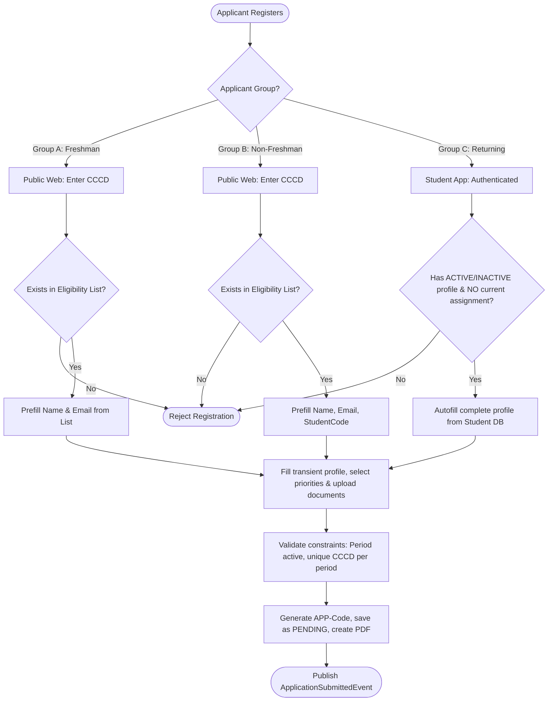
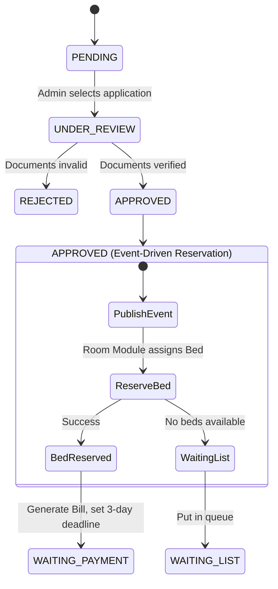

# SDMS Application Workflow & Application Code Generation Audit (v1.0)

This document standardizes and freezes the operational workflows, state transitions, unique code generation rules, and retry policies for the Application Module of the Smart Dormitory Management System (SDMS).

---

## 1. Application Code Generation

Every dormitory application must receive a unique, human-readable identifier formatted as: `APP-YYYY-XXXXX` (e.g., `APP-2026-00001`).

### A. Generation Timing
The application code is generated at the moment the student submits the application successfully. It is generated *after* eligibility checks and input validations pass, but *before* the application transaction is committed to the database.

### B. Concurrency & Unique Strategy
To guarantee uniqueness in high-concurrency environments:
1.  **Database Sequence:** A PostgreSQL sequence `dorm_app_code_seq` is utilized. Incrementing the sequence is handled atomically via `SELECT nextval('dorm_app_code_seq')`, which is thread-safe and non-blocking.
2.  **String Formatting:** The returned sequence number is zero-padded to 5 digits and prefixed with the current calendar year.
    $$\text{Code} = \text{"APP-"} + \text{YYYY} + \text{"-"} + \text{String.format("\%05d", sequenceValue)}$$
3.  **Database Guard:** A database `UNIQUE` constraint is enforced on the `application_code` column to act as the final defensive layer.

### C. Reset Strategy
To maintain a clean sequential count per year:
*   An automated scheduler job (cron) runs exactly on January 1st at 00:00:00 system time.
*   The job executes the reset command: `ALTER SEQUENCE dorm_app_code_seq RESTART WITH 1;`.
*   If applications are submitted during the transition window, they receive codes with the updated year and restarted sequence count.

---

## 2. Application Submission Workflows

### A. Group A: Freshmen (Public Website)
1.  **Verification:** The applicant provides their CCCD on the public website. The system checks `registration_eligibilities` for the active `RegistrationPeriod` where target is `FRESHMAN`.
2.  **Staging:** If verified, the system opens the application form prefilled with the `fullName` and `email` from the eligibility record. The student fills in remaining transient details (birthdate, phone, parents' names, permanent address, emergency contact).
3.  **Priorities:** The student selects applicable priority categories and uploads scans/photos of supporting certificates and required normal documents (CCCD scan, portrait photo).
4.  **Submission:** Upon clicking submit, the system verifies that the registration period window is open, validates that this CCCD has not already applied for the period, generates the sequence code, sets the status to `PENDING`, and generates a draft PDF application.

### B. Group B: Non-Freshman First-Time Residents (Public Website)
1.  **Verification:** The applicant enters their CCCD on the public website. The system queries `registration_eligibilities` for target `CURRENT_STUDENT`.
2.  **Staging:** The form is pre-populated with `fullName`, `email`, and `studentCode`. The student completes the form, attaches files, and submits.
3.  **Submission:** Follows the same flow as Group A, creating a `PENDING` application and publishing `DormitoryApplicationSubmittedEvent`.

### C. Group C: Returning Residents (Student Mobile App)
1.  **Natural Eligibility:** The student authenticates via the mobile app. Natural eligibility is confirmed if the user has an active `Student` profile (status `ACTIVE` or `INACTIVE`) and does **not** have an active `StudentHousingAssignment` (status `RESERVED` or `OCCUPIED`) for the upcoming period. No eligibility list lookup is needed.
2.  **Auto-population:** The application form is auto-populated with the student's profile details directly from the Student Module database, requiring no manual profile typing.
3.  **Updates & Renewal:** The student updates any outdated profile details (which remain transient inside the application draft) and uploads the signed commitment form and priority documents.
4.  **Submission:** The application is submitted under `RegistrationType.RENEWAL`. The status is set to `PENDING` for review.

---

## 3. Approval & Assignment Reservation Workflow

When an administrator reviews and approves an application, the system transitions states to allocate room resources cleanly:

1.  **Review (`PENDING` $\rightarrow$ `UNDER_REVIEW`):** The administrator inspects verification documents.
2.  **Rejection (`UNDER_REVIEW` $\rightarrow$ `REJECTED`):** If any document is invalid, the admin sets the status to `REJECTED` and inputs a `reviewNote` explaining the rejection. The workflow terminates.
3.  **Approval (`UNDER_REVIEW` $\rightarrow$ `APPROVED`):** If all documents are valid, the system calculates the final `priorityScore` and the admin clicks Approve. The status changes to `APPROVED`, publishing `DormitoryApplicationApprovedEvent`.
4.  **Bed Allocation & Reservation:**
    *   The Room Module listener catches the approval event and queries for an available `Bed` matching the applicant's `gender`.
    *   **Case 4a (Bed Found):** The Room Module creates a `StudentHousingAssignment` record in `RESERVED` status and publishes `BedReservedEvent`.
    *   **Case 4b (No Bed Found):** The Room Module fails to allocate a bed. The system immediately transitions the application status to `WAITING_LIST`. No assignment and no bill are created.
5.  **Bill Generation & WAITING_PAYMENT:**
    *   The Payment Module listener catches the `BedReservedEvent`, generates an accommodation fee `Bill` (status `UNPAID`), and sets the `paymentDeadline` to exactly `current_time + 3 days`.
    *   The Application Module updates the application status to `WAITING_PAYMENT`.

---

## 4. Waiting List Promotion Workflow

The `WaitingListPromotionJob` is a scheduled task that executes periodically (e.g., nightly or upon bed releases):

1.  **Capacity Scanner:** The job queries for available beds in the KTX grouped by `gender` (Beds with status `AVAILABLE`).
2.  **Promotion Queue Retrieval:** For each gender with $N$ available beds, the job queries `dormitory_applications`:
    *   **Filter:** `status = 'WAITING_LIST'` AND `gender = {gender}`.
    *   **Sorting:** `priority_score DESC`, then `created_at ASC` (First-In, First-Out for identical scores).
    *   **Limit:** $N$ applications.
3.  **Execution:** For the selected applications, the job transitions their status to `APPROVED`, publishing `DormitoryApplicationApprovedEvent` to trigger the bed reservation and billing sequence.

---

## 5. Payment Expiry Workflow

If a student fails to pay their accommodation bill within the designated 3-day window, their reservation is cancelled to free up the bed:

1.  **Detection:** A scheduled job (`AssignmentExpireJob`) scans the database hourly.
2.  **Query:** Identifies applications where `status = 'WAITING_PAYMENT'` AND `payment_deadline < current_time` AND the associated bill is `UNPAID`.
3.  **State Execution:**
    *   The job transitions the application status to `EXPIRED`, publishing `DormitoryApplicationExpiredEvent`.
    *   **Room Module Listener:** Upon receiving the event, it cancels the `StudentHousingAssignment` (status $\rightarrow$ `CANCELLED`), freeing the `Bed` (status $\rightarrow$ `AVAILABLE`).
    *   **Payment Module Listener:** Voids the outstanding bill.
    *   **Promotion Trigger:** The release of the bed immediately allows the `WaitingListPromotionJob` to promote the next candidate on the waiting list.

---

## 6. Application PDF Workflow

To establish a binding commitment between the student and the university, PDF documents are generated during the process:

1.  **Template Compilation:**
    *   **Dormitory Application Form (Giấy đăng ký nội trú):** Merges the student's transient profile details, academic records, and claimed priority categories.
    *   **Commitment Form (Giấy cam kết nội trú):** Lists KTX regulations, payment deadlines, check-in requirements, and code of conduct statements.
2.  **Generation Timing:**
    *   Immediately upon submitting the application form, a background worker compiles the template using the submitted data and stores it in Object Storage (e.g., S3/MinIO).
    *   The generated URL is saved in `application_pdf_url`.
3.  **Execution & Signature:**
    *   The student downloads the generated PDF, prints it, and signs the commitment section.
    *   *Option A:* The student uploads a scanned copy of the signed document under `COMMITMENT` in `verification_documents`.
    *   *Option B:* The student presents the physical signed document to the warden at the time of check-in, which is verified against the digital PDF saved in `application_pdf_url`.

---

## 7. Application Reapply Workflow

Once an application enters a terminal state, the applicant's retry path is defined as follows:

*   **`REJECTED` (Document Verification Failure):**
    *   The application remains frozen in `REJECTED` status for audit history.
    *   The applicant is allowed to create a **completely new** `DormitoryApplication` record for the active period. The system does not support modifying/re-submitting the rejected application.
*   **`EXPIRED` (Failed to Pay on Time):**
    *   The application is frozen in `EXPIRED` status.
    *   The reservation is lost. The student cannot "reactivate" the reservation. To request housing again, they must submit a **new application** and go through the queue, re-evaluating priority scores and waiting list positions.
*   **`CHECK_OUT` (Housing Assignment Terminated):**
    *   When the student checks out of the dormitory, the current `StudentHousingAssignment` transitions to `CHECKED_OUT`.
    *   For the next academic period, the student must submit a new `DormitoryApplication` (Renewal flow via the Student Mobile App) to request a new assignment.

---

## 8. PASS / WARNING / FAIL

*   **Status:** **PASS**. The application code generation is thread-safe and collision-free; the submission workflows are tailored for Groups A, B, and C; the approval, waiting list promotion, and expiry state machines are robustly decoupled; and the reapplication policy prevents system lockups.

---

## 9. Final Decision

**APPLICATION-04 PASS**
