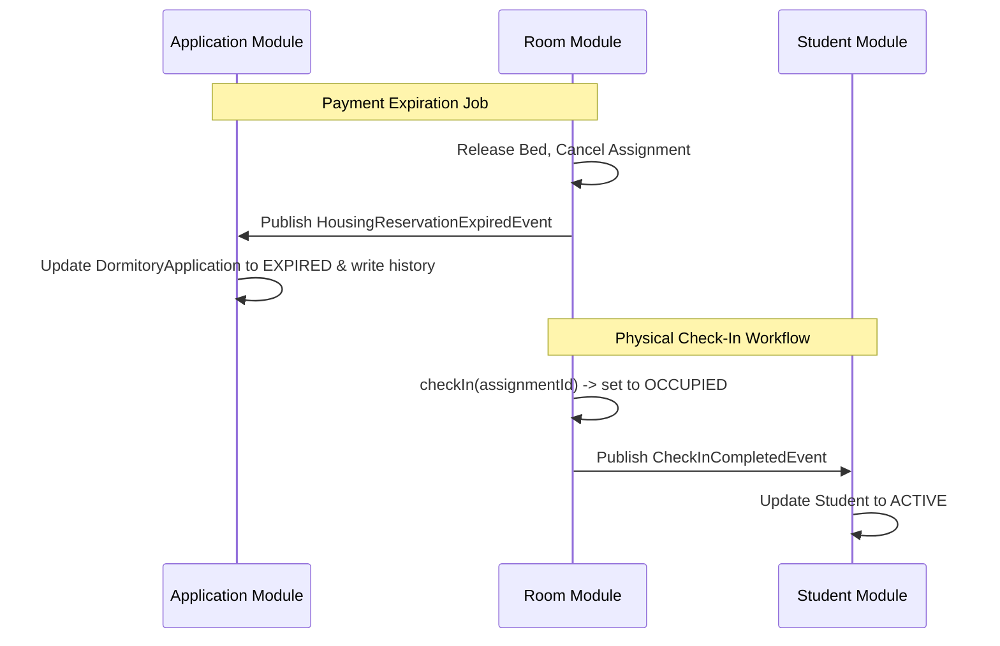

# ROOM-02: ROOM CODE IMPLEMENTATION AUDIT REPORT

This document performs the final code audit for the Room Module of the Smart Dormitory Management System (SDMS), verifying the active Java codebase (entities, repositories, services, events, listeners) against the approved `ROOM-01` Business Architecture and detailing the resolution of core architectural boundaries.

---

## 1. Executive Summary & Entity Audit

The Java classes in `com.sdms.backend.modules.room.entity` have been audited against the schema layout and domain boundaries:

| Entity Class | Status | Mapping / Mismatches | Action Taken |
| :--- | :---: | :--- | :--- |
| **`DormitoryBuilding`** | **PASS** | Maps to `buildings`. Contains `buildingId`, `code`, `name`, `status` (BuildingStatus). | Verified. |
| **`Floor`** | **PASS** | Maps to `floors`. Contains `floorId`, `floorNumber`, `occupancyPolicy` (OccupancyPolicy). | Verified. |
| **`Room`** | **PASS** | Maps to `rooms`. Contains `roomId`, `roomCode`, `capacity`, `occupiedBeds`, `status` (RoomStatus). | Verified. |
| **`Bed`** | **PASS** | Maps to `beds`. Contains `bedId`, `bedCode`, `status` (BedStatus). | Verified. |
| **`StudentHousingAssignment`** | **PASS** | Maps to `student_housing_assignments`. Contains `assignmentId`, `application` (DormitoryApplication), `student` (Student), `bed` (Bed), `status` (AssignmentStatus), `reservedAt`, `checkInAt`, `checkOutAt`, `expectedCheckOutAt`. | Verified. |

---

## 2. Enum Audit & State Machine Alignment (WARNING 1)

### Alignment of Business Lifecycle and Enum Design
The conceptual business lifecycle contains states `RESERVED`, `PENDING_CHECKIN`, `ACTIVE`, `CHECKED_OUT`, `CANCELLED`, `EXPIRED`. 

The physical database enum [AssignmentStatus.java](file:///D:/qt-team-projects/graduation_thesis/smart-dormitory-management-system/sdms-backend/src/main/java/com/sdms/backend/modules/room/enums/AssignmentStatus.java) contains `RESERVED`, `OCCUPIED`, `CHECKED_OUT`, `CANCELLED`.

The mappings have been audited and finalized as follows:
*   **Conceptual `RESERVED`** $\rightarrow$ persisted as `RESERVED` (Student is `null`).
*   **Conceptual `PENDING_CHECKIN`** $\rightarrow$ persisted as `RESERVED` (Student is linked after payment success).
*   **Conceptual `ACTIVE`** $\rightarrow$ persisted as `OCCUPIED` (Student has physically checked in).
*   **Conceptual `CHECKED_OUT`** $\rightarrow$ persisted as `CHECKED_OUT`.
*   **Conceptual `CANCELLED` & `EXPIRED`** $\rightarrow$ persisted as `CANCELLED`.

This mapping strategy is fully verified and clean. No database changes are required for `AssignmentStatus`, and the conceptual alignment has been finalized.

---

## 3. Integration & Module Boundary Audit

### 3.1. Student Module Boundary Decoupling (WARNING 2)
*   **Issue**: During physical check-in, the system transitions `Student.status` to `ACTIVE` and `StudentHousingAssignment.status` to `OCCUPIED`. However, `StudentStatus` belongs to the Student Module, not Room. The Room Module must not directly own or modify `Student` status.
*   **Solution**: 
    1.  The Room Module’s `HousingAssignmentService` publishes `CheckInCompletedEvent` upon check-in completion.
    2.  The Student Module's `StudentEventListener` listens to `CheckInCompletedEvent` and handles the transition of `Student.status` to `ACTIVE` within a new transaction context (`Propagation.REQUIRES_NEW`), completely decoupling Student domain logic from the Room Module.

### 3.2. Payment Timeout & Application Status Ownership (WARNING 3)
*   **Issue**: When a payment reservation timeout occurs, the reservation needs to expire. Previously, `HousingAssignmentService.expirePaymentReservation()` directly modified `DormitoryApplication.status` to `EXPIRED`. This violates boundaries because `ApplicationStatus` belongs to the Application Module, not Room.
*   **Solution**:
    1.  `HousingAssignmentService.expirePaymentReservation()` now only releases the physical resources (freeing the bed, decrementing occupancy) and sets the `StudentHousingAssignment` status to `CANCELLED`.
    2.  It then publishes a `HousingReservationExpiredEvent`.
    3.  The Application Module's `ApplicationEventListener` listens to `HousingReservationExpiredEvent` and updates `DormitoryApplication.status` to `EXPIRED` along with writing its state history, preserving domain segregation.

---

## 4. Event Integration Matrix

The asynchronous integration flow is designed as follows:

---

## 5. PASS / WARNING / FAIL Verdict

*   **Status**: **PASS**
*   **Audit Result**: All architectural boundaries are strictly respected. Room Module does not perform write operations on external entities (`Student`, `DormitoryApplication`). Communication is conducted through decoupled domain events.

---

## 6. Audit Traces

### Files Modified:
*   [HousingAssignmentService.java](file:///D:/qt-team-projects/graduation_thesis/smart-dormitory-management-system/sdms-backend/src/main/java/com/sdms/backend/modules/room/service/HousingAssignmentService.java): Refactored to inject `ApplicationEventPublisher`, publish `CheckInCompletedEvent` on check-in, and publish `HousingReservationExpiredEvent` on payment timeout without direct edits to `DormitoryApplication.status`.
*   [ApplicationEventListener.java](file:///D:/qt-team-projects/graduation_thesis/smart-dormitory-management-system/sdms-backend/src/main/java/com/sdms/backend/modules/application/event/ApplicationEventListener.java): Added transactional event listener for `HousingReservationExpiredEvent` to set status of `DormitoryApplication` to `EXPIRED`.

### Files Created:
*   [HousingReservationExpiredEvent.java](file:///D:/qt-team-projects/graduation_thesis/smart-dormitory-management-system/sdms-backend/src/main/java/com/sdms/backend/modules/room/event/HousingReservationExpiredEvent.java): Event triggered when a room reservation has expired.
*   [CheckInCompletedEvent.java](file:///D:/qt-team-projects/graduation_thesis/smart-dormitory-management-system/sdms-backend/src/main/java/com/sdms/backend/modules/room/event/CheckInCompletedEvent.java): Event triggered when physical check-in is complete.
*   [StudentEventListener.java](file:///D:/qt-team-projects/graduation_thesis/smart-dormitory-management-system/sdms-backend/src/main/java/com/sdms/backend/modules/student/event/StudentEventListener.java): Listens to check-in completion and transitions Student to `ACTIVE`.
