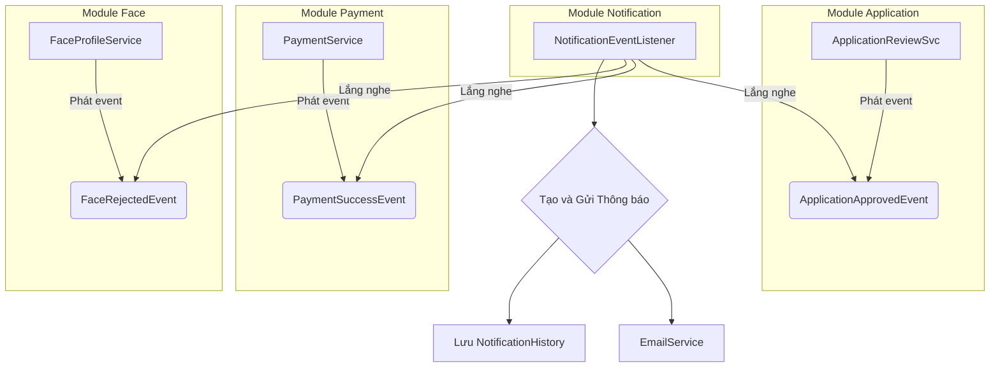

# Chức năng và Hoạt động của Module Thông báo
**Phiên bản:** 1.0 · **Ngày:** 2026-06-25

Tài liệu này mô tả chức năng, kiến trúc, và cách hoạt động của Module Thông báo (`Notification`) trong hệ thống SDMS.

---

## 1. Chức năng chính

Module `Notification` hoạt động như một trung tâm giao tiếp, có trách nhiệm gửi các thông báo đến người dùng (chủ yếu là sinh viên) thông qua nhiều kênh khác nhau. Chức năng cốt lõi của nó là:

*   **Lắng nghe sự kiện nghiệp vụ:** Theo dõi các sự kiện quan trọng xảy ra trong hệ thống (ví dụ: đơn được duyệt, hóa đơn được tạo, thanh toán thành công).
*   **Tạo nội dung thông báo:** Dựa trên loại sự kiện, tạo ra nội dung thông báo phù hợp (ví dụ: sử dụng các template HTML cho email).
*   **Gửi thông báo đa kênh:** Hỗ trợ gửi thông báo qua các kênh khác nhau.
*   **Lưu trữ lịch sử:** Ghi lại tất cả các thông báo đã gửi vào cơ sở dữ liệu để phục vụ cho việc tra cứu và kiểm toán.

## 2. Các Kênh Thông báo (`NotificationChannel`)

Hệ thống hỗ trợ các kênh sau:

| Kênh | Mô tả | Tình trạng triển khai |
| :--- | :--- | :--- |
| `EMAIL` | Gửi email đến địa chỉ đã đăng ký của người dùng. | **Đã triển khai** (sử dụng dịch vụ Brevo/Sendinblue). |
| `IN_APP` | Hiển thị thông báo ngay bên trong ứng dụng di động của sinh viên. | **Đã triển khai** (sử dụng InAppNotificationStrategy). |
| `SMS` | Gửi tin nhắn SMS đến số điện thoại của người dùng. | **Chưa triển khai**. |

## 3. Kiến trúc Dựa trên Sự kiện

Module `Notification` được thiết kế để hoàn toàn tách biệt với các module nghiệp vụ khác. Nó không gọi đến bất kỳ service nào, mà chỉ **lắng nghe các Domain Events** do các module khác phát ra.

## 4. Các Sự kiện được Lắng nghe (Ví dụ)

`NotificationEventListener` sẽ có các phương thức để xử lý từng loại sự kiện cụ thể:

*   **`handleApplicationStatusChanged(ApplicationApprovedEvent event)`:**
    *   **Nghiệp vụ:** Khi đơn được duyệt, gửi email cho sinh viên thông báo rằng đơn đã thành công và hướng dẫn các bước tiếp theo (thanh toán).
    *   **Template:** `application-status.html`

*   **`handleBillCreated(BillCreatedEvent event)`:**
    *   **Nghiệp vụ:** Khi một hóa đơn mới được tạo, gửi email thông báo cho sinh viên về khoản phí cần thanh toán và hạn chót.
    *   **Template:** `bill-created.html`

*   **`handlePaymentSuccess(PaymentSuccessEvent event)`:**
    *   **Nghiệp vụ:** Khi thanh toán thành công, gửi email xác nhận và cảm ơn.
    *   **Template:** `payment-success.html`

*   **`handleFaceStatusChanged(FaceRejectedEvent event)`:**
    *   **Nghiệp vụ:** Khi ảnh khuôn mặt bị từ chối, gửi email cho sinh viên, nêu rõ lý do và hướng dẫn tải lên ảnh khác.
    *   **Template:** `face-status.html`

*   **`handleCheckInCompleted(CheckInCompletedEvent event)`:**
    *   **Nghiệp vụ:** Khi sinh viên check-in thành công, gửi email chào mừng và cung cấp thông tin về phòng ở.
    *   **Template:** `checkin-completed.html`

## 5. Thực thể `NotificationHistory`

Mỗi thông báo được gửi đi sẽ được lưu lại trong bảng `notification_history`.

| Thuộc tính | Kiểu dữ liệu | Mô tả |
| :--- | :--- | :--- |
| `historyId` | UUID | Khóa chính. |
| `userId` | UUID | Người nhận thông báo. |
| `channel` | Enum `NotificationChannel` | Kênh đã gửi (EMAIL, IN_APP). |
| `type` | Enum `NotificationType` | Loại thông báo (ví dụ: `APPLICATION`, `PAYMENT`). |
| `title` | String | Tiêu đề của thông báo. |
| `content` | Text | Nội dung chi tiết của thông báo. |
| `status` | Enum `NotificationStatus` | Trạng thái gửi (`SENT`, `FAILED`). |

## 6. Đối chiếu Code thực tế (Code is Truth)

*   **TÌNH TRẠNG HIỆN TẠI:**
    *   `NotificationService` và `NotificationServiceImpl` đã hoàn thiện.
    *   `EmailService` và `InAppNotificationStrategy` đã được triển khai đầy đủ.
    *   Thực thể `NotificationHistory` đã được định nghĩa.
    *   `NotificationEventListener` đã triển khai hoàn thiện và đang xử lý tới 6 luồng sự kiện lớn (như `ApplicationApprovedEvent`, `PaymentSuccessEvent`, `FaceProfileApprovedEvent`, v.v). Không còn lỗ hổng.
*   **HƯỚNG DỊCH CHUYỂN TƯƠNG LAI:**
    *   Cần triển khai thêm tính năng Firebase Cloud Messaging (FCM) ở Backend nếu muốn đẩy Notification (Push) thẳng xuống điện thoại ngay cả khi tắt App.
