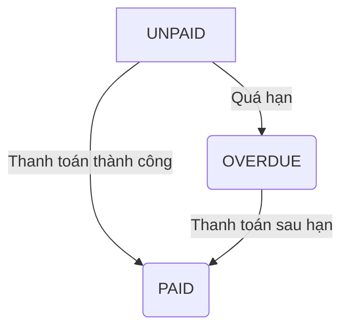

# Vòng đời Hóa đơn và Giao dịch Thanh toán
**Phiên bản:** 1.0 · **Ngày:** 2026-06-25

Tài liệu này mô tả chi tiết vòng đời của các thực thể `Bill` (Hóa đơn) và `Payment` (Giao dịch) trong hệ thống SDMS, làm rõ các quy trình nghiệp vụ liên quan đến thanh toán.

---

## 1. Thực thể chính

### A. `Bill` (Hóa đơn)
Đại diện cho một khoản phí mà sinh viên cần phải thanh toán.

| Thuộc tính | Kiểu dữ liệu | Mô tả |
| :--- | :--- | :--- |
| `billId` | UUID | Khóa chính. |
| `studentId` | UUID | Liên kết đến sinh viên phải thanh toán. |
| `billType` | Enum `BillType` | Loại hóa đơn (ví dụ: `DORMITORY_FEE`, `ELECTRICITY_FEE`). |
| `amount` | BigDecimal | Số tiền cần thanh toán. |
| `dueDate` | LocalDate | Hạn cuối phải thanh toán. |
| `status` | Enum `BillStatus` | Trạng thái của hóa đơn (xem bên dưới). |

### B. `Payment` (Giao dịch)
Đại diện cho một lần thanh toán cụ thể được thực hiện để chi trả cho một hoặc nhiều hóa đơn.

| Thuộc tính | Kiểu dữ liệu | Mô tả |
| :--- | :--- | :--- |
| `paymentId` | UUID | Khóa chính. |
| `billId` | UUID | Liên kết đến hóa đơn được thanh toán. |
| `paymentMethod` | Enum `PaymentMethod` | Phương thức thanh toán (`CASH`, `ONLINE`). |
| `amount` | BigDecimal | Số tiền đã thanh toán. |
| `transactionCode` | String | Mã giao dịch từ cổng thanh toán hoặc do hệ thống tạo. |
| `status` | Enum `PaymentStatus` | Trạng thái của giao dịch (xem bên dưới). |

## 2. Vòng đời của Hóa đơn (`BillStatus`)

| Trạng thái | Mô tả | Chuyển đổi |
| :--- | :--- | :--- |
| `UNPAID` | **Chưa thanh toán:** Trạng thái ban đầu khi hóa đơn được tạo. | Được tạo ra bởi `BillGenerationListener` khi lắng nghe `BedReservedEvent` hoặc `ExtensionApprovedEvent`. |
| `PAID` | **Đã thanh toán:** Hóa đơn đã được thanh toán đầy đủ. | Chuyển từ `UNPAID` hoặc `OVERDUE` khi một giao dịch `Payment` liên quan được xác nhận là `SUCCESS`. |
| `OVERDUE` | **Quá hạn:** Hóa đơn không được thanh toán trước `dueDate`. | Được cập nhật bởi `BillOverdueJob` (một scheduler chạy hàng ngày để kiểm tra các hóa đơn quá hạn). |
| `CANCELLED` | **Đã hủy:** Hóa đơn bị hủy (ví dụ: do việc giữ chỗ bị hủy). | Chuyển từ `UNPAID` khi có sự kiện hủy tương ứng. |

## 3. Vòng đời của Giao dịch (`PaymentStatus`)

| Trạng thái | Mô tả | Chuyển đổi |
| :--- | :--- | :--- |
| `PENDING` | **Đang chờ xử lý:** Giao dịch đã được khởi tạo (ví dụ: sinh viên được chuyển đến trang cổng thanh toán) nhưng chưa có kết quả cuối cùng. | Trạng thái ban đầu khi tạo một giao dịch online. |
| `SUCCESS` | **Thành công:** Giao dịch đã được cổng thanh toán xác nhận là thành công. | Chuyển từ `PENDING` khi nhận được webhook thành công từ cổng thanh toán, hoặc khi Admin xác nhận thanh toán tiền mặt. |
| `FAILED` | **Thất bại:** Giao dịch bị lỗi hoặc bị từ chối bởi cổng thanh toán. | Chuyển từ `PENDING` khi nhận được webhook thất bại. |

## 4. Quy trình Tích hợp

1.  **Tạo Hóa đơn (Tự động):**
    *   **Sự kiện:** `BedReservedEvent` và `ExtensionApprovedEvent`.
    *   **Hành động:** `BillGenerationListener` lắng nghe sự kiện, tạo ra một `Bill` mới với trạng thái `UNPAID`.
    *   **Đối chiếu code:** Listener này **đã được triển khai hoàn chỉnh** trong `com.sdms.backend.modules.payment.event`.

2.  **Sinh viên Thanh toán Online:**
    *   Sinh viên chọn thanh toán online. Hệ thống tạo một `Payment` với trạng thái `PENDING` và chuyển hướng sinh viên đến cổng thanh toán.
    *   **Đối chiếu code:** Logic này đã được triển khai trong `PaymentController` và `PaymentService`.

3.  **Xác nhận Thanh toán (Thành công):**
    *   **Hành động:** Cổng thanh toán gọi về webhook của hệ thống, hoặc Admin xác nhận thanh toán tiền mặt.
    *   **Nghiệp vụ:**
        1.  `PaymentService` cập nhật trạng thái của `Payment` thành `SUCCESS`.
        2.  Cập nhật trạng thái của `Bill` liên quan thành `PAID`.
        3.  Phát ra sự kiện quan trọng `PaymentSuccessEvent`.
    *   **Đối chiếu code:** Logic này đã được triển khai trong `SepayWebhookController` và `PaymentService`.

4.  **Xử lý Sau Thanh toán:**
    *   **Sự kiện:** `PaymentSuccessEvent`.
    *   **Hành động:** Các module khác lắng nghe sự kiện này để hoàn tất quy trình:
        *   **Module `Student`:** Tạo `Student` và `UserAccount`.
        *   **Module `Room`:** Chuyển trạng thái `Assignment` và `Bed` sang `ACTIVE`/`OCCUPIED`.
        *   **Module `Notification`:** Gửi thông báo thanh toán thành công.
    *   **Đối chiếu code:** Các listener này đã được triển khai một phần, đặc biệt là `StudentProvisioningListener`.

5.  **Xử lý Hóa đơn Quá hạn:**
    *   **Hành động:** `BillOverdueJob` chạy định kỳ.
    *   **Nghiệp vụ:** Tìm các hóa đơn `UNPAID` có `dueDate` đã qua và cập nhật trạng thái của chúng thành `OVERDUE`. Phát ra sự kiện `BillOverdueEvent`.
    *   **Đối chiếu code:** `BillOverdueJob` đã được tạo trong `com.sdms.backend.modules.payment.scheduler`. Cần đảm bảo listener cho `BillOverdueEvent` được triển khai để xử lý việc hủy giữ chỗ.
