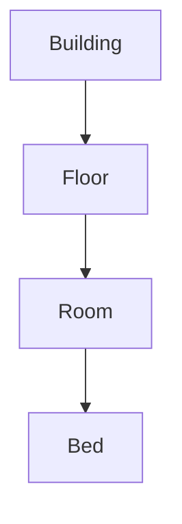

# Phân tích Mô hình Thực thể Module Room
**Phiên bản:** 1.0 · **Ngày:** 2026-06-25

Tài liệu này phân tích chi tiết về các thực thể và các trạng thái (status) của chúng trong Module `Room`, làm rõ các quy tắc nghiệp vụ liên quan đến quản lý cơ sở vật chất và tình trạng cư trú.

---

## 1. Sơ đồ Thực thể Phân cấp

Mô hình dữ liệu của module được xây dựng theo cấu trúc phân cấp 4 lớp, từ tổng quan đến chi tiết.

*   **`Building` (Tòa nhà):** Chứa thông tin về các tòa nhà trong KTX (ví dụ: tên, số tầng, trạng thái).
*   **`Floor` (Tầng):** Chứa thông tin về các tầng trong một tòa nhà (ví dụ: tên tầng, sơ đồ).
*   **`Room` (Phòng):** Chứa thông tin về các phòng trên một tầng (ví dụ: tên phòng, sức chứa, loại phòng, giới tính cho phép).
*   **`Bed` (Giường):** Đơn vị cơ sở nhỏ nhất, đại diện cho một chỗ ở. Đây là thực thể mà sinh viên sẽ được gán vào.

## 2. Phân tích Trạng thái của `Bed` (`BedStatus`)

Trạng thái của `Bed` là yếu tố cốt lõi để quản lý việc phân phòng.

| Trạng thái | Mô tả | Chuyển đổi |
| :--- | :--- | :--- |
| `AVAILABLE` | **Trống:** Giường đang có sẵn, có thể được gán cho sinh viên. | Đây là trạng thái mặc định của giường mới, hoặc khi một sinh viên check-out. |
| `RESERVED` | **Đã giữ chỗ:** Giường đã được hệ thống giữ lại cho một sinh viên đã được duyệt đơn nhưng chưa thanh toán. Giường này không thể được gán cho người khác. | Chuyển từ `AVAILABLE` khi `RoomAllocationListener` xử lý sự kiện `ApplicationApprovedEvent`. |
| `OCCUPIED` | **Đang ở:** Sinh viên đã hoàn tất thanh toán và check-in. Giường đang có người ở. | Chuyển từ `RESERVED` khi `CheckInService` xử lý việc check-in. |
| `MAINTENANCE` | **Đang bảo trì:** Giường đang trong quá trình sửa chữa, không thể sử dụng. | Admin có thể chuyển một giường sang trạng thái này thủ công. |

## 3. Thực thể Liên kết: `StudentHousingAssignment`

Đây là thực thể "xương sống" của việc quản lý cư trú, tạo ra mối liên kết giữa một sinh viên và một giường cụ thể trong một khoảng thời gian.

| Thuộc tính | Kiểu dữ liệu | Mô tả |
| :--- | :--- | :--- |
| `assignmentId` | UUID | Khóa chính. |
| `studentId` | UUID | Liên kết đến sinh viên (`Student`). |
| `bedId` | UUID | Liên kết đến giường (`Bed`). |
| `applicationId` | UUID | Liên kết đến đơn đăng ký (`DormitoryApplication`) đã được duyệt. |
| `status` | Enum `AssignmentStatus` | Trạng thái của việc phân phòng này (xem bên dưới). |
| `startDate` | LocalDate | Ngày bắt đầu hợp đồng lưu trú. |
| `endDate` | LocalDate | Ngày kết thúc hợp đồng. |
| `checkInDate` | LocalDateTime | Thời điểm check-in thực tế. |
| `checkOutDate` | LocalDateTime | Thời điểm check-out thực tế. |

## 4. Phân tích Trạng thái của `StudentHousingAssignment` (`AssignmentStatus`)

Trạng thái của `Assignment` theo dõi vòng đời cư trú của sinh viên.

| Trạng thái | Mô tả | Chuyển đổi |
| :--- | :--- | :--- |
| `RESERVED` | **Đã giữ chỗ:** Được tạo ra khi đơn được duyệt. Tương ứng với `BedStatus.RESERVED`. | Trạng thái ban đầu. |
| `ACTIVE` | **Đang hoạt động:** Sinh viên đã thanh toán và check-in thành công. Tương ứng với `BedStatus.OCCUPIED`. | Chuyển từ `RESERVED` sau khi `CheckInService` được gọi. |
| `CANCELLED` | **Đã hủy:** Việc giữ chỗ bị hủy do sinh viên không thanh toán đúng hạn. | Chuyển từ `RESERVED` khi `HousingJobScheduler` phát hiện hóa đơn quá hạn. |
| `TERMINATED` | **Đã kết thúc:** Sinh viên đã hoàn thành quá trình lưu trú và check-out. | Chuyển từ `ACTIVE` sau khi Admin thực hiện thủ tục check-out. |

## 5. Đối chiếu Code và "Khoảng trống" Nghiệp vụ

*   **Thực thể và Trạng thái:** Các thực thể `Building`, `Floor`, `Room`, `Bed`, `StudentHousingAssignment` và các Enum trạng thái tương ứng đã được định nghĩa đầy đủ và chính xác trong code (`com.sdms.backend.modules.room.entity` và `com.sdms.backend.modules.room.enums`).
*   **Service Logic:** Các service như `BuildingService`, `RoomService`, `BedService` đã triển khai tốt các logic CRUD. `HousingAssignmentService` cũng đã có các phương thức nền tảng.
*   **Tự động hóa (Lỗ hổng):**
    *   **Tạo `Assignment` tự động:** Cần có `RoomAllocationListener` để lắng nghe `ApplicationApprovedEvent` và tự động gọi `housingAssignmentService.reserveBed(...)`. Nếu không, Admin sẽ phải thực hiện việc này thủ công.
    *   **Hủy `Assignment` tự động:** Cần có một listener hoặc job để theo dõi các hóa đơn quá hạn (`PaymentExpiredEvent`) và tự động gọi `housingAssignmentService.cancelReservation(...)` để giải phóng giường. `HousingJobScheduler` đã có nhưng cần đảm bảo nó được kích hoạt đúng cách.
    *   **Kết thúc `Assignment`:** Cần có một quy trình check-out rõ ràng (có thể là một API cho Admin) để chuyển trạng thái `Assignment` thành `TERMINATED` và `Bed` thành `AVAILABLE`.
