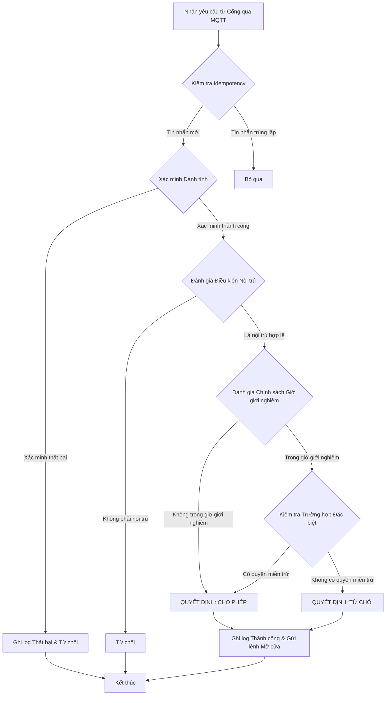

# Luồng Hoạt động và Logic Kiểm soát Ra vào
**Phiên bản:** 1.0 · **Ngày:** 2026-06-25

Tài liệu này mô tả chi tiết luồng hoạt động và logic xử lý của Module Ra vào Thông minh (`SmartAccess`) khi nhận được một yêu cầu xác thực từ cổng.

---

## 1. Bối cảnh nghiệp vụ

Khi một sinh viên muốn ra hoặc vào KTX qua cổng thông minh, hệ thống không chỉ đơn giản là xác minh danh tính (khuôn mặt, thẻ RFID) mà còn phải kiểm tra một loạt các quy tắc nghiệp vụ khác để đưa ra quyết định cuối cùng là "CHO PHÉP" (`GRANTED`) hay "TỪ CHỐI" (`DENIED`).

## 2. Sơ đồ Luồng Xử lý Yêu cầu

## 3. Phân tích Chi tiết các Bước

### Bước 1: Nhận yêu cầu và Kiểm tra Idempotency
*   **Hành động:** `MqttMessageListener` nhận được một tin nhắn từ topic `sdms/gate/{gateId}/verify`.
*   **Logic (`IdempotencyService`):**
    1.  Trích xuất một mã định danh duy nhất từ tin nhắn (ví dụ: `messageId`).
    2.  Kiểm tra xem `messageId` này đã được xử lý trong bảng `processed_messages` hay chưa.
    3.  Nếu đã có, bỏ qua và kết thúc. Nếu chưa, lưu `messageId` lại và tiếp tục xử lý.
*   **Mục đích:** Chống việc xử lý lặp lại một yêu cầu do lỗi mạng MQTT.
*   **Đối chiếu code:** `IdempotencyService` và thực thể `ProcessedMessage` đã được định nghĩa. Cần đảm bảo nó được gọi ở bước đầu tiên.

### Bước 2: Xác minh Danh tính (`Identity Verification`)
*   **Hành động:** Hệ thống cần biết "ai" đang yêu cầu ra vào.
*   **Logic:**
    *   **Nếu là RFID:** Tìm `studentId` được liên kết với mã RFID này.
    *   **Nếu là Khuôn mặt:** Gửi ảnh đến Module `Face` để thực hiện nhận dạng và trả về `studentId` nếu khớp.
*   **Kết quả:**
    *   **Thành công:** Có được `studentId` của người yêu cầu. Phát sự kiện `IdentityVerifiedEvent`.
    *   **Thất bại:** Không xác định được danh tính. Phát sự kiện `IdentityFailedEvent`, ghi log và từ chối.

### Bước 3: Đánh giá Điều kiện Nội trú (`EligibilityEvaluationService`)
*   **Hành động:** Lắng nghe `IdentityVerifiedEvent`.
*   **Logic:**
    1.  Dùng `studentId` để truy vấn Module `Room`.
    2.  Kiểm tra xem sinh viên này có một `StudentHousingAssignment` đang ở trạng thái `ACTIVE` hay không.
*   **Kết quả:**
    *   **Hợp lệ:** Sinh viên là một nội trú hợp lệ. Tiếp tục bước 4.
    *   **Không hợp lệ:** Sinh viên không có phòng hoặc đã hết hạn hợp đồng. Quyết định `DENIED`.

### Bước 4: Đánh giá Chính sách (`AccessEvaluationService`)
*   **Hành động:** Nếu sinh viên hợp lệ, tiếp tục đánh giá các chính sách truy cập.
*   **Logic:**
    1.  **Kiểm tra Giờ giới nghiêm (`CurfewResolutionStrategy`):**
        *   Lấy thời gian hiện tại.
        *   Truy vấn bảng `curfew_policies` để xem có chính sách nào đang áp dụng cho đối tượng sinh viên này (`ResidentType`) và trong khung giờ hiện tại không.
    2.  **Kiểm tra Chính sách Khung thời gian (`TimeWindowEvaluationStrategy`):**
        *   Kiểm tra xem có chính sách đặc biệt nào (ví dụ: chỉ cho phép ra vào từ 7h-22h) áp dụng cho phòng hoặc tòa nhà của sinh viên không.
*   **Kết quả:**
    *   **Không vi phạm:** Không có chính sách nào bị vi phạm. Quyết định `GRANTED`.
    *   **Vi phạm:** Có ít nhất một chính sách bị vi phạm (ví dụ: đang trong giờ giới nghiêm). Quyết định `DENIED`.

### Bước 5: Ra quyết định và Thực thi
*   **Hành động:** Tổng hợp kết quả từ các bước trên.
*   **Logic:**
    1.  Ghi lại quyết định cuối cùng (`GRANTED` hoặc `DENIED`) và các lý do vào bảng `access_history`.
    2.  Phát ra sự kiện tương ứng: `AccessGrantedEvent` hoặc `AccessDeniedEvent`.
    3.  `MqttCommandPublisher` lắng nghe các sự kiện này và gửi lệnh `sdms/gate/{gateId}/decision` (chứa lệnh "OPEN" hoặc "REJECT") về lại cho thiết bị ESP32.
*   **Đối chiếu code:**
    *   Các Service như `AccessEvaluationService`, `EligibilityEvaluationService` và các Strategy đã được định nghĩa trong `com.sdms.backend.modules.smartaccess.application`.
    *   Các thực thể `CurfewPolicy`, `TimeWindowPolicy`, `AccessHistory` đã có.
    *   **Lỗ hổng:** Việc kết nối các bước xử lý này với nhau thông qua các sự kiện nội bộ (`IdentityVerifiedEvent`, `AccessGrantedEvent`) cần được rà soát kỹ lưỡng để đảm bảo luồng đi đúng như thiết kế.
