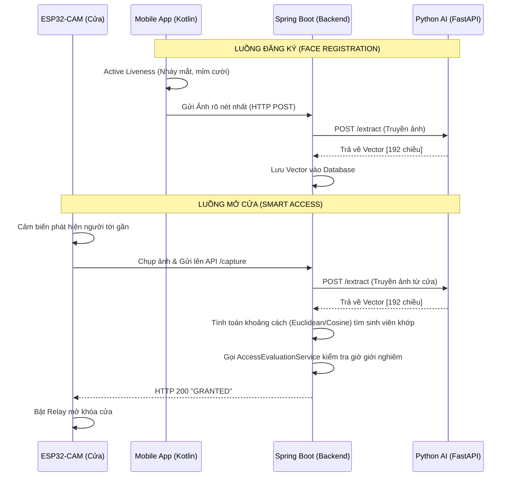

# TÀI LIỆU ĐỊNH HƯỚNG KIẾN TRÚC & ROADMAP TÍCH HỢP HỆ THỐNG
**Dự án:** Smart Dormitory Management System (SDMS)
**Module:** Smart Access & Face Recognition
**Phiên bản:** 1.0 (Kiến trúc Python AI Sidecar & Backend-Centric)

---

## 1. TỔNG QUAN KIẾN TRÚC MỚI
Sau quá trình Audit và phân tích rào cản kỹ thuật, hệ thống chốt sử dụng kiến trúc **"Backend làm Trung tâm phân tích AI" (Backend-Centric AI)** với sự hỗ trợ của một **Python Microservice**. 

Kiến trúc này giải quyết triệt để 2 vấn đề lớn nhất của đồ án:
1. Con chip ESP32-CAM quá yếu để tự nhận diện khuôn mặt. Nó chỉ đóng vai trò Camera thụ động.
2. Tránh việc Spring Boot bị sập (Crash JVM) nếu chạy trực tiếp các thư viện C++ (OpenCV/TensorFlow) trên server.

### Luồng Dữ liệu (Data Flow)

---

## 2. KẾ HOẠCH THỰC THI CHO TỪNG MODULE (ROADMAP)

### Giai đoạn 1: Triển khai Python AI Sidecar (Priority: High)
Đây là trái tim của hệ thống nhận diện.
- **Công nghệ:** Python, FastAPI, TensorFlow Lite, OpenCV.
- **Nhiệm vụ:**
  - Copy file mô hình AI (`mobile_face_net.tflite`) đang dùng bên App Android bỏ sang Server Python để đảm bảo đồng nhất đầu ra là mảng Float 192 chiều.
  - Viết 1 API duy nhất: `POST /api/v1/faces/extract`.
  - API nhận vào `MultipartFile` (Hình ảnh), dùng OpenCV cắt lấy khuôn mặt, ném vào TFLite và `return` về mảng Float.

### Giai đoạn 2: Điều chỉnh Spring Boot Backend (Priority: High)
- **Tích hợp Python:** Mở file `RestAiExtractionAdapter.java`, xóa đoạn code sinh Vector Mock (random array), thay bằng RestTemplate gọi thực tế tới `http://localhost:8000/api/v1/faces/extract`.
- **Viết API cho Cửa (ESP32):** Tạo endpoint `POST /api/v1/smart-access/door-capture`.
- **Thuật toán so khớp (Matching):** Viết một hàm tính khoảng cách `Euclidean Distance` (hoặc `Cosine Similarity`) bằng Java. Duyệt qua mảng `FaceEmbedding` trong DB để tìm người có độ lệch nhỏ nhất (Thường ngưỡng Threshold = 0.6). Nếu tìm thấy, ném qua `AccessEvaluationService` để check Rule.

### Giai đoạn 3: Viết Firmware cho ESP32-CAM (Priority: High)
- **Công nghệ:** C++ (Arduino IDE).
- **Nhiệm vụ:**
  - Kết nối Wi-Fi.
  - Khởi tạo phần cứng Camera.
  - Lắng nghe Nút nhấn hoặc Cảm biến PIR.
  - Khi có tín hiệu: Gọi hàm `esp_camera_fb_get()` lấy Frame ảnh hiện tại, đóng gói HTTP Multipart POST và bắn thẳng lên IP của Spring Boot Backend.
  - Đọc HTTP Response: Nếu chữ chứa `GRANTED`, ghi chân GPIO (ví dụ chân số 4) lên `HIGH` trong 5 giây để kích Relay nam châm mở cửa. Trả về `LOW` để đóng cửa.

### Giai đoạn 4: Điều chỉnh Mobile App Kotlin (Priority: Medium)
- **Cắt giảm:** Xóa bỏ code trích xuất Vector bằng TFLite ở bước Đăng ký (để App nhẹ đi).
- **Giữ lại:** Bắt buộc giữ lại luồng Liveness Detection (nháy mắt, mỉm cười) để chống giả mạo bằng ảnh tĩnh.
- **Giao tiếp:** Gọi API upload File Ảnh lên Spring Boot khi người dùng hoàn tất đăng ký.
- **Giá trị gia tăng (Tùy chọn):** Nếu muốn tận dụng tính năng Offline / Room DB cũ, có thể sửa đổi thành tính năng **"Face Login"** (Mở app không cần mật khẩu, chỉ cần đưa mặt vào).

---

## 3. KHUYẾN NGHỊ TỪ ARCHITECT
- **Bắt đầu từ đâu?** Hãy code Python API Sidecar và test nó bằng Postman trước. Đảm bảo bạn ném 2 cái ảnh của cùng 1 người vào, Vector trả ra phải giống nhau (khoảng cách cực thấp). 
- **Networking:** Khi nối ESP32-CAM với Backend, nếu đang chạy ở Localhost (Máy tính cá nhân), nhớ lấy IPv4 LAN (ví dụ `192.168.1.x`) để nạp cứng vào code ESP32, không dùng `localhost`.
- **An ninh:** Tuyệt đối không lưu ảnh của sinh viên ở định dạng file tĩnh (jpg/png) nếu không cần thiết. Sau khi trích xuất ra Vector số, hãy xóa ảnh gốc đi để tiết kiệm ổ cứng và tuân thủ chuẩn Privacy.
