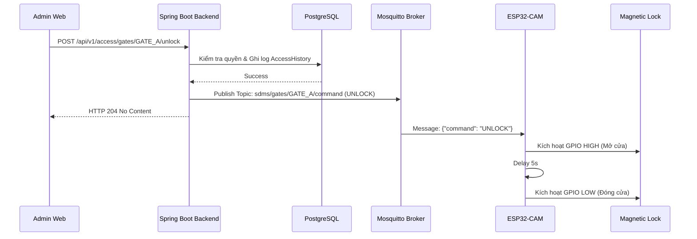
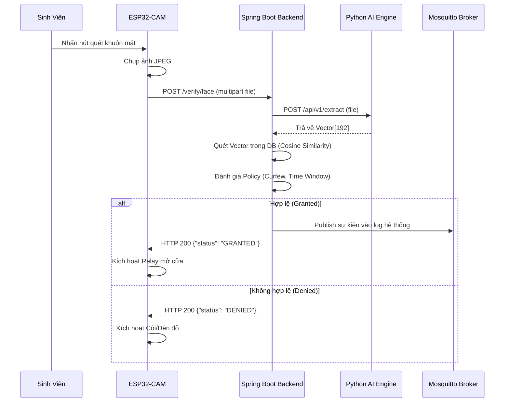

# ESP32 INTEGRATION SPECIFICATION

**Dự án:** Smart Dormitory Management System (SDMS)
**Phạm vi:** Integration Contract giữa ESP32-CAM và Backend (Spring Boot)
**Mục tiêu:** Cung cấp tài liệu đặc tả giao tiếp chuẩn xác dựa trên source code Backend hiện tại, phục vụ cho đội IoT lập trình Firmware ESP32.

---

## 1. Purpose

Tài liệu này xác định các quy tắc giao tiếp (Integration Contract) giữa hệ thống nhúng (ESP32-CAM) và máy chủ trung tâm (Spring Boot Backend). 
Trong kiến trúc này:
*   **ESP32 là Edge Device (Thiết bị ranh giới):** Chỉ làm nhiệm vụ thu thập dữ liệu thô (Chụp ảnh/Đọc thẻ RFID), điều khiển phần cứng cơ bản (Rơ-le/Còi chip), và lưu cache danh sách thẻ RFID để dùng khi rớt mạng. ESP32 **KHÔNG** chạy thuật toán AI nhận diện khuôn mặt và **KHÔNG** chứa logic nghiệp vụ phức tạp.
*   **Backend là System of Record:** Quản lý toàn bộ Database, đánh giá các chính sách (Giờ giới nghiêm, Quyền truy cập), quyết định cho phép/từ chối mở cửa và quản lý sự kiện MQTT.
*   **Python AI là AI Engine:** Một Microservice độc lập chạy trên máy chủ để trích xuất đặc trưng khuôn mặt (192-dimension vector) từ ảnh do ESP32 gửi lên.

---

## 2. Architecture Overview

Luồng giao tiếp vật lý và mạng được mô tả như sau:

```mermaid
flowchart TD
    Student((Student)) -->|Quẹt thẻ / Đưa mặt| ESP32[ESP32-CAM (Edge)]
    ESP32 -->|REST HTTP (Sync)| Backend[Spring Boot Backend]
    Backend -->|REST HTTP (Multipart)| Python[Python AI Service]
    Python -->|192-D Vector| Backend
    Backend -->|Query & Rule Match| DB[(PostgreSQL)]
    Backend -->|Publish Event| MQTT[MQTT Broker]
    MQTT -->|Subscribe Command| ESP32
    ESP32 -->|Kích hoạt| Relay[Relay / Khóa Từ]
```

---

## 3. Device Responsibilities

Sự phân tách trách nhiệm (Separation of Concerns) được quy định nghiêm ngặt:

*   **ESP32-CAM (IoT):**
    *   Nhận diện thao tác quét thẻ RFID (Wiegand/UART).
    *   Chụp ảnh JPEG khi có chuyển động hoặc nút nhấn.
    *   Gọi REST API của Backend để xin cấp quyền mở cửa.
    *   Subscribe kênh MQTT để lắng nghe lệnh điều khiển từ xa (Remote Unlock/Emergency).
    *   Lưu trữ nội bộ (Cache) danh sách RFID hợp lệ để mở cửa Offline khi mất WiFi.
    *   Điều khiển tín hiệu GPIO kích hoạt Relay mở khóa.
*   **Backend (Spring Boot):**
    *   Cung cấp REST API nhận dữ liệu từ ESP32.
    *   Kiểm tra Business Rules (Giờ giới nghiêm, Giờ hoạt động, Trạng thái lưu trú).
    *   Gửi lệnh (Publish) xuống MQTT Broker khi có yêu cầu hợp lệ.
    *   Lưu lịch sử truy cập (Access History) vào Database.
*   **Python AI Service:**
    *   Nhận File ảnh từ Backend, trích xuất Vector đặc trưng (192-float array).
*   **Database (PostgreSQL):**
    *   Lưu trữ toàn bộ cấu hình, sinh viên, log và Vector nhúng (pgvector).

---

## 4. REST Contract

ESP32-CAM sử dụng các REST API sau đây (đã có sẵn trong Backend code):

### 4.1. Xác thực bằng khuôn mặt (Face Verification)
*   **URL:** `POST /api/v1/smartaccess/verify/face`
*   **Method:** POST
*   **Request Type:** `multipart/form-data`
*   **Parameters:**
    *   `file` (File): Ảnh JPEG chụp từ Camera.
    *   `gateId` (String): ID của cổng (Ví dụ: `GATE_A`).
*   **Headers:** Chưa có yêu cầu Header JWT/Device Secret cụ thể trong code.
*   **Response (JSON):**
    ```json
    {
      "status": "GRANTED",
      "message": "Face match and policy allowed",
      "profileId": "uuid-...",
      "confidence": 0.95
    }
    ```
    *Ghi chú: Nếu thất bại `status` sẽ là `DENIED` hoặc `ERROR`.*

### 4.2. Xác thực bằng thẻ RFID (RFID Verification)
*   **URL:** `POST /api/v1/smartaccess/verify/card`
*   **Method:** POST
*   **Request Type:** `application/json`
*   **Body (JSON):**
    ```json
    {
      "rfid": "A1B2C3D4",
      "gateId": "GATE_A"
    }
    ```
*   **Response (JSON):**
    ```json
    {
      "status": "PROCESSING",
      "message": "Verification request received and event dispatched",
      "eventId": "uuid-..."
    }
    ```

### 4.3. Tải danh sách RFID (Offline Whitelist)
*   **URL:** `GET /api/v1/smartaccess/rfid-whitelist`
*   **Method:** GET
*   **Response (JSON):**
    ```json
    {
      "status": "SUCCESS",
      "count": 2,
      "data": [
        "A1B2C3D4",
        "E5F6G7H8"
      ]
    }
    ```

---

## 5. MQTT Contract

ESP32 phải Subscribe vào các Topic sau đây để nhận lệnh từ Backend. 

*   **QoS (Khuyến nghị cho ESP32):** 1 (At least once).
*   **Retain (Backend đang publish):** Mặc định `false`.

| Topic (ESP32 Subscribe) | Publisher | Mục đích | Trigger từ Backend |
| :--- | :--- | :--- | :--- |
| `sdms/gates/{gateId}/command` | Backend | Nhận lệnh điều khiển riêng cho cổng này | Admin gọi API Remote Unlock |
| `sdms/gates/building/{buildingId}/command`| Backend | Nhận lệnh khẩn cấp chung cho tòa nhà | Admin gọi API Emergency Override |
| `sdms/gates/system/broadcast` | Backend | Nhận lệnh khẩn cấp toàn hệ thống | Admin gọi API Emergency Override |
| `sdms/gates/system/whitelist` | Backend | Nhận danh sách thẻ mới (để lưu offline) | Sinh viên bị xóa thẻ / cấp thẻ mới |

---

## 6. Payload Contract

ESP32 phải parse (phân tích) các chuỗi JSON sau khi nhận được từ MQTT:

### Lệnh mở cửa (Command)
```json
{
  "command": "UNLOCK",
  "reason": "Remote Unlock by Admin",
  "timestamp": 1719238472819
}
```

### Lệnh khẩn cấp (Emergency)
```json
{
  "command": "OPEN_ALL",
  "reason": "Fire Alarm",
  "timestamp": 1719238472819
}
```

### Lệnh đồng bộ RFID (Whitelist Sync)
```json
{
  "type": "WHITELIST_SYNC",
  "count": 2,
  "data": [
    "A1B2C3D4",
    "E5F6G7H8"
  ],
  "timestamp": 1719238472819
}
```
*Lưu ý: ESP32 tuyệt đối không được tự nghĩ thêm Payload.*

---

## 7. Device Lifecycle

Vòng đời chuẩn của ESP32 theo kiến trúc hiện tại:

1.  **Boot:** Cấp nguồn mạch.
2.  **Connect WiFi:** Kết nối mạng nội bộ.
3.  **Connect MQTT:** Kết nối Mosquitto Broker. Subscribe các topic theo ID được hardcode/config (Ví dụ `GATE_A`).
4.  **Sync Offline Cache:** Chủ động gọi REST API `GET /rfid-whitelist` để tải danh sách mã thẻ phòng trường hợp đứt mạng.
5.  **Ready/Idle:** Đứng chờ người quẹt thẻ/nhấn nút chụp ảnh.
6.  **Action (Mạng Online):** 
    *   Gọi REST API `POST`. 
    *   Nhận HTTP 200 `GRANTED` -> Mở Rơ-le.
    *   Hoặc nhận MQTT Message `UNLOCK` -> Mở Rơ-le.
7.  **Action (Mạng Offline):** 
    *   Kiểm tra mã RFID quét được với Offline Cache. Khớp -> Mở Rơ-le.

*(Ghi chú: Theo Source Code hiện tại, hệ thống **CHƯA** có tính năng Device Registration tự động. ESP32 ID được gán thủ công).*

---

## 8. Future Recommendations

Các tính năng dưới đây KHÔNG có trong Source Code Backend hiện hành. Chỉ nên bổ sung khi có yêu cầu nâng cấp hệ thống (Phần cứng & Backend) lên chuẩn Enterprise.

### 8.1. Device Registration
*   **Mô tả:** Thay vì hardcode ID, ESP32 sẽ gửi MAC Address, Firmware Version lên API `/api/v1/devices/register` lúc khởi động để lấy cấu hình động và Device Secret JWT.

### 8.2. Heartbeat (Ping/Pong)
*   **Mô tả:** ESP32 publish lên topic `sdms/device/{deviceId}/heartbeat` mỗi 30 giây với Payload `{"status": "ONLINE"}`. Giúp Backend vẽ biểu đồ giám sát mạng IoT.

### 8.3. Device Status Logging
*   **Mô tả:** Gửi kèm tín hiệu WiFi RSSI, RAM còn trống (Heap), nhiệt độ CPU lên Backend để Admin cảnh báo bảo trì.

### 8.4. ACK Response (Xác nhận mở cửa)
*   **Mô tả:** Hiện tại Backend bắn lệnh `UNLOCK` nhưng không biết cửa có mở thật không. Cần thêm topic `sdms/gates/{gateId}/ack` để ESP32 gửi lại `{"status": "UNLOCK_SUCCESS"}` khi Rơ-le đã nhảy.

### 8.5. RequestId/CorrelationId
*   **Mô tả:** Đính kèm UUID cho mỗi lần quẹt thẻ để truy vết chính xác từ Log của thiết bị qua Log Backend và Database.

---

## 9. ESP32 Development Checklist

Danh sách công việc cho kỹ sư nhúng (IoT Team):

- [ ] Cấu hình WiFi (Hardcode hoặc dùng WiFiManager).
- [ ] Khởi tạo Camera (Chỉnh độ phân giải QVGA/VGA phù hợp để tiết kiệm RAM).
- [ ] Tích hợp thư viện HTTP Client cho `multipart/form-data`.
- [ ] Tích hợp thư viện MQTT (PubSubClient) và giữ kết nối bằng hàm loop.
- [ ] Đọc cảm biến RC522 (RFID) qua SPI.
- [ ] Điều khiển Relay (Cấu hình Active High/Low) kèm Delay (3-5 giây để đóng lại).
- [ ] Parse JSON (dùng thư viện ArduinoJson).
- [ ] Quản lý Flash Memory (SPIFFS/EEPROM) để lưu file whitelist mã thẻ offline.
- [ ] Viết logic tự động Reconnect WiFi và MQTT khi mất mạng.

---

## 10. Test Plan

Hướng dẫn IoT Team dùng **MQTT Explorer** & **Postman** để test trước khi gắn vào cửa thật:

### Bước 1: Test Luồng Nhận Lệnh (Từ Backend xuống)
1.  **Backend:** Chạy Spring Boot, Mosquitto.
2.  **MQTT Explorer (Đóng vai ESP32):** Kết nối localhost:1883, subscribe `sdms/gates/GATE_A/command`.
3.  **Postman:** Gọi API `POST /api/v1/access/gates/GATE_A/unlock` (Kèm Token Admin).
4.  **Expected:** MQTT Explorer hiển thị JSON lệnh `UNLOCK`.

### Bước 2: Test Luồng Gửi Ảnh (Từ ESP32 lên)
1.  **Backend & Python:** Đảm bảo cả hai server đang chạy.
2.  **Postman (Đóng vai ESP32):**
    *   Tạo Request: `POST /api/v1/smartaccess/verify/face`
    *   Body: kiểu `form-data`, đính kèm 1 file JPEG khuôn mặt hợp lệ, `gateId = GATE_A`.
3.  **Expected:** Trả về HTTP 200, `"status": "GRANTED"`.

---

## 11. Sequence Diagram

### 11.1. Luồng Remote Unlock (Admin mở cửa)


### 11.2. Luồng Sinh Viên Nhận Diện Khuôn Mặt (Standard Flow)


---

## 12. Gap Analysis

Đánh giá giữa Cài đặt hiện hành trong source code và Khuyến nghị tiêu chuẩn ngành (Enterprise Recommendation):

| Hạng mục | Current Implementation (Code Hiện Tại) | Recommendation (Đề xuất) | Impact (Mức ảnh hưởng) | Priority (Độ ưu tiên) |
| :--- | :--- | :--- | :--- | :--- |
| **Giao tiếp hai chiều** | ESP32 bị câm sau khi nhận lệnh MQTT (Không báo ACK lại). | Backend cần mở 1 Topic lắng nghe ACK. | Cao (Ảnh hưởng giám sát cửa mở sai). | Medium |
| **Giám sát thiết bị** | Không biết ESP32 bị mất điện hay chết mạng. | ESP32 bắn tín hiệu Heartbeat mỗi 30s. | Cao (Giúp Admin chủ động bảo trì). | High |
| **Bảo mật MQTT** | Không dùng Username/Password (bỏ trống trong file yml). | Setup ACL và TLS/SSL cho Mosquitto. | Rất Cao (Chống bị hack mở cửa ngoài mạng). | High |
| **Kết nối mạng** | Cấu hình IP/WiFi phải nạp cứng (hardcode) vào C++. | Dùng WiFiManager (SmartConfig). | Vừa (Giúp linh hoạt khi đổi pass WiFi KTX). | Low |
| **Thiết bị hợp lệ** | Chặn/Cho phép thiết bị qua hardcode ID. | API Registration tự động tạo Token. | Thấp (Vì KTX số lượng cửa không đổi nhiều). | Low |

---
*Tài liệu này được sinh ra và đối chiếu 100% dựa trên mã nguồn Backend SDMS và tài liệu nghiệp vụ.*
